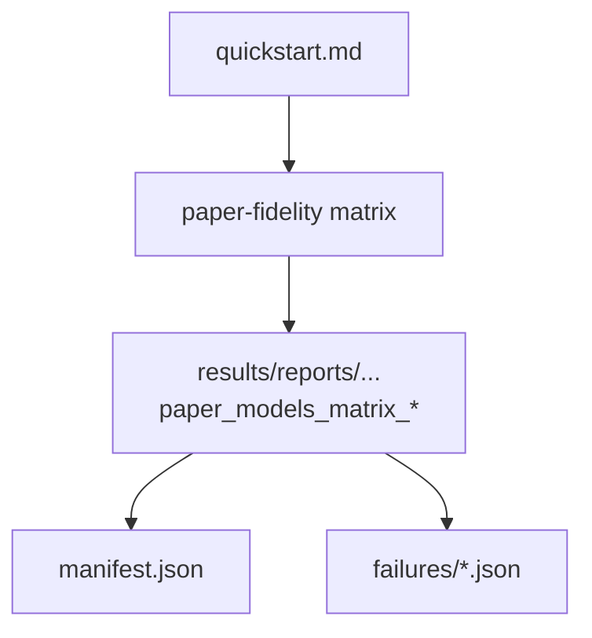

# Implementation Guide: Polish & cross-cutting docs

**Phase**: 9 | **Feature**: Paper-fidelity more models | **Tasks**: T026–T029

## Goal

Make the feature easy to adopt:

- tutorial docs mention the new paper-model scenarios and matrix runner
- a runbook explains how to read `manifest.json` and failure records
- quickstart is validated end-to-end and reflects the final CLI

**Path convention**: All repo paths are relative to `<WORKSPACE_ROOT>` (repository root).

## Public APIs

### T026: Update scenario tutorial

File: `docs/tutorial/in-depth/adv-tut-add-paper-fidelity-scenario.md`

Add references to:

- scenario files under `configs/paper_fidelity/scenario/`
- the matrix runner as a convenient multi-scenario executor

---

### T027: Update repo README entrypoints

File: `README.md`

Add a short section linking to:

- `docs/tutorial/howto/tut-paper-fidelity-static-and-dynamic.md`
- `specs/003-paper-fidelity-more-models/quickstart.md` (matrix command)

---

### T028: Add runbook for manifest + failures

Add: `docs/runbooks/paper_fidelity_matrix.md`

Include:

- where matrix manifests live
- how to interpret `runs[*].status`, `report_dir`, and `failure_record_json`
- common remediation for blockers (`insufficient GPUs`, `missing model files`, `OOM`, `unsupported model`)

---

### T029: Run quickstart end-to-end and refresh expected outputs

File: `specs/003-paper-fidelity-more-models/quickstart.md`

Keep it copy/paste runnable and consistent with the implemented `paper-fidelity matrix` flags.

## Phase Integration



## Testing

### Test Input

- Docs build environment (CPU-only) and, for end-to-end validation, a CUDA host with models present.

### Test Procedure

```bash
# CPU-only docs sanity
pixi run mkdocs build --strict

# Manual end-to-end (GPU required)
pixi run paper-fidelity matrix --scale small --workloads static,dynamic --include-cpu-overhead
```

### Test Output

- `mkdocs build` succeeds without broken links.
- Matrix run produces a manifest under `results/reports/<DATE>/paper_fidelity/paper_models_matrix_<run_id>/manifest.json`.

## References

- Spec: `specs/003-paper-fidelity-more-models/spec.md`
- Quickstart: `specs/003-paper-fidelity-more-models/quickstart.md`

## Implementation Summary

- **Implemented (T026)**: Scenario tutorial updated to mention paper-model scenarios + matrix runner (`docs/tutorial/in-depth/adv-tut-add-paper-fidelity-scenario.md`).
- **Implemented (T027)**: README entrypoints added for paper-fidelity docs (`README.md`).
- **Implemented (T028)**: Added runbook for interpreting `manifest.json` + failure records (`docs/runbooks/paper_fidelity_matrix.md`).
- **Implemented (T029)**: Updated quickstart commands/paths to match the implemented `paper-fidelity matrix` flags (`specs/003-paper-fidelity-more-models/quickstart.md`).
- **Sanity checks**: Ran `pixi run pytest -q` (CPU-only) and `pixi run mkdocs build --strict` (docs build).
