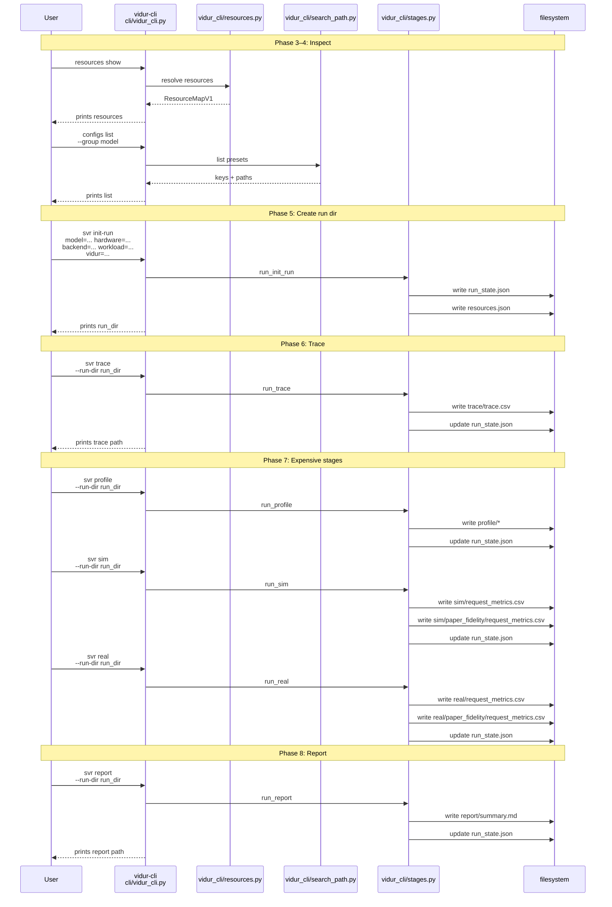
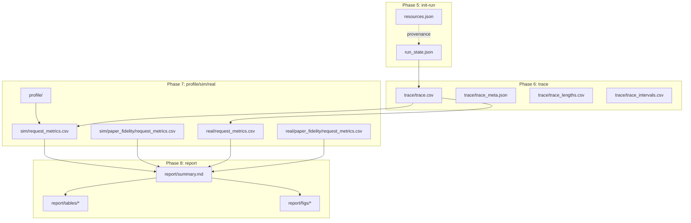
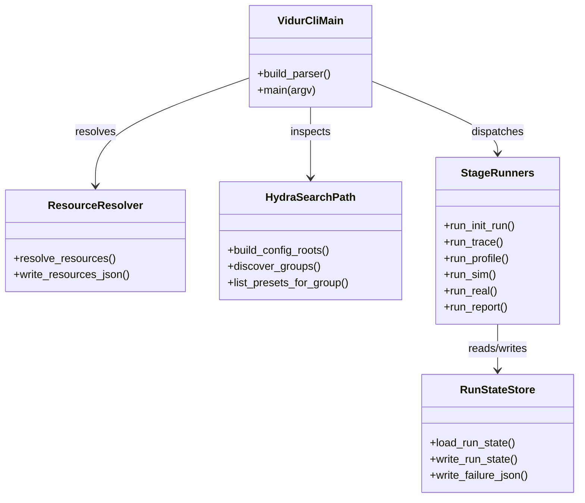
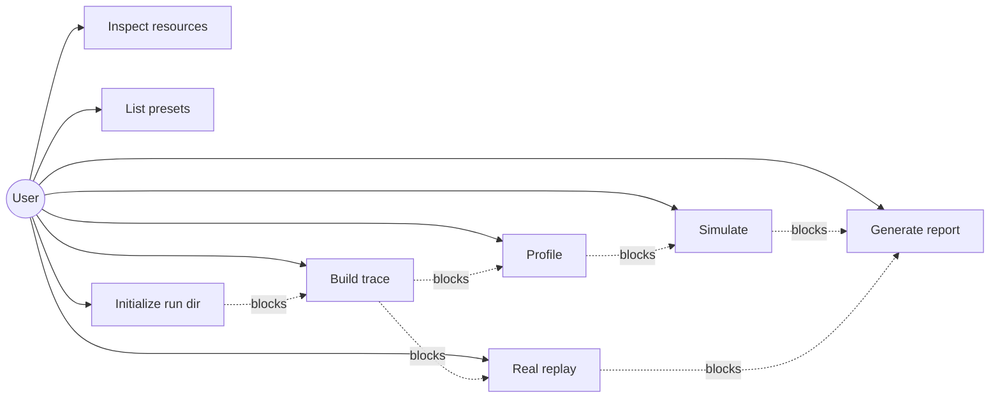
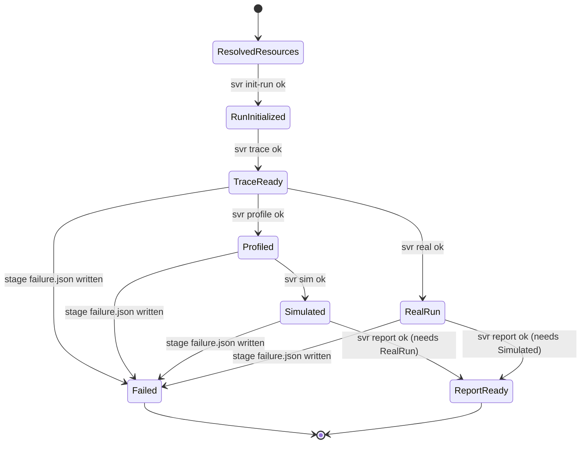

# Phase Integration Guide: Vidur CLI

**Feature**: `004-vidur-cli` | **Phases**: 9

## Overview

This feature introduces a first-class `vidur-cli` that turns the existing sim-vs-real workflow into a resumable, step-by-step pipeline:

- Inspect resources/config roots (`resources show`, `configs list`)
- Create a run directory (`svr init-run`)
- Materialize inputs (`svr trace`)
- Run expensive stages independently (`svr profile`, `svr sim`, `svr real`)
- Generate a comparison report (`svr report`)

The run directory is the integration spine: every stage reads `run_state.json` and writes outputs under `<run_dir>/...`, preserving provenance and failures (`failure.json`) without deleting partial artifacts.

**Path convention**: All repo paths are relative to `<WORKSPACE_ROOT>` (repository root). Commands can run from arbitrary `<PWD>` via `pixi run -m <WORKSPACE_ROOT> ...`.

## Implementation Status

All phases (1–9) are implemented and tracked as complete in `specs/004-vidur-cli/tasks.md`.

- End-to-end runbook: `tests/manual/vidur_cli_smoke.md`
- “Keep green” checklist: `specs/004-vidur-cli/checklists/smoke.md`
- Artifact layout contract: `specs/004-vidur-cli/contracts/artifacts.md`

## Phase Flow

**MUST HAVE: End-to-End Sequence Diagram**



## Artifact Flow Between Phases



## System Architecture



## Use Cases



## Activity Flow



## Inter-Phase Dependencies

### Phase 5 → Phase 6 (init-run → trace)

**Artifacts**:

- `<run_dir>/run_state.json` (created by `svr init-run`, updated by `svr trace`)
- `<run_dir>/resources.json` (snapshot used for provenance)

**Code dependencies**:

```python
# stages.py reads/writes the run state created in init-run
from gpu_simulate_test.vidur_cli.run_state import load_run_state, write_run_state
```

### Phase 6 → Phase 7 (trace → profile/sim/real)

**Artifacts**:

- `<run_dir>/trace/trace.csv` (canonical input)
- `<run_dir>/trace/trace_lengths.csv` + `trace_intervals.csv` (legacy compatibility for `run_vidur_sim`)

**Code dependencies**:

```python
from gpu_simulate_test.vidur_ext.sim_runner import run_vidur_sim
from gpu_simulate_test.vidur_cli.real_runner import run_token_length_replay
```

### Phase 7 → Phase 8 (sim/real → report)

**Artifacts**:

- `<run_dir>/sim/request_metrics.csv` + `token_metrics.csv`
- `<run_dir>/real/request_metrics.csv` + `token_metrics.csv`

**Code dependencies**:

```python
from gpu_simulate_test.vidur_cli.reporting import write_paper_fidelity_style_report
```

## Integration Testing

```bash
# Run from a scratch <PWD> using the repo’s Pixi env via -m:
mkdir -p /tmp/vidur-cli-e2e
cd /tmp/vidur-cli-e2e

GSIM_REPO_ROOT=<WORKSPACE_ROOT> \
RUN_DIR=$(
  pixi run -m <WORKSPACE_ROOT> vidur-cli svr init-run \
    model=qwen3_0_6b hardware=a100 backend=transformers workload=default vidur=default
)

# Deterministic trace from a tiny lengths CSV:
cat > lengths.csv <<'EOF'
num_prefill_tokens,num_decode_tokens
8,16
12,16
EOF
pixi run -m <WORKSPACE_ROOT> vidur-cli svr trace --run-dir "$RUN_DIR" --from-lengths ./lengths.csv

# Phase-7+8 stages require GPU/model assets for success; at minimum validate failure modes:
set +e
pixi run -m <WORKSPACE_ROOT> vidur-cli svr sim --run-dir "$RUN_DIR"
test -f "$RUN_DIR/failure.json"
set -e
```

## Critical Integration Points

1. **Workspace-root correctness**: `workspace_root` must never default to writing into `<WORKSPACE_ROOT>/tmp` unless explicitly configured.
2. **Run-dir resolution**: relative `--run-dir` must resolve relative to `workspace_root` (not `<PWD>`).
3. **Stage prerequisites**: missing prerequisites must be detected early and reported consistently.
4. **Artifact schema stability**: `resources.json`, `run_state.json`, and `failure.json` must keep schema v1 fields and store absolute paths.

## References

- Individual phase guides: `context/tasks/working/004-vidur-cli/impl-phase-*.md`
- Spec: `specs/004-vidur-cli/spec.md`
- Tasks breakdown: `specs/004-vidur-cli/tasks.md`
- Data model: `specs/004-vidur-cli/data-model.md`
- Contracts: `specs/004-vidur-cli/contracts/`
