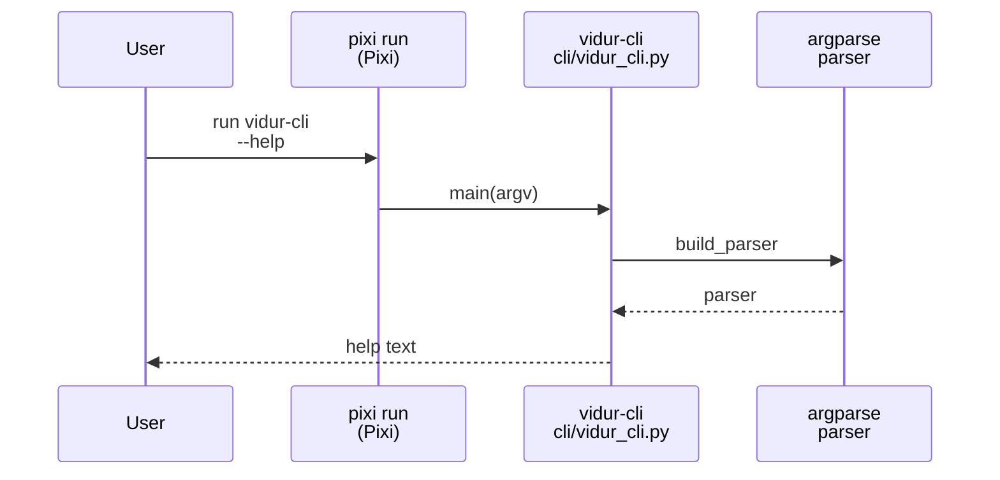
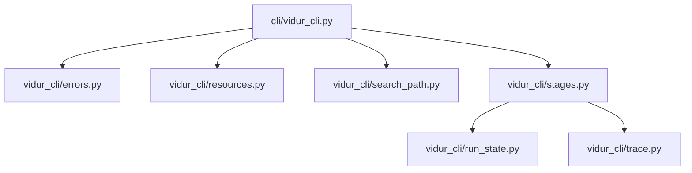

# Implementation Guide: Setup (scaffolding + entrypoint wiring)

**Phase**: 1 | **Feature**: Vidur CLI | **Tasks**: T001–T011

## Goal

Create the minimal scaffolding so the `vidur-cli` command exists and all helper modules are in place:

- Dev environment + submodules are initialized (Vidur + Sarathi-Serve).
- `vidur-cli` is runnable (console script + Pixi task).
- Code skeleton exists for `src/gpu_simulate_test/cli/vidur_cli.py` and helper modules under `src/gpu_simulate_test/vidur_cli/`.

**Path convention**: All repo paths are relative to `<WORKSPACE_ROOT>` (repository root). CLI examples may run from another directory `<PWD>` using `pixi run -m <WORKSPACE_ROOT> ...`.

## Public APIs

### T003: `vidur-cli` entrypoint wiring (`pyproject.toml`)

Add a console script and a Pixi task so the CLI can be invoked as either:

- `pixi run vidur-cli ...` (preferred end-user UX)
- `pixi run python -m gpu_simulate_test.cli.vidur_cli ...` (dev invocation)

```toml
# pyproject.toml

[project.scripts]
vidur-cli = "gpu_simulate_test.cli.vidur_cli:main"

[tool.pixi.tasks]
# Use a small wrapper to preserve "run-from-anywhere" semantics for relative paths.
vidur-cli = "bash scripts/vidur_cli_task.sh"
```

---

### T004: CLI module skeleton (`src/gpu_simulate_test/cli/vidur_cli.py`)

Create a stable entrypoint with a testable parser builder.

```python
# src/gpu_simulate_test/cli/vidur_cli.py

from __future__ import annotations

import argparse
from typing import Sequence


def build_parser() -> argparse.ArgumentParser:
    """Return the argparse parser for `vidur-cli`."""
    parser = argparse.ArgumentParser(prog="vidur-cli")
    # Global options + subcommands will be filled in Phase 2+.
    return parser


def main(argv: Sequence[str] | None = None) -> None:
    """Entry point for `vidur-cli`."""
    parser = build_parser()
    _ = parser.parse_args(list(argv) if argv is not None else None)
```

**Usage Flow**:



---

### T005–T011: Helper package skeleton (`src/gpu_simulate_test/vidur_cli/`)

Create module placeholders with stable names (filled in later phases):

```text
src/gpu_simulate_test/vidur_cli/
├── __init__.py
├── errors.py
├── resources.py
├── search_path.py
├── run_state.py
├── trace.py
└── stages.py
```

Recommended `__init__.py` exports:

```python
# src/gpu_simulate_test/vidur_cli/__init__.py

from gpu_simulate_test.vidur_cli.resources import resolve_resources
from gpu_simulate_test.vidur_cli.run_state import load_run_state, write_run_state

__all__ = [
    "load_run_state",
    "resolve_resources",
    "write_run_state",
]
```

## Phase Integration



## Testing

### Test Input

- None (this phase is scaffolding only).

### Test Procedure

```bash
# From anywhere (keeps <PWD> independent from the repo root):
mkdir -p /tmp/vidur-cli-smoke
cd /tmp/vidur-cli-smoke

# Verify module is importable in the Pixi env:
pixi run -m <WORKSPACE_ROOT> python -c "import gpu_simulate_test.cli.vidur_cli as v; print(v.build_parser().prog)"

# Verify the CLI help path is wired:
pixi run -m <WORKSPACE_ROOT> vidur-cli --help
```

### Test Output

- The `python -c ...` prints `vidur-cli`.
- The help command exits `0` and prints a help screen (even if no subcommands are wired yet).

## References

- Spec: `specs/004-vidur-cli/spec.md`
- Plan: `specs/004-vidur-cli/plan.md`
- Research: `specs/004-vidur-cli/research.md`

## Implementation Summary

Completed (T001–T011).

- Added the `vidur-cli` console script in `pyproject.toml` and a Pixi task wrapper in `scripts/vidur_cli_task.sh` (uses `INIT_CWD` so relative paths resolve relative to the user’s invocation directory, not the repo root).
- Created the `src/gpu_simulate_test/vidur_cli/` helper package with the phase-1 module skeletons: `errors.py`, `resources.py`, `search_path.py`, `run_state.py`, `trace.py`, `stages.py`.
- Basic wiring check: `pixi run -m <WORKSPACE_ROOT> vidur-cli --help`
