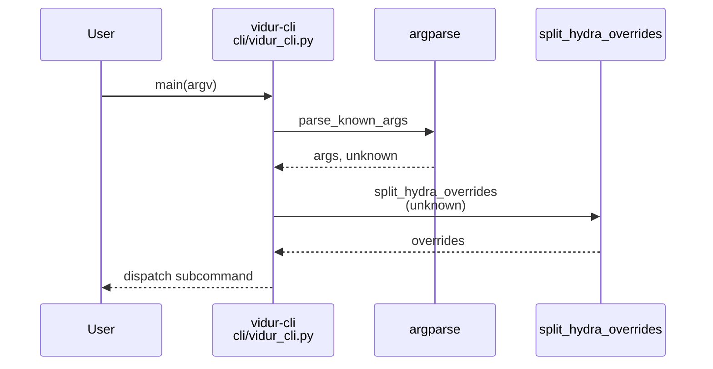
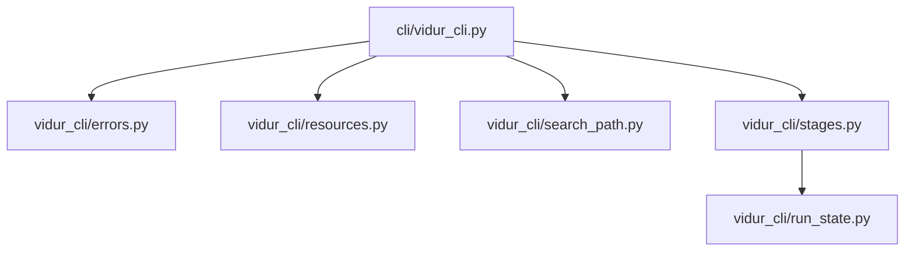

# Implementation Guide: Foundational (argparse + configs + run-state plumbing)

**Phase**: 2 | **Feature**: Vidur CLI | **Tasks**: T012–T022

## Goal

Build the shared plumbing that all later user stories depend on:

- Robust `argparse` CLI dispatch (global flags + subcommands).
- Trailing `key=value` handling for Hydra overrides.
- Config TOML parsing and resource-map JSON writing primitives.
- Hydra config-root resolution and config composition helper.
- Run state (`run_state.json`) and failure metadata (`failure.json`) read/write helpers.

**Path convention**: All repo paths are relative to `<WORKSPACE_ROOT>` (repository root). For “run-from-anywhere” manual tests, prefer `pixi run -m <WORKSPACE_ROOT> ...` from a separate `<PWD>`.

## Public APIs

### T012–T013: CLI parser + override splitting (`src/gpu_simulate_test/cli/vidur_cli.py`)

Model the command surface from the contracts:

- `specs/004-vidur-cli/contracts/cli.md`

Recommended parsing primitives:

```python
# src/gpu_simulate_test/cli/vidur_cli.py

from __future__ import annotations

import argparse
from dataclasses import dataclass
from typing import Sequence


@dataclass(frozen=True)
class GlobalOptions:
    user_config: str | None
    config_dirs: list[str]
    print_resolved: bool


def split_hydra_overrides(unknown_args: list[str]) -> list[str]:
    """Convert argparse unknown args to Hydra overrides.

    Rules (per spec):
    - Accept only `key=value` pairs
    - No `--` delimiter required
    - Reject any unknown arg without `=`
    """
    overrides: list[str] = []
    for item in unknown_args:
        if "=" not in item:
            raise ValueError(f"Unexpected argument (expected key=value override): {item!r}")
        overrides.append(item)
    return overrides


def build_parser() -> argparse.ArgumentParser:
    parser = argparse.ArgumentParser(prog="vidur-cli")
    parser.add_argument("--user-config", default=None)
    parser.add_argument("--config-dir", action="append", default=[])
    parser.add_argument("--print-resolved", action="store_true", default=False)
    sub = parser.add_subparsers(dest="cmd", required=True)
    # Subcommands are filled in later phases.
    return parser


def main(argv: Sequence[str] | None = None) -> None:
    parser = build_parser()
    args, unknown = parser.parse_known_args(list(argv) if argv is not None else None)
    _ = split_hydra_overrides(list(unknown))
```

**Usage Flow**:



---

### T014: Top-level error handling (`src/gpu_simulate_test/vidur_cli/errors.py`)

Unify “actionable failures” into one exception type so every command has consistent:

- exit code (non-zero)
- readable message
- optional context fields (e.g., attempted sources)

```python
# src/gpu_simulate_test/vidur_cli/errors.py

from __future__ import annotations

from dataclasses import dataclass
from typing import Any


@dataclass(frozen=True)
class UserFacingError(RuntimeError):
    message: str
    hint: str | None = None
    context: dict[str, Any] | None = None
    exit_code: int = 2

    def format_stderr(self) -> str:
        lines = [self.message]
        if self.hint:
            lines.append(f"Hint: {self.hint}")
        if self.context:
            lines.append(f"Context: {self.context}")
        return "\n".join(lines)
```

---

### T015–T016: TOML parsing + resources.json writer (`src/gpu_simulate_test/vidur_cli/resources.py`)

Implement stdlib-only TOML parsing (`tomllib`) and a JSON writer aligned with:

- Data model: `specs/004-vidur-cli/data-model.md`
- Schema: `specs/004-vidur-cli/contracts/resources.schema.json`

```python
# src/gpu_simulate_test/vidur_cli/resources.py

from __future__ import annotations

from dataclasses import dataclass
from pathlib import Path
from typing import Any, Literal, Mapping

from gpu_simulate_test.io import utcnow_iso, write_json


ResolvedSource = Literal["env", "config_toml", "repo_fallback", "pwd_default"]
ConfigTomlSource = Literal["flag", "env", "default"]


@dataclass(frozen=True)
class ResolvedPath:
    value: Path
    source: ResolvedSource
    details: dict[str, Any] | None = None


def write_resources_json(out_path: Path, payload: Mapping[str, Any]) -> Path:
    """Write `resources.json` and return the absolute path."""
    write_json(out_path, payload)
    return out_path.resolve()
```

---

### T017–T019: Hydra config roots + composition (`src/gpu_simulate_test/vidur_cli/search_path.py`)

Implement the config-root precedence and a composition helper:

1. `--config-dir` (in order)
2. `GSIM_VIDUR_CLI_HYDRA_CONFIG_DIRS` (split by `os.pathsep`)
3. `hydra.config_dirs` from config TOML
4. Repo fallback: `<repo_root>/configs/compare_vidur_real`

```python
# src/gpu_simulate_test/vidur_cli/search_path.py

from __future__ import annotations

import os
from dataclasses import dataclass
from pathlib import Path
from typing import Iterable


@dataclass(frozen=True)
class ConfigRoots:
    roots: list[Path]


def build_config_roots(
    *,
    repo_root: Path,
    cli_config_dirs: Iterable[str],
    env_config_dirs: str | None,
    toml_config_dirs: Iterable[str],
) -> ConfigRoots:
    roots: list[Path] = []
    for raw in list(cli_config_dirs) + list(_split_env_dirs(env_config_dirs)) + list(toml_config_dirs):
        roots.append(Path(raw).expanduser().resolve())
    roots.append((repo_root / "configs" / "compare_vidur_real").resolve())
    return ConfigRoots(roots=roots)


def _split_env_dirs(value: str | None) -> list[str]:
    if not value:
        return []
    return [p for p in value.split(os.pathsep) if p]
```

> Compose helper should use Hydra programmatic composition (`initialize`/`compose`) and apply injected overrides for resolved resources (see design decision “Mode A” in `context/design/vidur-cli/design-of-vidur-cli.md`).

---

### T020–T022: Run state + failure writing (`src/gpu_simulate_test/vidur_cli/run_state.py`)

Implement schema-aligned read/write primitives:

- Schema: `specs/004-vidur-cli/contracts/run_state.schema.json`
- Schema: `specs/004-vidur-cli/contracts/failure.schema.json`

```python
# src/gpu_simulate_test/vidur_cli/run_state.py

from __future__ import annotations

from dataclasses import dataclass
from pathlib import Path
from typing import Any, Literal, Mapping

from gpu_simulate_test.io import utcnow_iso, write_json


StageName = Literal["init-run", "trace", "profile", "sim", "real", "report", "resources", "configs"]


def write_failure_json(*, run_dir: Path, stage: StageName, error_type: str, message: str, context: Mapping[str, Any] | None) -> Path:
    payload: dict[str, Any] = {
        "schema_version": "v1",
        "failed_at": utcnow_iso(),
        "stage": stage,
        "error_type": error_type,
        "message": message,
    }
    if context:
        payload["context"] = dict(context)
    out = run_dir / "failure.json"
    write_json(out, payload)
    return out.resolve()
```

## Phase Integration



## Testing

### Test Input

- A scratch directory (as `<PWD>`) for “run-from-anywhere” behavior:
  - `/tmp/vidur-cli-foundation-smoke/`

### Test Procedure

```bash
mkdir -p /tmp/vidur-cli-foundation-smoke
cd /tmp/vidur-cli-foundation-smoke

# Parser + override splitting should work without executing a real subcommand yet.
pixi run -m <WORKSPACE_ROOT> python -c "from gpu_simulate_test.cli.vidur_cli import split_hydra_overrides; print(split_hydra_overrides(['a=b','c=d']))"
```

### Test Output

- The command prints `['a=b', 'c=d']` and exits `0`.

## References

- Spec: `specs/004-vidur-cli/spec.md`
- Data model: `specs/004-vidur-cli/data-model.md`
- Contracts: `specs/004-vidur-cli/contracts/`
- Design: `context/design/vidur-cli/design-of-vidur-cli.md`

## Implementation Summary

Completed (T012–T022).

- CLI plumbing: `src/gpu_simulate_test/cli/vidur_cli.py` implements global flags (`--user-config`, `--config-dir`, `--print-resolved`), subcommand dispatch, and `split_hydra_overrides()` (enforces trailing `key=value` overrides).
- Error model: `src/gpu_simulate_test/vidur_cli/errors.py` defines `UserFacingError` and `format_exception_for_cli()` (consistent stderr formatting + exit codes).
- Resource primitives: `src/gpu_simulate_test/vidur_cli/resources.py` implements stdlib `tomllib` parsing (`load_project_config_toml`) and `resources.json` writing (`write_resources_json`, schema v1).
- Hydra helpers: `src/gpu_simulate_test/vidur_cli/search_path.py` implements config-root resolution (`build_config_roots`), filesystem discovery (`discover_groups`, `list_presets_for_group`), and programmatic composition (`compose_config`).
- Run state + failures: `src/gpu_simulate_test/vidur_cli/run_state.py` implements `run_state.json` read/write (schema v1), `failure.json` writing + stage wrapper (`run_with_failure_json`), run-dir normalization (`normalize_run_dir`), and prerequisite helpers (`require_file`, `require_dir`).
