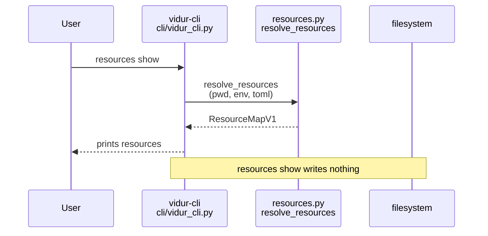
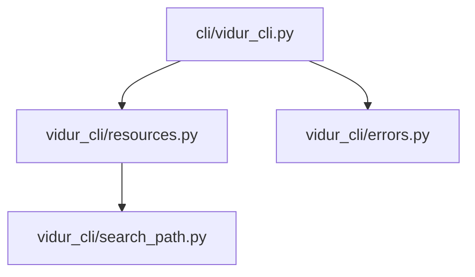

# Implementation Guide: US1 preflight resource resolution

**Phase**: 3 | **Feature**: Vidur CLI | **Tasks**: T023–T030

## Goal

Make resource resolution explicit and safe before a run:

- Resolve `repo_root`, `models_root`, `datasets_root`, `workspace_root`, and the config TOML path.
- Record provenance (env vs config TOML vs repo fallback vs pwd default).
- Provide a `vidur-cli resources show` command and a `--print-resolved` preflight mode.
- On failure: exit non-zero with a message that lists sources tried and how to fix it.

**Path convention**: All repo paths are relative to `<WORKSPACE_ROOT>` (repository root). For run-from-anywhere validation, run commands from an arbitrary `<PWD>` with `pixi run -m <WORKSPACE_ROOT> ...`.

## Public APIs

### T023–T026: Resource resolution core (`src/gpu_simulate_test/vidur_cli/resources.py`)

Align the in-memory model and `resources.json` with:

- Data model: `specs/004-vidur-cli/data-model.md` (Resource Map entity)
- Schema: `specs/004-vidur-cli/contracts/resources.schema.json`

Recommended dataclasses:

```python
# src/gpu_simulate_test/vidur_cli/resources.py

from __future__ import annotations

from dataclasses import dataclass
from pathlib import Path
from typing import Any, Literal, Mapping

from gpu_simulate_test.io import build_env_snapshot, utcnow_iso, write_json


ResolvedSource = Literal["env", "config_toml", "repo_fallback", "pwd_default"]
ConfigTomlSource = Literal["flag", "env", "default"]
WorkspaceSource = Literal["env", "config_toml", "pwd_default"]


@dataclass(frozen=True)
class ResolvedPath:
    value: Path
    source: ResolvedSource
    details: dict[str, Any] | None = None


@dataclass(frozen=True)
class ResolvedWorkspace:
    value: Path
    source: WorkspaceSource
    details: dict[str, Any] | None = None


@dataclass(frozen=True)
class ResolvedConfigToml:
    path: Path
    source: ConfigTomlSource


@dataclass(frozen=True)
class ResourceMapV1:
    repo_root: ResolvedPath
    models_root: ResolvedPath
    datasets_root: ResolvedPath
    workspace_root: ResolvedWorkspace
    config_toml: ResolvedConfigToml
    hydra_config_roots: list[Path]

    def to_json(self) -> Mapping[str, Any]:
        return {
            "schema_version": "v1",
            "resolved_at": utcnow_iso(),
            "repo_root": _resolved_path(self.repo_root),
            "models_root": _resolved_path(self.models_root),
            "datasets_root": _resolved_path(self.datasets_root),
            "workspace_root": _resolved_workspace(self.workspace_root),
            "config_toml": {"path": str(self.config_toml.path), "source": self.config_toml.source},
            "hydra_config_roots": [str(p) for p in self.hydra_config_roots],
            "env_snapshot": build_env_snapshot(),
        }


def write_resources_json(*, run_dir: Path, resources: ResourceMapV1) -> Path:
    out = run_dir / "resources.json"
    write_json(out, resources.to_json())
    return out.resolve()


def _resolved_path(p: ResolvedPath) -> Mapping[str, Any]:
    out: dict[str, Any] = {"value": str(p.value), "source": p.source}
    if p.details:
        out["details"] = dict(p.details)
    return out


def _resolved_workspace(p: ResolvedWorkspace) -> Mapping[str, Any]:
    out: dict[str, Any] = {"value": str(p.value), "source": p.source}
    if p.details:
        out["details"] = dict(p.details)
    return out
```

Key rules to enforce:

- All paths written to JSON must be absolute/normalized (`Path(...).expanduser().resolve()`).
- `--user-config` and `GSIM_VIDUR_CLI_USER_CONFIG` relative paths resolve relative to `<PWD>` (not repo root).
- Defaults:
  - config TOML: `<PWD>/.vidur-config/default.toml` (optional; not an error if missing)
  - `repo_root`: `<PWD>` when neither env nor TOML provides it
  - `models_root`: `<repo_root>/models`
  - `datasets_root`: `<repo_root>/datasets`
  - `workspace_dir`: `"default"` ⇒ `<PWD>/.vidur-output/default`

---

### T027–T028: `resources show` + `--print-resolved` (`src/gpu_simulate_test/cli/vidur_cli.py`)

Add the `resources show` subcommand and the preflight printing path.

Recommended behavior:

- `vidur-cli resources show` prints the resolved resource map (ideally JSON matching `resources.json` schema).
- `vidur-cli --print-resolved <any command>` prints the resource map + config roots *before* executing, then proceeds.

**Usage Flow**:



---

### T029: Actionable failure messaging (`src/gpu_simulate_test/vidur_cli/errors.py`)

When a required resource cannot be resolved, raise a `UserFacingError` with:

- `message`: what is missing
- `context`: attempted sources (env var names, TOML keys, fallback path)
- `hint`: one concrete fix (set env var, add TOML key, pass `--user-config`)

## Phase Integration



## Testing

### Test Input

- A scratch working dir `<PWD>`:
  - `/tmp/vidur-cli-us1/`
- Optionally, a config TOML inside `<PWD>`:
  - `/tmp/vidur-cli-us1/.vidur-config/default.toml`

### Test Procedure

```bash
mkdir -p /tmp/vidur-cli-us1
cd /tmp/vidur-cli-us1

# Success case via env-provided repo_root (models/datasets fall back under the repo):
GSIM_REPO_ROOT=<WORKSPACE_ROOT> \
pixi run -m <WORKSPACE_ROOT> vidur-cli resources show

# Relative --user-config resolution (should use /tmp/vidur-cli-us1/my.toml):
cat > my.toml <<'EOF'
[resources]
repo_root = "<WORKSPACE_ROOT>"
workspace_dir = "default"
EOF
pixi run -m <WORKSPACE_ROOT> vidur-cli --user-config ./my.toml resources show

# Failure case (no env + no TOML + empty pwd):
env -u GSIM_REPO_ROOT -u GSIM_MODELS_ROOT -u GSIM_DATASETS_ROOT \
  pixi run -m <WORKSPACE_ROOT> vidur-cli resources show
```

### Test Output

- Success runs exit `0` and print a resource map that includes:
  - `repo_root.source == "env"` (first case) or `"config_toml"` (second case)
  - `config_toml.source == "flag"` for `--user-config ./my.toml`
- Failure run exits non-zero and prints:
  - which resource(s) are missing
  - sources attempted (env var, TOML key, fallback)
  - at least one fix step (e.g., “set GSIM_REPO_ROOT=...”)

## References

- Spec: `specs/004-vidur-cli/spec.md` (US1 + FR-003..FR-008)
- Data model: `specs/004-vidur-cli/data-model.md` (Resource Map)
- Contracts: `specs/004-vidur-cli/contracts/resources.schema.json`
- Design: `context/design/vidur-cli/design-of-vidur-cli.md` (resource precedence)

## Implementation Summary

TODO(after implementation): document the final env/TOML precedence and show a sample `resources show` output.

