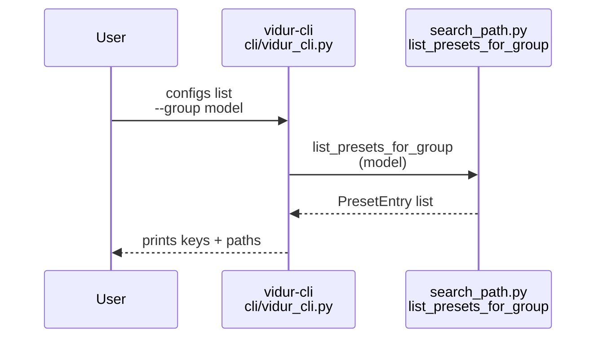
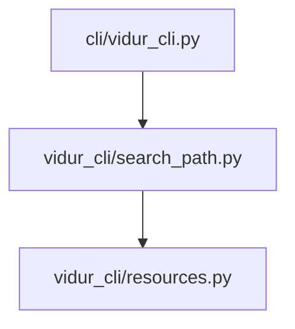

# Implementation Guide: US2 preset discovery (configs list)

**Phase**: 4 | **Feature**: Vidur CLI | **Tasks**: T031–T036

## Goal

Make available Hydra presets discoverable without reading repo internals:

- List config groups (`model`, `hardware`, `backend`, `workload`, `vidur`, …) based on the resolved config roots.
- For a specific group, list preset keys and their source paths.
- Warn when a higher-precedence config root shadows a preset that also exists in a lower-precedence root.

**Path convention**: All repo paths are relative to `<WORKSPACE_ROOT>` (repository root). Use `pixi run -m <WORKSPACE_ROOT> ...` when running from a scratch `<PWD>`.

## Public APIs

### T031–T033: Group + preset scanning (`src/gpu_simulate_test/vidur_cli/search_path.py`)

Implement filesystem-only discovery over config roots:

- A “group” is a directory like `<root>/model/`
- A “preset key” is a YAML file like `<root>/model/qwen3_0_6b.yaml` ⇒ key `qwen3_0_6b`

```python
# src/gpu_simulate_test/vidur_cli/search_path.py

from __future__ import annotations

from dataclasses import dataclass
from pathlib import Path


@dataclass(frozen=True)
class PresetEntry:
    group: str
    key: str
    active_path: Path
    all_paths: list[Path]


def discover_groups(config_roots: list[Path]) -> list[str]:
    """Return sorted unique group names across all config roots."""
    groups: set[str] = set()
    for root in config_roots:
        if not root.exists():
            continue
        for child in root.iterdir():
            if child.is_dir():
                groups.add(child.name)
    return sorted(groups)


def list_presets_for_group(*, group: str, config_roots: list[Path]) -> list[PresetEntry]:
    """Return preset keys and their source paths (first root wins)."""
    hits: dict[str, list[Path]] = {}
    for root in config_roots:
        d = root / group
        if not d.exists() or not d.is_dir():
            continue
        for y in sorted(d.glob("*.yaml")):
            hits.setdefault(y.stem, []).append(y.resolve())
    out: list[PresetEntry] = []
    for key, paths in sorted(hits.items(), key=lambda kv: kv[0]):
        out.append(PresetEntry(group=group, key=key, active_path=paths[0], all_paths=paths))
    return out
```

Override warning rule (per spec FR-010):

- If `len(all_paths) > 1`, emit a warning that includes:
  - the active path (highest precedence)
  - the shadowed path (lowest precedence) or all shadowed paths

---

### T034–T035: `configs list --group <group>` handler (`src/gpu_simulate_test/cli/vidur_cli.py`)

Implement:

- `vidur-cli configs list --group <group>`
- If group is unknown: exit non-zero and print available groups.

**Usage Flow**:



## Phase Integration



## Testing

### Test Input

- A scratch `<PWD>`: `/tmp/vidur-cli-us2/`
- Optional override config dir to test shadowing:
  - `/tmp/vidur-cli-us2/my_configs/model/qwen3_0_6b.yaml`

### Test Procedure

```bash
mkdir -p /tmp/vidur-cli-us2
cd /tmp/vidur-cli-us2

# List repo presets using env-provided repo_root:
GSIM_REPO_ROOT=<WORKSPACE_ROOT> \
pixi run -m <WORKSPACE_ROOT> vidur-cli configs list --group model

# Unknown group should fail and list available groups:
GSIM_REPO_ROOT=<WORKSPACE_ROOT> \
pixi run -m <WORKSPACE_ROOT> vidur-cli configs list --group does_not_exist

# Shadowing warning (make an empty yaml to test detection):
mkdir -p my_configs/model
touch my_configs/model/qwen3_0_6b.yaml
GSIM_REPO_ROOT=<WORKSPACE_ROOT> \
pixi run -m <WORKSPACE_ROOT> vidur-cli --config-dir ./my_configs configs list --group model
```

### Test Output

- For `--group model`, output includes the repo preset key `qwen3_0_6b` and its YAML path under `configs/compare_vidur_real/model/`.
- For unknown group, exit is non-zero and output lists valid groups (e.g., `model`, `hardware`, ...).
- With `--config-dir ./my_configs`, output warns that `qwen3_0_6b` is overridden and prints both paths.

## References

- Spec: `specs/004-vidur-cli/spec.md` (US2 + FR-009..FR-011)
- Contracts: `specs/004-vidur-cli/contracts/cli.md`
- Design: `context/design/vidur-cli/design-of-vidur-cli.md` (config search path + introspection)

## Implementation Summary

Completed (T031–T036).

- Implemented filesystem-only config discovery in `src/gpu_simulate_test/vidur_cli/search_path.py`:
  - `discover_groups(config_roots)` returns available groups across all roots.
  - `list_presets_for_group(group=..., config_roots=...)` returns `PresetEntry` with `active_path` (highest precedence) and `all_paths` (including shadowed paths).
- Implemented `vidur-cli configs list --group <group>` in `src/gpu_simulate_test/cli/vidur_cli.py`:
  - Output format: `<key>\\t<active_path>` per line.
  - Override warnings: prints `WARNING: preset overridden ...` to stderr when `len(all_paths) > 1` (includes active + shadowed paths).
  - Unknown group: exits non-zero with `available_groups` in the error context.
