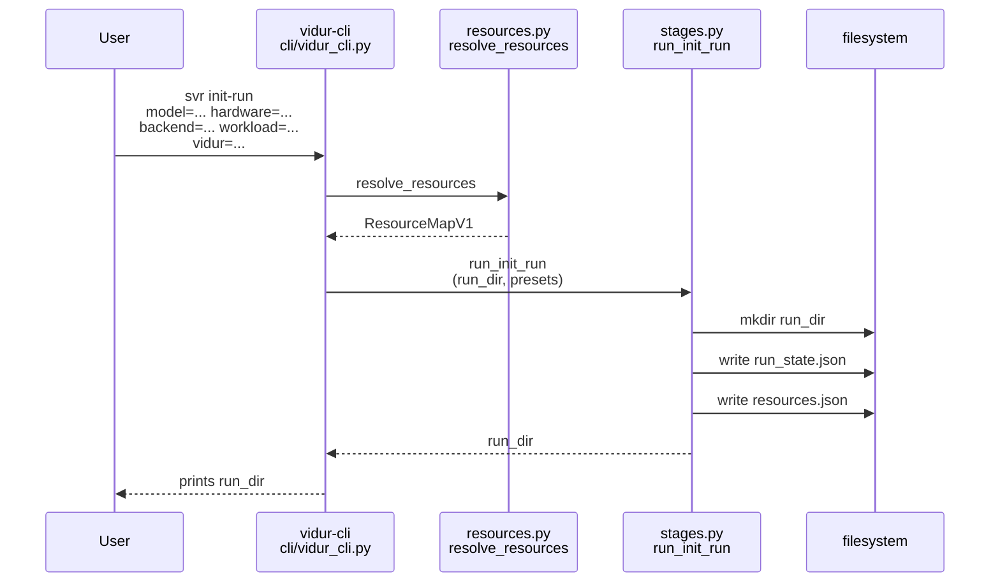
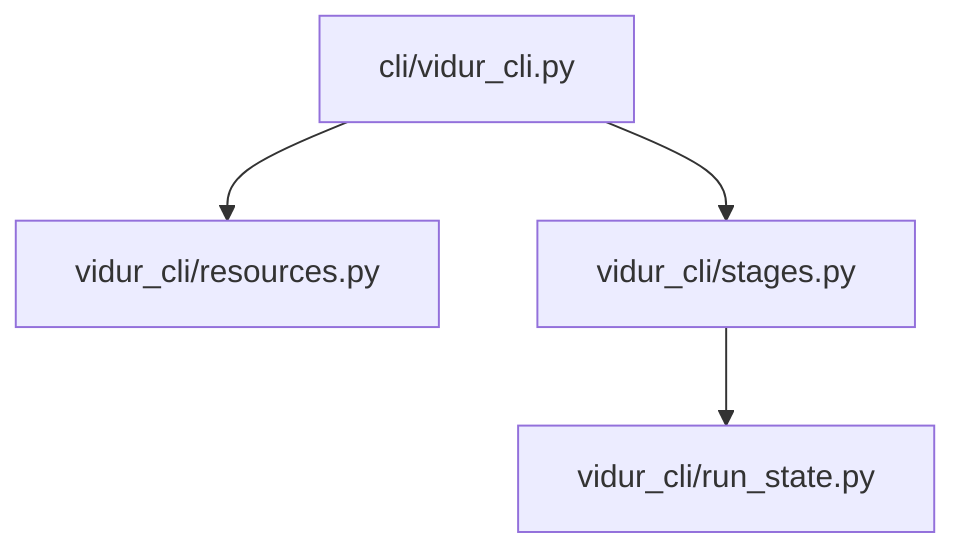

# Implementation Guide: US3 run workspace initialization (svr init-run)

**Phase**: 5 | **Feature**: Vidur CLI | **Tasks**: T037–T044

## Goal

Create a run directory that anchors the whole workflow:

- Parse and validate required preset selections (`model=... hardware=... backend=... workload=... vidur=...`).
- Allocate a run dir under the resolved workspace root:
  - default: `<workspace_root>/sim_vs_real/<run_tag>/`
  - if `--run-dir` is relative: interpret relative to `<workspace_root>`
- Write `run_state.json` and `resources.json` (schema v1), plus an optional `resolved_config.yaml`.
- On failure, write `failure.json` (when possible) and do not delete partial outputs.

**Path convention**: All repo paths are relative to `<WORKSPACE_ROOT>` (repository root). The run workspace is under `<PWD>` by default (unless `workspace_dir` is absolute).

## Public APIs

### T037: Run tag generation (`src/gpu_simulate_test/vidur_cli/run_state.py`)

Default run tag format: `preset+timestamp` (UTC), filesystem-safe.

```python
# src/gpu_simulate_test/vidur_cli/run_state.py

from __future__ import annotations

import re
from dataclasses import dataclass
from datetime import datetime, timezone
from pathlib import Path


@dataclass(frozen=True)
class Presets:
    model: str
    hardware: str
    backend: str
    workload: str
    vidur: str


def utc_timestamp_tag() -> str:
    return datetime.now(timezone.utc).strftime("%Y%m%dT%H%M%SZ")


def sanitize_tag(value: str) -> str:
    """Make a filesystem-safe tag (keep letters/digits/._+-)."""
    value = value.strip()
    value = re.sub(r"[^A-Za-z0-9._+-]+", "_", value)
    return value.strip("_") or "run"


def default_run_tag(presets: Presets) -> str:
    parts = [
        f"m={presets.model}",
        f"h={presets.hardware}",
        f"b={presets.backend}",
        f"w={presets.workload}",
        f"v={presets.vidur}",
        utc_timestamp_tag(),
    ]
    return sanitize_tag("+".join(parts))
```

---

### T039–T043: Init-run stage runner (`src/gpu_simulate_test/vidur_cli/stages.py`)

Create the run directory and write artifacts:

- `run_state.json` (schema v1)
- `resources.json` (schema v1)
- optional `resolved_config.yaml` (provenance snapshot; see notes below)

```python
# src/gpu_simulate_test/vidur_cli/stages.py

from __future__ import annotations

from pathlib import Path

from gpu_simulate_test.vidur_cli.resources import ResourceMapV1, write_resources_json
from gpu_simulate_test.vidur_cli.run_state import Presets, write_run_state


def run_init_run(*, run_dir: Path, presets: Presets, overrides: list[str], resources: ResourceMapV1) -> Path:
    """Create the run directory and initialize run artifacts."""
    run_dir.mkdir(parents=True, exist_ok=True)
    write_resources_json(run_dir=run_dir, resources=resources)
    write_run_state(run_dir=run_dir, presets=presets, overrides=overrides)
    return run_dir.resolve()
```

Notes on `resolved_config.yaml` (T042):

- Prefer writing a “run context” snapshot (resources + presets + config roots + overrides) rather than a single stage’s Hydra config.
- Keep it machine-readable and deterministic (OmegaConf YAML with `resolve=True`).

**Usage Flow**:



## Phase Integration



## Testing

### Test Input

- Scratch `<PWD>`: `/tmp/vidur-cli-us3/`
- Env var for repo_root:
  - `GSIM_REPO_ROOT=<WORKSPACE_ROOT>`

### Test Procedure

```bash
mkdir -p /tmp/vidur-cli-us3
cd /tmp/vidur-cli-us3

RUN_DIR=$(
  GSIM_REPO_ROOT=<WORKSPACE_ROOT> \
  pixi run -m <WORKSPACE_ROOT> vidur-cli svr init-run \
    model=qwen3_0_6b hardware=a100 backend=transformers workload=default vidur=default
)
echo "run_dir=$RUN_DIR"

test -f "$RUN_DIR/run_state.json"
test -f "$RUN_DIR/resources.json"
```

### Test Output

- The init command prints an absolute `<run_dir>` path and exits `0`.
- `<run_dir>/run_state.json` and `<run_dir>/resources.json` exist and contain absolute paths.

## References

- Spec: `specs/004-vidur-cli/spec.md` (US3 + FR-014..FR-016, FR-030)
- Data model: `specs/004-vidur-cli/data-model.md` (Run State entity)
- Contracts: `specs/004-vidur-cli/contracts/run_state.schema.json`
- Design: `context/design/vidur-cli/design-of-vidur-cli.md` (run dir policy)

## Implementation Summary

TODO(after implementation): summarize run tag rules and the exact run-dir layout created by init-run.

