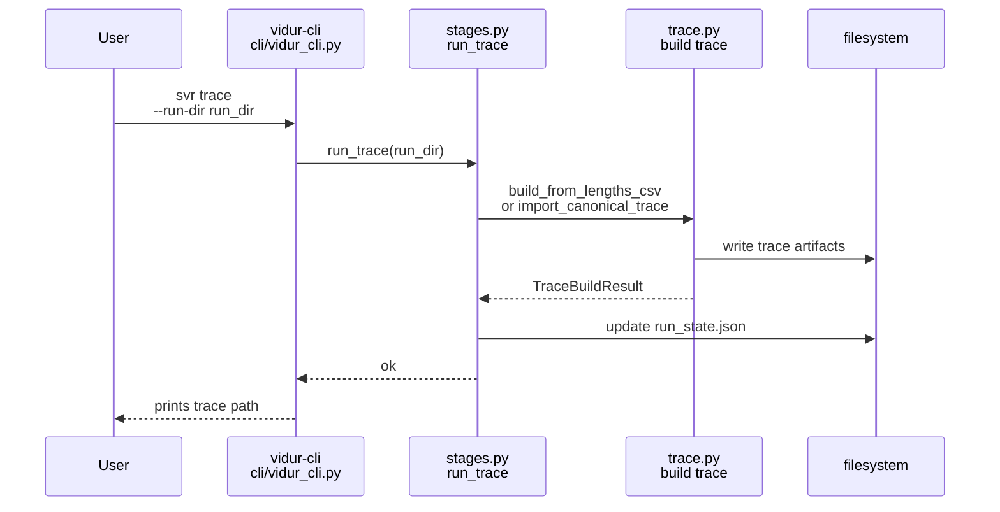
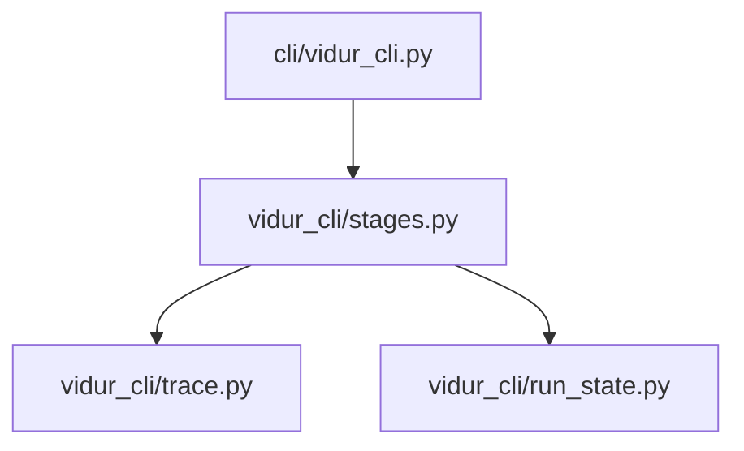

# Implementation Guide: US4 canonical trace materialization (svr trace)

**Phase**: 6 | **Feature**: Vidur CLI | **Tasks**: T045–T053

## Goal

Create a canonical token-length trace dataset under the run directory:

- `trace/trace.csv` (required columns: `request_id`, `arrival_time_ns`, `num_prefill_tokens`, `num_decode_tokens`)
- `trace/trace_meta.json` (schema v1)
- Compatibility outputs for existing runners:
  - `trace/trace_lengths.csv`
  - `trace/trace_intervals.csv`
- Update `run_state.json` with trace artifact pointers and status.

**Path convention**: All repo paths are relative to `<WORKSPACE_ROOT>` (repository root). Run artifacts live under `<run_dir>` created by US3.

## Public APIs

### T045–T050: Trace building helpers (`src/gpu_simulate_test/vidur_cli/trace.py`)

Validation rules (from `specs/004-vidur-cli/data-model.md`):

- `arrival_time_ns` is integer, `>= 0`, non-decreasing
- `num_prefill_tokens` and `num_decode_tokens` are integer, `>= 1`
- `request_id` is integer and unique

```python
# src/gpu_simulate_test/vidur_cli/trace.py

from __future__ import annotations

from dataclasses import dataclass
from pathlib import Path
from typing import Any, Literal

import pandas as pd

from gpu_simulate_test.io import assert_columns, utcnow_iso, write_csv, write_json
from gpu_simulate_test.workloads.arrival_schedule import ArrivalScheduleConfig, build_trace_intervals


TRACE_REQUIRED_COLUMNS = ["request_id", "arrival_time_ns", "num_prefill_tokens", "num_decode_tokens"]


@dataclass(frozen=True)
class TraceBuildResult:
    trace_csv: Path
    trace_meta_json: Path
    trace_lengths_csv: Path
    trace_intervals_csv: Path


def validate_canonical_trace(df: pd.DataFrame) -> None:
    assert_columns(df, TRACE_REQUIRED_COLUMNS, context="trace.csv")
    # (Implement numeric + monotonic checks; raise ValueError with actionable message.)


def import_canonical_trace(*, src_csv: Path, out_csv: Path) -> None:
    df = pd.read_csv(src_csv)
    validate_canonical_trace(df)
    out_csv.parent.mkdir(parents=True, exist_ok=True)
    df.to_csv(out_csv, index=False)


def build_from_lengths_csv(
    *,
    lengths_csv: Path,
    schedule: ArrivalScheduleConfig,
    out_dir: Path,
) -> TraceBuildResult:
    """Create canonical trace from a lengths-only CSV deterministically."""
    lengths = pd.read_csv(lengths_csv)
    assert_columns(lengths, ["num_prefill_tokens", "num_decode_tokens"], context=str(lengths_csv))
    n = len(lengths)

    intervals = build_trace_intervals(n, config=schedule)
    trace = pd.DataFrame(
        {
            "request_id": intervals["request_id"].astype(int),
            "arrival_time_ns": intervals["arrival_time_ns"].astype(int),
            "num_prefill_tokens": lengths["num_prefill_tokens"].astype(int),
            "num_decode_tokens": lengths["num_decode_tokens"].astype(int),
        }
    )
    validate_canonical_trace(trace)

    trace_dir = out_dir
    trace_csv = trace_dir / "trace.csv"
    trace_meta = trace_dir / "trace_meta.json"
    trace_lengths = trace_dir / "trace_lengths.csv"
    trace_intervals = trace_dir / "trace_intervals.csv"

    write_csv(trace_csv, trace, required_columns=TRACE_REQUIRED_COLUMNS)
    # Compatibility artifacts:
    write_csv(
        trace_lengths,
        trace[["request_id", "num_prefill_tokens", "num_decode_tokens"]].assign(prompt_id=trace["request_id"].astype(str)),
        required_columns=["request_id", "prompt_id", "num_prefill_tokens", "num_decode_tokens"],
    )
    write_csv(trace_intervals, intervals, required_columns=["request_id", "inter_arrival_ns", "arrival_time_ns"])

    meta: dict[str, Any] = {
        "schema_version": "v1",
        "created_at": utcnow_iso(),
        "trace_csv": str(trace_csv.resolve()),
        "source": {"kind": "lengths_csv", "path": str(Path(lengths_csv).expanduser().resolve())},
        "arrival_schedule": {
            "kind": schedule.kind,
            "seed": int(schedule.seed),
            "inter_arrival_ns": int(schedule.inter_arrival_ns),
            "poisson_rate_per_s": float(schedule.poisson_rate_per_s),
        },
    }
    write_json(trace_meta, meta)
    return TraceBuildResult(
        trace_csv=trace_csv.resolve(),
        trace_meta_json=trace_meta.resolve(),
        trace_lengths_csv=trace_lengths.resolve(),
        trace_intervals_csv=trace_intervals.resolve(),
    )
```

---

### T051–T052: `svr trace` stage runner + CLI wiring (`src/gpu_simulate_test/vidur_cli/stages.py`, `src/gpu_simulate_test/cli/vidur_cli.py`)

Stage runner responsibilities:

- Require `--run-dir` for all `svr` subcommands except `init-run`.
- Write outputs under `<run_dir>/trace/`.
- Update `run_state.json.artifacts.trace` with:
  - `trace_csv`, `trace_meta_json`, `status`, `ended_at`
- On error:
  - write `<run_dir>/failure.json` with `stage="trace"`
  - preserve partial outputs

**Usage Flow**:



## Phase Integration



## Testing

### Test Input

- A run directory `<run_dir>` created by US3.
- A minimal lengths-only CSV (for the `--from-lengths` path):
  - `/tmp/vidur-cli-us4/lengths.csv`

### Test Procedure

```bash
mkdir -p /tmp/vidur-cli-us4
cd /tmp/vidur-cli-us4

RUN_DIR=$(
  GSIM_REPO_ROOT=<WORKSPACE_ROOT> \
  pixi run -m <WORKSPACE_ROOT> vidur-cli svr init-run \
    model=qwen3_0_6b hardware=a100 backend=transformers workload=default vidur=default
)

cat > lengths.csv <<'EOF'
num_prefill_tokens,num_decode_tokens
8,16
12,16
EOF

pixi run -m <WORKSPACE_ROOT> vidur-cli svr trace --run-dir "$RUN_DIR" --from-lengths ./lengths.csv

test -f "$RUN_DIR/trace/trace.csv"
test -f "$RUN_DIR/trace/trace_meta.json"
test -f "$RUN_DIR/trace/trace_lengths.csv"
test -f "$RUN_DIR/trace/trace_intervals.csv"
```

### Test Output

- `svr trace` exits `0` and prints the primary output path (typically `<run_dir>/trace/trace.csv`).
- The run state contains `artifacts.trace.status == "ok"` and absolute pointers to the trace artifacts.

## References

- Spec: `specs/004-vidur-cli/spec.md` (US4 + FR-017..FR-019)
- Data model: `specs/004-vidur-cli/data-model.md` (Canonical Trace + Trace Meta)
- Contracts: `specs/004-vidur-cli/contracts/trace_meta.schema.json`

## Implementation Summary

TODO(after implementation): document supported trace inputs (`--import-trace`, `--from-lengths`, default) and determinism controls.

