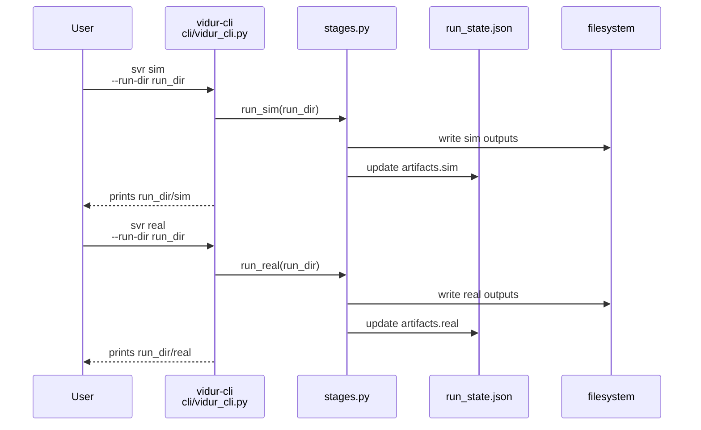
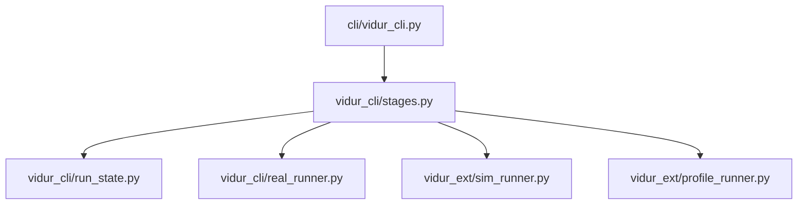

# Implementation Guide: US5 step-by-step stages (profile/sim/real)

**Phase**: 7 | **Feature**: Vidur CLI | **Tasks**: T054–T062

## Goal

Make expensive operations resumable by splitting them into independent stages:

- `svr profile`: generate a profiling root and record it in `run_state.json`
- `svr sim`: run Vidur simulation using trace + profiling root
- `svr real`: run real replay using the canonical trace (token-length replay)

Each stage must:

- require `--run-dir` (except init-run)
- fail fast when prerequisites are missing (no partial state mutation)
- write a `failure.json` on failure (and preserve partial outputs)
- print the primary output path on success

**Path convention**: All repo paths are relative to `<WORKSPACE_ROOT>` (repository root). Run artifacts live under `<run_dir>`.

## Public APIs

### T055: Prerequisite checks (`src/gpu_simulate_test/vidur_cli/run_state.py`)

Centralize “required artifacts” checks so every stage reports missing prerequisites consistently.

```python
# src/gpu_simulate_test/vidur_cli/run_state.py

from __future__ import annotations

from pathlib import Path

from gpu_simulate_test.vidur_cli.errors import UserFacingError


def require_file(path: Path, *, what: str) -> Path:
    if not path.exists():
        raise UserFacingError(
            f"Missing prerequisite: {what} ({path})",
            hint="Run the prerequisite stage first (see `vidur-cli --help`).",
        )
    return path
```

---

### T056: `svr profile` runner (`src/gpu_simulate_test/vidur_cli/stages.py`)

Suggested implementation approach:

- Use Vidur profiling wrapper: `gpu_simulate_test.vidur_ext.profile_runner.run_vidur_profiling`
- Output directory: `<run_dir>/profile`
- Record `profiling_root` and `include_cpu_overhead` in `run_state.json.artifacts.profile`

```python
# src/gpu_simulate_test/vidur_cli/stages.py

from __future__ import annotations

from pathlib import Path

from gpu_simulate_test.vidur_ext.profile_runner import VidurProfileInputs, run_vidur_profiling


def run_profile(*, run_dir: Path, model_id: str, hardware_id: str, include_cpu_overhead: bool, repo_root: Path) -> Path:
    out_dir = run_dir / "profile"
    inputs = VidurProfileInputs(
        model_id=model_id,
        hardware_id=hardware_id,
        profiling_root=out_dir,
        include_cpu_overhead=bool(include_cpu_overhead),
    )
    _ = run_vidur_profiling(inputs, repo_root=repo_root)
    return out_dir.resolve()
```

---

### T057: `svr sim` runner (`src/gpu_simulate_test/vidur_cli/stages.py`)

Suggested implementation approach:

- Reuse legacy sim runner: `gpu_simulate_test.vidur_ext.sim_runner.run_vidur_sim`
- Treat `<run_dir>/trace` as `workload_dir` (requires compatibility artifacts created by US4)
- Output directory: `<run_dir>/sim`
- Record `sim_run_dir` in `run_state.json.artifacts.sim`

---

### T058–T059: Token-length replay + `svr real` (`src/gpu_simulate_test/vidur_cli/real_runner.py`, `src/gpu_simulate_test/vidur_cli/stages.py`)

Implement a minimal “token-length replay” runner:

- Input: canonical `trace/trace.csv`
- For each row:
  - prefill length = `num_prefill_tokens`
  - decode length = `num_decode_tokens`
- Output in repo’s metrics schema:
  - `<run_dir>/real/request_metrics.csv`
  - `<run_dir>/real/token_metrics.csv`

```python
# src/gpu_simulate_test/vidur_cli/real_runner.py

from __future__ import annotations

from dataclasses import dataclass
from pathlib import Path

import pandas as pd

from gpu_simulate_test.real_bench.metrics import build_metrics_frames, write_run_outputs


@dataclass(frozen=True)
class RealReplayResult:
    out_dir: Path


def run_token_length_replay(
    *,
    trace_csv: Path,
    backend: str,
    model_id: str,
    model_ref: Path | None,
    device: str,
    out_dir: Path,
) -> RealReplayResult:
    """Replay token-length trace and write request/token metrics under out_dir.

    Note: backend-specific implementations should avoid requiring prompt text datasets.
    """
    trace = pd.read_csv(trace_csv)
    # (Validate required columns; run backend; build metrics frames; write outputs)
    return RealReplayResult(out_dir=out_dir.resolve())
```

**Usage Flow (svr sim + svr real)**:



## Phase Integration



## Testing

### Test Input

- A run directory `<run_dir>` with:
  - `trace/trace.csv` + compatibility files (`trace_lengths.csv`, `trace_intervals.csv`)
- GPU + model assets are required for successful `profile` and `sim`.

### Test Procedure

Fast failure-path verification (no GPU required):

```bash
mkdir -p /tmp/vidur-cli-us5
cd /tmp/vidur-cli-us5

RUN_DIR=$(
  GSIM_REPO_ROOT=<WORKSPACE_ROOT> \
  pixi run -m <WORKSPACE_ROOT> vidur-cli svr init-run \
    model=qwen3_0_6b hardware=a100 backend=transformers workload=default vidur=default
)

# `svr sim` should fail fast because profiling_root is missing.
set +e
pixi run -m <WORKSPACE_ROOT> vidur-cli svr sim --run-dir "$RUN_DIR"
test -f "$RUN_DIR/failure.json"
set -e
```

Full success-path smoke test (requires CUDA + valid model files):

```bash
pixi run -m <WORKSPACE_ROOT> vidur-cli svr trace   --run-dir "$RUN_DIR" --from-lengths <SOME_LENGTHS.csv>
pixi run -m <WORKSPACE_ROOT> vidur-cli svr profile --run-dir "$RUN_DIR"
pixi run -m <WORKSPACE_ROOT> vidur-cli svr sim     --run-dir "$RUN_DIR"
pixi run -m <WORKSPACE_ROOT> vidur-cli svr real    --run-dir "$RUN_DIR"
```

### Test Output

- Failure-path: command exits non-zero and writes `<run_dir>/failure.json` with `stage` set correctly.
- Success-path:
  - `<run_dir>/profile/` exists and `run_state.json.artifacts.profile.status == "ok"`
  - `<run_dir>/sim/request_metrics.csv` + `token_metrics.csv` exist
  - `<run_dir>/real/request_metrics.csv` + `token_metrics.csv` exist

## References

- Spec: `specs/004-vidur-cli/spec.md` (US5 + FR-020..FR-027)
- Data model: `specs/004-vidur-cli/data-model.md` (Run State + Failure)
- Contracts: `specs/004-vidur-cli/contracts/run_state.schema.json`, `specs/004-vidur-cli/contracts/failure.schema.json`
- Existing stage CLIs (legacy): `src/gpu_simulate_test/cli/{vidur_profile,vidur_sim,real_bench}.py`

## Implementation Summary

TODO(after implementation): document which backends are supported for token-length replay and the exact output directory layout under `<run_dir>/`.

