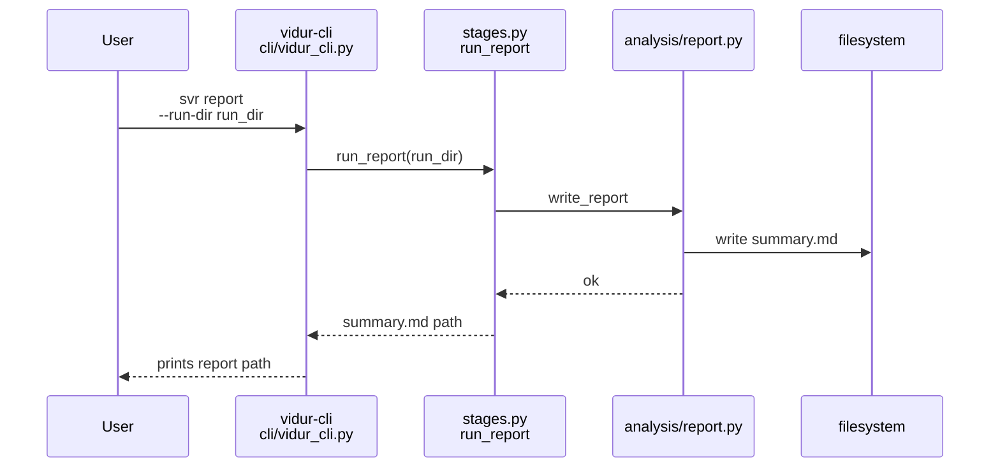
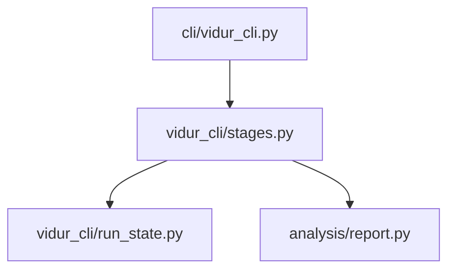

# Implementation Guide: US6 comparison report (svr report)

**Phase**: 8 | **Feature**: Vidur CLI | **Tasks**: T063–T068

## Goal

Generate a sim-vs-real comparison report as the final stage:

- Inputs: `run_state.json` must record `sim_run_dir` and `real_run_dir`
- Outputs under `<run_dir>/report/`:
  - `summary.md` (must include arrival kind + CPU overhead status; warn if CPU overhead disabled)
  - `tables/*` and `figs/*` (optional)
- Update `run_state.json.artifacts.report` and print the report path on success.

**Path convention**: All repo paths are relative to `<WORKSPACE_ROOT>` (repository root). Run artifacts live under `<run_dir>`.

## Public APIs

### T064: Report prerequisites (`src/gpu_simulate_test/vidur_cli/run_state.py`)

Add a helper that reads `run_state.json` and enforces prerequisites with actionable errors.

---

### T065–T067: Report stage runner (`src/gpu_simulate_test/vidur_cli/stages.py`)

Recommended implementation approach:

- Use the existing report writer to generate tables/figs:
  - `src/gpu_simulate_test/analysis/report.py`
- Use trace metadata + profile state to enrich `summary.md`:
  - Arrival kind from `<run_dir>/trace/trace_meta.json` (`arrival_schedule.kind`)
  - CPU overhead status from `run_state.json.artifacts.profile.include_cpu_overhead`

```python
# src/gpu_simulate_test/vidur_cli/stages.py

from __future__ import annotations

from pathlib import Path

from gpu_simulate_test.analysis.compare import align_tokens_by_actual_decode
from gpu_simulate_test.analysis.load_metrics import load_run_metrics
from gpu_simulate_test.analysis.report import ReportPaths, write_report


def run_report(*, run_dir: Path, real_run_dir: Path, sim_run_dir: Path) -> Path:
    out_dir = run_dir / "report"
    real = load_run_metrics(real_run_dir)
    sim = load_run_metrics(sim_run_dir)
    real_tok, sim_tok = align_tokens_by_actual_decode(real=real, sim=sim)

    paths = ReportPaths(
        out_dir=out_dir,
        summary_md=out_dir / "summary.md",
        tables_dir=out_dir / "tables",
        figs_dir=out_dir / "figs",
    )
    _ = write_report(
        paths,
        ttft_real=real.request_metrics["ttft_ns"].astype(float),
        ttft_sim=sim.request_metrics["ttft_ns"].astype(float),
        token_lat_real=real_tok["token_latency_ns"].astype(float),
        token_lat_sim=sim_tok["token_latency_ns"].astype(float),
        percentiles=[0.5, 0.9, 0.99],
        real_run_dir=real.run_dir,
        sim_run_dir=sim.run_dir,
    )
    return paths.summary_md.resolve()
```

**Usage Flow**:



## Phase Integration



## Testing

### Test Input

- A run directory `<run_dir>` with:
  - `run_state.json` containing `artifacts.sim.sim_run_dir` and `artifacts.real.real_run_dir`
  - Metrics present under those dirs (`request_metrics.csv`, `token_metrics.csv`)

### Test Procedure

Failure-path verification:

```bash
# If sim/real are missing, report should fail with an actionable message.
pixi run -m <WORKSPACE_ROOT> vidur-cli svr report --run-dir <run_dir>
```

Success-path smoke test (requires that sim + real have already run successfully):

```bash
pixi run -m <WORKSPACE_ROOT> vidur-cli svr report --run-dir <run_dir>
test -f "<run_dir>/report/summary.md"
```

### Test Output

- Failure-path: exits non-zero, prints which prerequisite is missing.
- Success-path:
  - `<run_dir>/report/summary.md` exists and includes:
    - arrival schedule kind
    - CPU overhead status and warning if disabled

## References

- Spec: `specs/004-vidur-cli/spec.md` (US6 + FR-025..FR-026)
- Existing reporting code: `src/gpu_simulate_test/analysis/report.py`
- Contracts: `specs/004-vidur-cli/contracts/cli.md`

## Implementation Summary

TODO(after implementation): summarize how the report stage reads run state, generates artifacts, and enriches the summary with parity-critical metadata.

