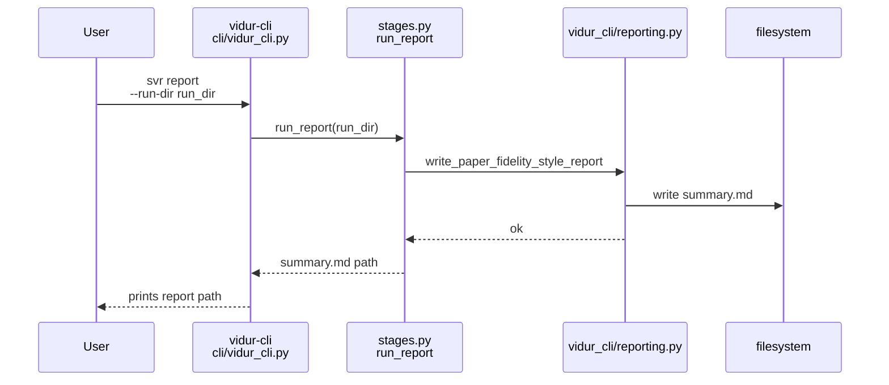
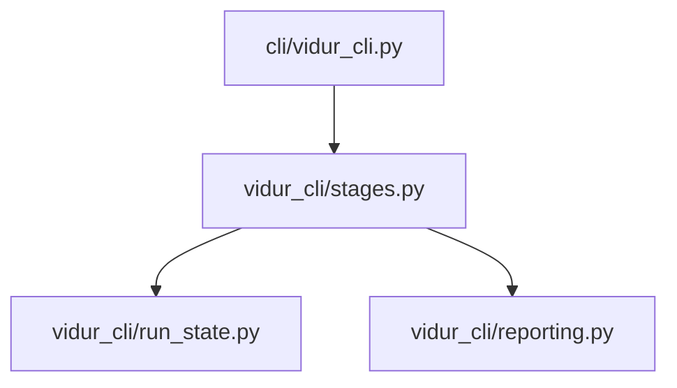

# Implementation Guide: US6 comparison report (svr report)

**Phase**: 8 | **Feature**: Vidur CLI | **Tasks**: T063–T068

## Goal

Generate a sim-vs-real comparison report as the final stage:

- Inputs: `run_state.json` must record `sim_run_dir` and `real_run_dir`
- Outputs under `<run_dir>/report/`:
  - `summary.md` (must include arrival kind + CPU overhead status; warn if CPU overhead disabled)
  - `tables/*` and `figs/*` (optional)
- Update `run_state.json.artifacts.report` and print the report path on success.

**Path convention**: All repo paths are relative to `<WORKSPACE_ROOT>` (repository root). Run artifacts live under `<run_dir>`.

## Public APIs

### T064: Report prerequisites (`src/gpu_simulate_test/vidur_cli/run_state.py`)

Add a helper that reads `run_state.json` and enforces prerequisites with actionable errors.

---

### T065–T067: Report stage runner (`src/gpu_simulate_test/vidur_cli/stages.py`)

Recommended implementation approach:

- Use the paper-fidelity scoring utilities to generate a paper-fidelity-style sim-vs-real report:
  - `src/gpu_simulate_test/vidur_cli/reporting.py` (`write_paper_fidelity_style_report`)
- Enrich the report with trace metadata + profile state:
  - Arrival kind/params from `<run_dir>/trace/trace_meta.json` (`arrival_schedule`)
  - CPU overhead status + CSV path from `artifacts.profile` + profiling root layout

```python
# src/gpu_simulate_test/vidur_cli/stages.py

from __future__ import annotations

from pathlib import Path

from gpu_simulate_test.vidur_cli.reporting import write_paper_fidelity_style_report


def run_report(
    *,
    run_dir: Path,
    sim_run_dir: Path,
    real_run_dir: Path,
    profiling_root: Path,
    include_cpu_overhead: bool,
) -> Path:
    report_dir = run_dir / "report"
    report_dir.mkdir(parents=True, exist_ok=True)
    summary_md = write_paper_fidelity_style_report(
        run_dir=run_dir,
        report_dir=report_dir,
        sim_run_dir=sim_run_dir,
        real_run_dir=real_run_dir,
        profiling_root=profiling_root,
        include_cpu_overhead=bool(include_cpu_overhead),
    )
    return summary_md
```

**Usage Flow**:



## Phase Integration



## Testing

### Test Input

- A run directory `<run_dir>` with:
  - `run_state.json` containing `artifacts.sim.sim_run_dir` and `artifacts.real.real_run_dir`
  - Metrics present under those dirs (`request_metrics.csv`, `token_metrics.csv`)

### Test Procedure

Failure-path verification:

```bash
# If sim/real are missing, report should fail with an actionable message.
pixi run -m <WORKSPACE_ROOT> vidur-cli svr report --run-dir <run_dir>
```

Success-path smoke test (requires that sim + real have already run successfully):

```bash
pixi run -m <WORKSPACE_ROOT> vidur-cli svr report --run-dir <run_dir>
test -f "<run_dir>/report/summary.md"
```

### Test Output

- Failure-path: exits non-zero, prints which prerequisite is missing.
- Success-path:
  - `<run_dir>/report/summary.md` exists and includes:
    - arrival schedule kind
    - CPU overhead status and warning if disabled

## References

- Spec: `specs/004-vidur-cli/spec.md` (US6 + FR-025..FR-026)
- Report writer: `src/gpu_simulate_test/vidur_cli/reporting.py`
- Contracts: `specs/004-vidur-cli/contracts/cli.md`

## Implementation Summary

Completed (T063–T068).

- CLI surface in `src/gpu_simulate_test/cli/vidur_cli.py`: added `svr report --run-dir <run_dir>` (prints the report path on success).
- Report stage runner in `src/gpu_simulate_test/vidur_cli/stages.py`:
  - Requires `artifacts.sim` and `artifacts.real` in `run_state.json` (fails fast with actionable errors if missing).
  - Generates `<run_dir>/report/summary.md` using `src/gpu_simulate_test/vidur_cli/reporting.py` (`write_paper_fidelity_style_report`):
    - Scores table for paper-fidelity normalized latency metrics (p50/p95, no Verdict column).
    - ECDF + percentiles SVGs for each scored metric under `<run_dir>/report/figs/`.
    - Provenance snapshots under `<run_dir>/report/run_meta.json` and `<run_dir>/report/scores.json`.
  - Adds an explicit “Config (apple-to-apple)” section listing parity-critical sim/real knobs (max_tokens, batch/chunk sizes, TP/PP, cpu_overhead modeling) and flags mismatches/unknowns.
  - Records `artifacts.report` (`report_dir`, `summary_md`, status, ended_at, overrides) and writes `failure.json` on errors.
