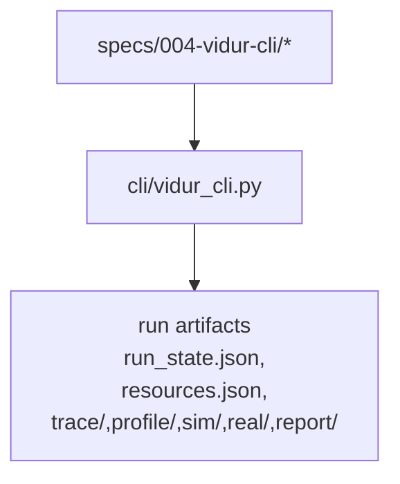

# Implementation Guide: Polish & cross-cutting concerns

**Phase**: 9 | **Feature**: Vidur CLI | **Tasks**: T069–T073

## Goal

Make the feature usable day-to-day:

- Improve CLI help text and examples.
- Reconcile implemented artifacts with the written contract.
- Add a manual smoke checklist for end-to-end validation.
- Ensure dependency wiring is stable after adding the console script / Pixi task.

**Path convention**: All repo paths are relative to `<WORKSPACE_ROOT>` (repository root). Run artifacts are created under a `<PWD>` workspace by default.

## Public APIs

### T069: CLI help polish (`src/gpu_simulate_test/cli/vidur_cli.py`)

Focus areas:

- Each subcommand has a clear one-line description.
- Required flags are obvious (especially `--run-dir`).
- `--print-resolved` is documented as a global flag.
- Provide at least one example invocation per subcommand.

---

### T071–T072: Manual smoke checklist docs (`tests/manual/vidur_cli_smoke.md`, `specs/004-vidur-cli/checklists/smoke.md`)

Document:

- prerequisites (Pixi env, submodules, GPU requirements)
- end-to-end commands
- expected artifact tree under `<run_dir>`
- common failure modes and where to find `failure.json`

## Phase Integration



## Testing

### Test Input

- End-to-end run prerequisites:
  - Vidur + Sarathi submodules initialized
  - CUDA-capable host (for profile/sim/real success path)
  - Model assets exist (per chosen preset)

### Test Procedure

Run the smoke checklist once it exists:

```bash
pixi run -m <WORKSPACE_ROOT> python -m gpu_simulate_test.cli.vidur_cli --help
cat tests/manual/vidur_cli_smoke.md
```

### Test Output

- The manual checklist is executable and matches actual on-disk artifacts produced by the workflow.

## References

- Contracts: `specs/004-vidur-cli/contracts/artifacts.md`
- Quickstart: `specs/004-vidur-cli/quickstart.md`
- Spec: `specs/004-vidur-cli/spec.md`

## Implementation Summary

Completed (T069–T073).

- Help/UX polish: `src/gpu_simulate_test/cli/vidur_cli.py` includes improved `--help` text, subcommand descriptions, and an epilog with end-to-end examples (including `--print-resolved`).
- Run-dir contract reconciliation: `specs/004-vidur-cli/contracts/artifacts.md` reflects the implemented run directory layout (schemas + required/optional files).
- Smoke docs:
  - `tests/manual/vidur_cli_smoke.md` provides a human-run CPU-only + GPU-required checklist.
  - `specs/004-vidur-cli/checklists/smoke.md` provides a short v1 “keep green” checklist.
- Pixi wiring stability: `pyproject.toml` defines a `vidur-cli` console script plus a Pixi task that uses `scripts/vidur_cli_task.sh` to preserve run-from-anywhere semantics for relative paths.
