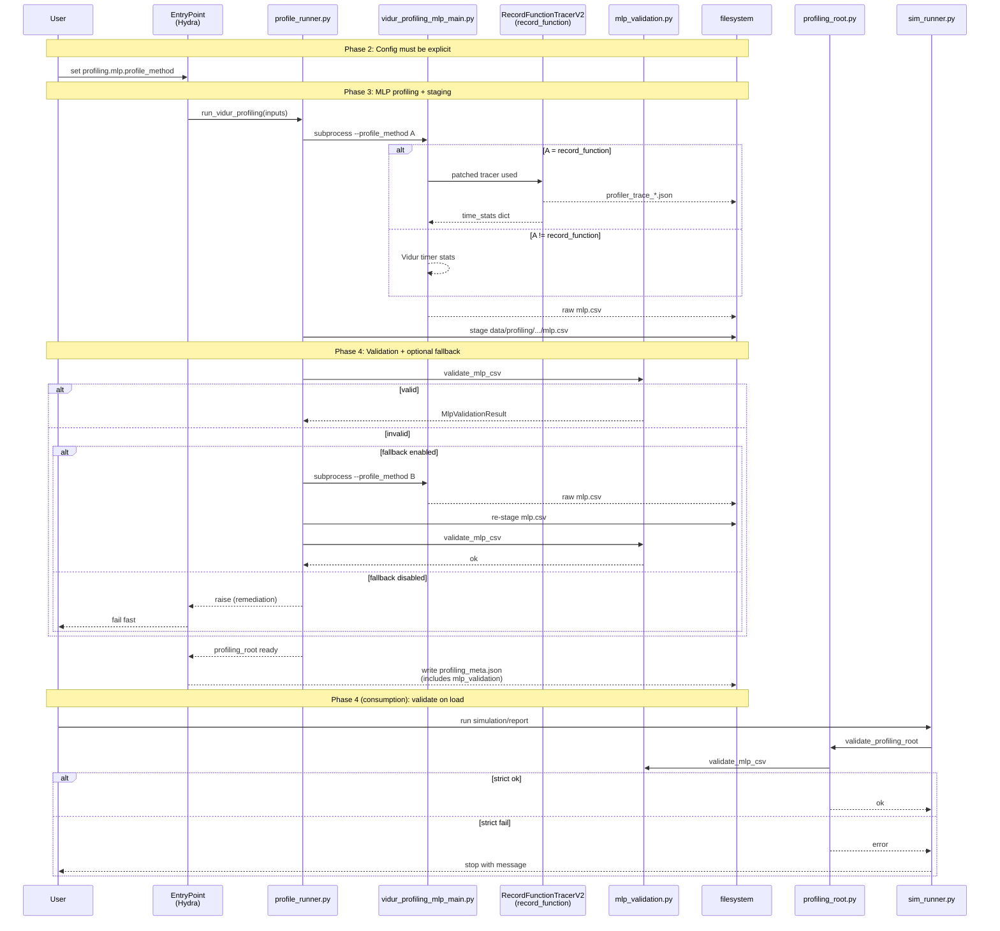
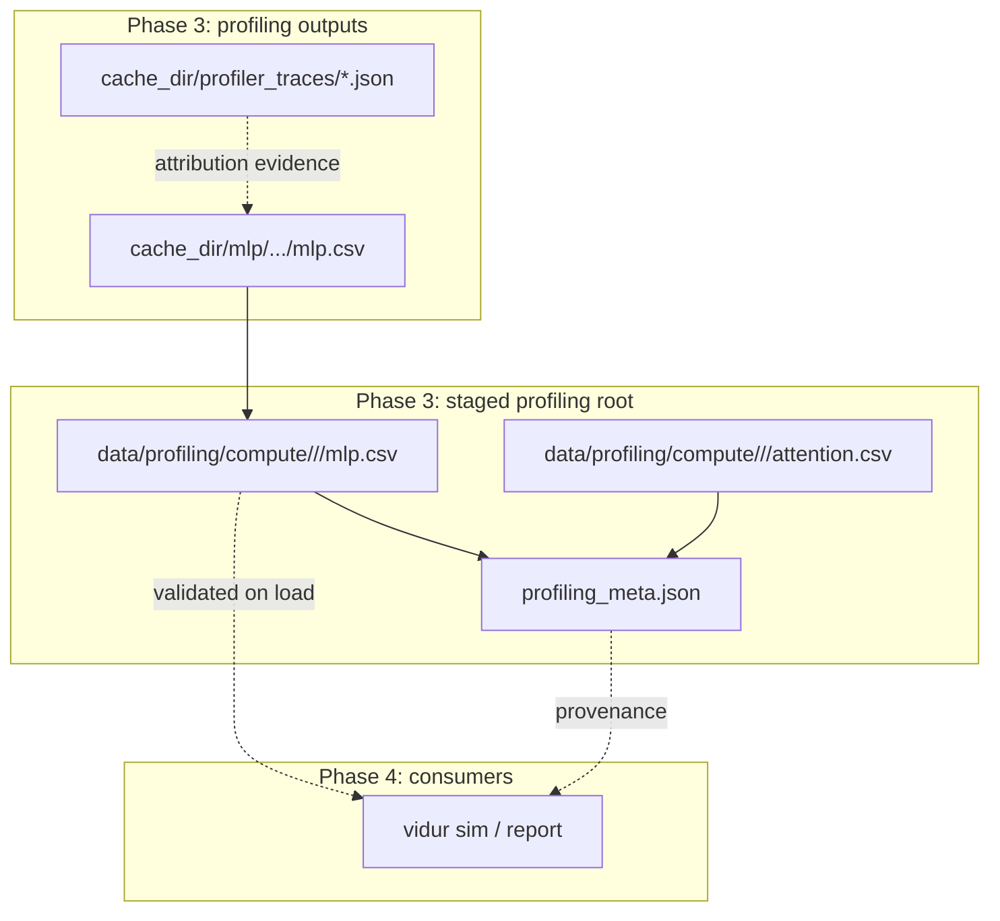
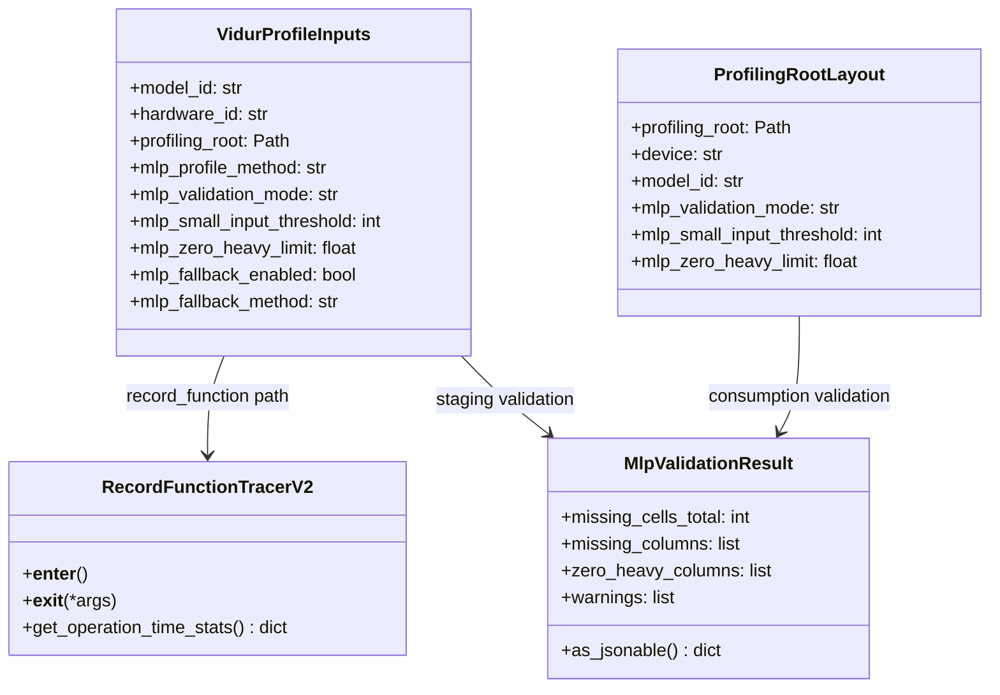
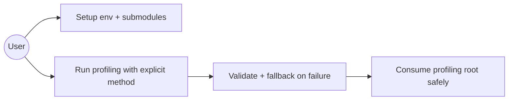
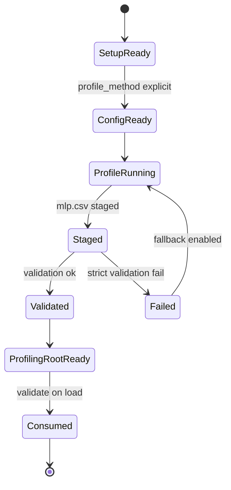

# Phase Integration Guide: Reliable Vidur MLP profiling for driver-launched kernels

**Feature**: `005-vidur-mlp-cuda-driver` | **Phases**: 6

## Overview

This feature fixes a profiling fidelity failure mode where Vidur’s record-function-based MLP profiler can miss GPU time when kernels are launched via the CUDA driver path (`cuda_driver`), producing missing timings that were previously masked as `0.0` during staging.

The integrated solution has three pillars:

1. **Explicit per-run method selection** (`profiling.mlp.profile_method`) to remove hidden defaults.
2. **Robust attribution** for record-function profiling via `RecordFunctionTracerV2` (counts both runtime and driver launch paths).
3. **Strict-by-default validation** at both staging and consumption, with an opt-in automatic fallback method for recovery.

**Path convention**: All repo paths are relative to `<WORKSPACE_ROOT>` (repository root).

## Implementation Status

Planned (implementation guides and tasks are authored; code changes are not yet applied).

- Tasks: `specs/005-vidur-mlp-cuda-driver/tasks.md`
- Guides: `context/tasks/working/005-vidur-mlp-cuda-driver/impl-phase-*.md`

## Phase Flow

**MUST HAVE: End-to-End Sequence Diagram**



## Artifact Flow Between Phases



## System Architecture



## Use Cases



## Activity Flow



## Inter-Phase Dependencies

### Phase 2 → Phase 3 (Foundational → US1)

**Artifacts / Inputs**:

- Hydra configs must include `profiling.mlp.profile_method` (required).

**Code dependencies**:

```python
from gpu_simulate_test.vidur_ext.profile_runner import VidurProfileInputs, run_vidur_profiling
```

### Phase 3 → Phase 4 (US1 → US2)

**Artifacts / Inputs**:

- Staged `data/profiling/compute/.../mlp.csv` (must be non-missing for core targets).

**Code dependencies**:

```python
from gpu_simulate_test.vidur_ext.mlp_validation import validate_mlp_csv
```

### Phase 4 → Phase 5 (US2 → US3)

**Artifacts / Inputs**:

- Stable public interfaces (`RecordFunctionTracerV2`, `validate_mlp_csv`) that unit tests can target.

## Integration Testing

```bash
cd <WORKSPACE_ROOT>

# Config-only sanity (no GPU required):
pixi run python -m gpu_simulate_test.cli.vidur_profiling_bundle --cfg job --resolve \
  output.dir=/tmp/vidur-profiling-bundle-cfg \
  profiling.mlp.profile_method=cuda_event

# Full profiling requires a CUDA-capable GPU; follow:
# specs/005-vidur-mlp-cuda-driver/quickstart.md
```

## References

- Phase guides: `context/tasks/working/005-vidur-mlp-cuda-driver/impl-phase-*.md`
- Spec: `specs/005-vidur-mlp-cuda-driver/spec.md`
- Tasks: `specs/005-vidur-mlp-cuda-driver/tasks.md`
- Data model: `specs/005-vidur-mlp-cuda-driver/data-model.md`
- Contracts: `specs/005-vidur-mlp-cuda-driver/contracts/`

