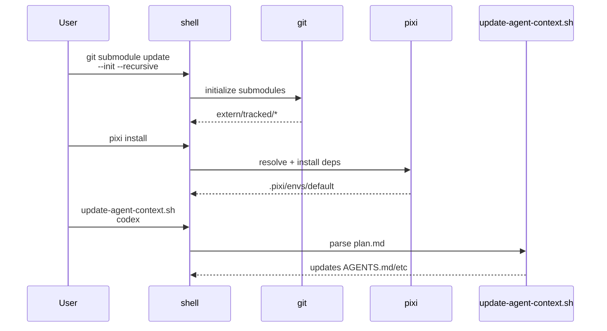
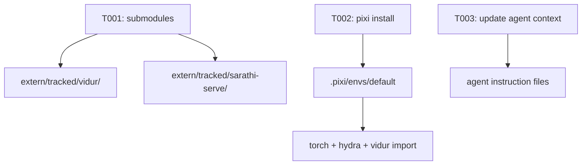

# Implementation Guide: Setup (env + prerequisites)

**Phase**: 1 | **Feature**: Reliable Vidur MLP profiling for driver-launched kernels | **Tasks**: T001–T003

## Goal

Prepare a reproducible dev/runtime environment for profiling runs:

- Vidur + Sarathi submodules are present under `extern/tracked/`.
- Pixi environment is installed and importable (`torch`, `hydra-core`, `vidur`).
- Agent context files are refreshed from `specs/005-vidur-mlp-cuda-driver/plan.md` (optional but recommended for Codex-driven work).

**Path convention**: All repo paths are relative to `<WORKSPACE_ROOT>` (repository root).

## Public APIs

### T001: Submodule initialization (`extern/tracked/*`)

Run from `<WORKSPACE_ROOT>`:

```bash
git submodule update --init --recursive
```

Key expected paths:

```text
extern/tracked/vidur/
extern/tracked/sarathi-serve/
```

---

### T002: Pixi environment materialization (`pyproject.toml`, `pixi.lock`)

Run from `<WORKSPACE_ROOT>`:

```bash
pixi install
```

Sanity checks (run inside Pixi):

```bash
pixi run python -c "import torch; print(torch.__version__)"
pixi run python -c "import vidur; import sarathi; print('ok')"
```

---

### T003: Refresh agent context (`.specify/scripts/bash/update-agent-context.sh`)

Update agent context files from the current feature’s `plan.md`:

```bash
.specify/scripts/bash/update-agent-context.sh codex
```

**Usage Flow**:



## Phase Integration



## Testing

### Test Input

- None (this phase establishes prerequisites).

### Test Procedure

```bash
cd <WORKSPACE_ROOT>

git submodule update --init --recursive
test -d extern/tracked/vidur
test -d extern/tracked/sarathi-serve

pixi install
pixi run python -c "import torch; print(torch.__version__)"
pixi run python -c "import vidur; import sarathi; print('ok')"
```

### Test Output

- Submodule directories exist.
- `pixi run ...` imports succeed (exit code 0).

## References

- Spec: `specs/005-vidur-mlp-cuda-driver/spec.md`
- Plan: `specs/005-vidur-mlp-cuda-driver/plan.md`
- Quickstart: `specs/005-vidur-mlp-cuda-driver/quickstart.md`

## Implementation Summary

TBD after implementation.

