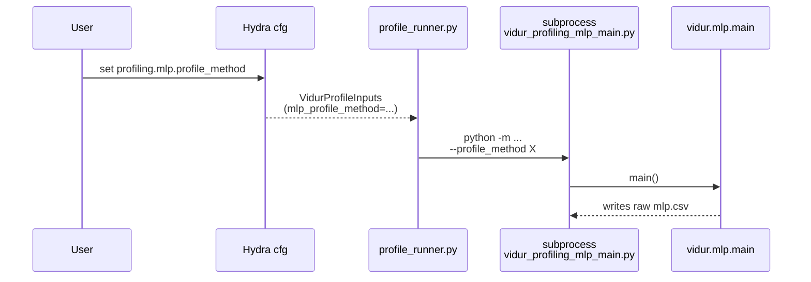
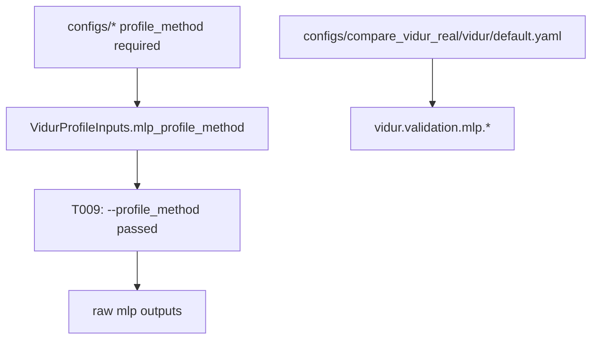

# Implementation Guide: Foundational (explicit method selection plumbing)

**Phase**: 2 | **Feature**: Reliable Vidur MLP profiling for driver-launched kernels | **Tasks**: T004–T013

## Goal

Make MLP profiling method selection and validation behavior explicit and reproducible:

- Require `profiling.mlp.profile_method` to be set for every profiling run (no hidden defaults).
- Plumb `profiling.mlp.*` from Hydra configs into `VidurProfileInputs`.
- Always pass `--profile_method ...` explicitly into Vidur’s MLP profiler subprocess.
- Add consumer-side defaults for MLP validation (`vidur.validation.mlp.*`) so profiling roots are validated consistently at load time.

**Path convention**: All repo paths are relative to `<WORKSPACE_ROOT>` (repository root).

## Public APIs

### T004–T007: Hydra config surface (`configs/*.yaml`)

Add a stable, documented config surface that matches `specs/005-vidur-mlp-cuda-driver/quickstart.md`:

```yaml
# configs/vidur_profiling/bundle.yaml (also: configs/paper_fidelity/profile.yaml, configs/compare_vidur_real/vidur_profile.yaml)
profiling:
  mlp:
    # REQUIRED (no default): record_function | cuda_event | kineto | perf_counter (Vidur choices)
    profile_method: ???
    validation:
      # strict (default) | non_strict
      mode: strict
      small_input_threshold: 128
      zero_heavy_limit: 0.01
    fallback:
      enabled: false
      method: cuda_event
```

Consumer-side defaults (used at profiling-root consumption time):

```yaml
# configs/compare_vidur_real/vidur/default.yaml
validation:
  mlp:
    mode: strict
    small_input_threshold: 128
    zero_heavy_limit: 0.01
```

Notes:

- “Missing values” always fail; “zero-heavy” fails in strict and warns in non-strict (spec definitions in `specs/005-vidur-mlp-cuda-driver/spec.md`).
- Keep the config names aligned across `bundle`, `paper-fidelity profile`, and `vidur-profile` so operators do not need per-entrypoint mental mapping.

---

### T008: Profiling runner inputs (`src/gpu_simulate_test/vidur_ext/profile_runner.py`)

Extend `VidurProfileInputs` so method + validation/fallback are carried end-to-end:

```python
# src/gpu_simulate_test/vidur_ext/profile_runner.py

from __future__ import annotations

from dataclasses import dataclass
from pathlib import Path
from typing import Literal

MlpValidationMode = Literal["strict", "non_strict"]


@dataclass(frozen=True)
class VidurProfileInputs:
    model_id: str
    hardware_id: str
    profiling_root: Path

    # REQUIRED: no hidden defaults.
    mlp_profile_method: str

    # Validation defaults (strict-by-default).
    mlp_validation_mode: MlpValidationMode = "strict"
    mlp_small_input_threshold: int = 128
    mlp_zero_heavy_limit: float = 0.01

    # Opt-in fallback behavior.
    mlp_fallback_enabled: bool = False
    mlp_fallback_method: str = "cuda_event"
```

Design intent:

- Callers must set `mlp_profile_method` explicitly (Hydra `???` is the simplest enforcement).
- The runner carries *both* staging validation knobs and fallback policy so the behavior is not “coded into defaults”.

---

### T009: Explicit MLP profiler invocation (`src/gpu_simulate_test/vidur_ext/profile_runner.py`)

Always pass `--profile_method` into the MLP subprocess call:

```python
# src/gpu_simulate_test/vidur_ext/profile_runner.py

mlp_cmd = [
    sys.executable,
    "-m",
    "gpu_simulate_test.vidur_ext.vidur_profiling_mlp_main",
    "--num_gpus",
    str(int(inputs.num_gpus)),
    "--num_tensor_parallel_workers",
    str(int(inputs.tensor_parallel_size)),
    "--models",
    inputs.model_id,
    "--output_dir",
    str(staging),
    "--max_tokens",
    str(int(inputs.max_tokens)),
    "--profile_method",
    str(inputs.mlp_profile_method),
]
```

**Usage Flow**:



---

### T010–T013: Call-site plumbing (configs → inputs)

Plumb `profiling.mlp.*` into `VidurProfileInputs` at each entrypoint:

- `src/gpu_simulate_test/vidur_ext/profiling_bundle.py`
- `src/gpu_simulate_test/paper_fidelity/profiling.py`
- `src/gpu_simulate_test/vidur_cli/stages.py`
- `src/gpu_simulate_test/cli/vidur_profile.py`

Recommended config extraction pattern:

```python
from omegaconf import OmegaConf

method = OmegaConf.select(cfg, "profiling.mlp.profile_method")
if method is None:
    raise ValueError("profiling.mlp.profile_method is required (no default).")

mode = str(OmegaConf.select(cfg, "profiling.mlp.validation.mode") or "strict")
small_thr = int(OmegaConf.select(cfg, "profiling.mlp.validation.small_input_threshold") or 128)
zero_limit = float(OmegaConf.select(cfg, "profiling.mlp.validation.zero_heavy_limit") or 0.01)
fallback_enabled = bool(OmegaConf.select(cfg, "profiling.mlp.fallback.enabled") or False)
fallback_method = str(OmegaConf.select(cfg, "profiling.mlp.fallback.method") or "cuda_event")
```

## Phase Integration



## Testing

### Test Input

- No GPU required for these checks (they validate config composition only).

### Test Procedure

```bash
cd <WORKSPACE_ROOT>

# Config composition smoke: Hydra prints the resolved config and exits.
pixi run python -m gpu_simulate_test.cli.vidur_profiling_bundle --cfg job --resolve \
  output.dir=/tmp/vidur-profiling-bundle-cfg \
  profiling.mlp.profile_method=cuda_event

pixi run python -m gpu_simulate_test.cli.vidur_profile --cfg job --resolve \
  vidur.profiling.root=/tmp/vidur-profile-cfg \
  profiling.mlp.profile_method=cuda_event
```

### Test Output

- Commands print a resolved Hydra config containing `profiling.mlp.profile_method` and exit `0`.

## References

- Spec: `specs/005-vidur-mlp-cuda-driver/spec.md`
- Data model: `specs/005-vidur-mlp-cuda-driver/data-model.md`
- Quickstart: `specs/005-vidur-mlp-cuda-driver/quickstart.md`

## Implementation Summary

TBD after implementation.

