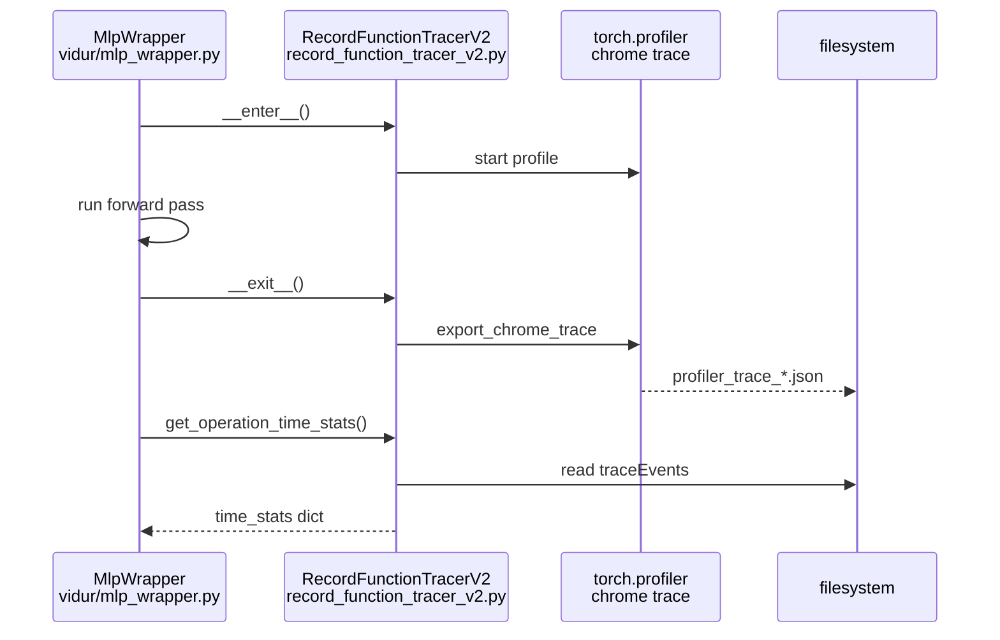
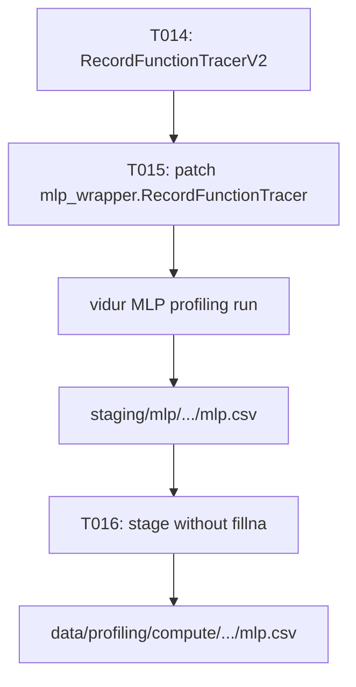

# Implementation Guide: US1 (RecordFunctionTracerV2 attribution)

**Phase**: 3 | **Feature**: Reliable Vidur MLP profiling for driver-launched kernels | **Tasks**: T014–T017

## Goal

Fix the root cause of missing MLP op timings when kernels are launched through CUDA driver APIs:

- Implement a correlation-based record-function tracer that recognizes both `cuda_runtime` and `cuda_driver` launch paths.
- Ensure the tracer attributes correlated GPU execution events (`kernel` + optional memcpy/memset categories) back to each `user_annotation` region.
- Stop masking missing measurements during staging (no blanket NaN→0 fill).

**Path convention**: All repo paths are relative to `<WORKSPACE_ROOT>` (repository root).

## Public APIs

### T014: `RecordFunctionTracerV2` (`src/gpu_simulate_test/vidur_ext/record_function_tracer_v2.py`)

Mirror Vidur’s `RecordFunctionTracer` interface, but broaden attribution:

- **Launch categories**: `cuda_runtime`, `cuda_driver`
- **Execution categories**: `kernel` (and optionally `gpu_memcpy`, `gpu_memset` if present in traces)
- **Correlation key**: `event["args"]["correlation"]`
- **Units**: Chrome trace `"dur"` is in microseconds; convert to milliseconds (`dur * 1e-3`)

Suggested public surface (add internal helpers to keep tests CPU-only):

```python
# src/gpu_simulate_test/vidur_ext/record_function_tracer_v2.py

from __future__ import annotations

from dataclasses import dataclass
from pathlib import Path
from typing import Any


def compute_operation_time_stats(trace_events: list[dict[str, Any]]) -> dict[str, dict[str, float]]:
    """Return per-op summary stats (min/max/mean/median/std in ms) from chrome trace events."""
    ...


@dataclass
class RecordFunctionTracerV2:
    """Correlation-based op timing tracer for Vidur MLP profiling.

    Responsibilities:
    - Capture a torch profiler chrome trace for a profiling window
    - Attribute GPU execution time to vidur_* user_annotation regions
    - Support both runtime and driver launch paths via correlation ids
    """

    output_path: str
    trace_path: Path | None = None

    def __enter__(self) -> None: ...
    def __exit__(self, *args: object) -> None: ...

    def get_operation_time_stats(self) -> dict[str, dict[str, float]]:
        """Load trace and return per-op summary statistics in milliseconds."""
        ...
```

**Usage Flow**:



**Pseudocode** (core attribution loop):

```python
def compute_operation_time_stats(trace_events):
    for region in user_annotation_events(trace_events):
        corr_ids = set()
        for launch in children(region):
            if launch.cat in {"cuda_runtime", "cuda_driver"}:
                corr_ids.add(launch.args.get("correlation"))
        gpu_us = 0
        for e in trace_events:
            if e.cat in {"kernel"} and e.args.get("correlation") in corr_ids:
                gpu_us += e.dur
        record_sample(region.name_without_vidur_prefix, gpu_us * 1e-3)
    return summarize(samples_by_op)
```

---

### T015: Patch Vidur’s MLP wrapper to use the tracer (`src/gpu_simulate_test/vidur_ext/vidur_profiling_mlp_main.py`)

Vidur’s MLP profiler uses Ray actors and a module-global `RecordFunctionTracer` symbol in:

- `extern/tracked/vidur/vidur/profiling/mlp/mlp_wrapper.py`

Patch that symbol **before** invoking Vidur’s `mlp.main`:

```python
# src/gpu_simulate_test/vidur_ext/vidur_profiling_mlp_main.py

def _patch_record_function_tracer() -> None:
    from gpu_simulate_test.vidur_ext.record_function_tracer_v2 import RecordFunctionTracerV2
    import vidur.profiling.mlp.mlp_wrapper as mlp_wrapper

    mlp_wrapper.RecordFunctionTracer = RecordFunctionTracerV2  # type: ignore[assignment]
```

Ray note (cross-process): if Ray workers do not inherit the patched module state, prefer an env-var-gated patch in `src/sitecustomize.py` so the patch runs in the worker interpreter as well (similar to the existing attention compat patch). Use `vidur_profiling_mlp_main.py` to set the env var when `--profile_method record_function` is selected.

---

### T016: Remove blanket NaN→0 staging (`src/gpu_simulate_test/vidur_ext/profile_runner.py`)

Stop masking missing measurements at staging time:

- Remove `mlp_df[time_cols] = mlp_df[time_cols].fillna(0.0)`
- Keep `drop_duplicates()` (dedup is safe and desirable).
- US2 will add validation + fallback; for US1, the invariant is “tracer produces complete keys so NaNs should not exist”.

---

### T017: Manual verification (GPU required)

Use `specs/005-vidur-mlp-cuda-driver/quickstart.md` and verify the staged CSV has no missing core timing targets:

- `time_stats.*.min|max|mean|median` are all non-missing for all rows.

## Phase Integration



## Testing

### Test Input

- GPU host with working CUDA runtime (for the manual profiling run).
- Optional: set `GSIM_CUDA_VISIBLE_DEVICES` in `<WORKSPACE_ROOT>/.env` (see quickstart).

### Test Procedure

```bash
cd <WORKSPACE_ROOT>

# Example (values are illustrative; adjust to your scenario):
pixi run vidur-profiling-bundle \
  output.dir=<WORKSPACE_ROOT>/tmp/vidur_bundle \
  profiling.mlp.profile_method=record_function

# Verify staged CSV has no missing values in time_stats.* columns:
pixi run python - <<'PY'
from pathlib import Path
import pandas as pd

csv_path = Path("<WORKSPACE_ROOT>/tmp/vidur_bundle/data/profiling/compute/a100/meta-llama/Llama-2-7b-hf/mlp.csv")
df = pd.read_csv(csv_path)
time_cols = [c for c in df.columns if c.startswith("time_stats.")]
missing = int(df[time_cols].isna().sum().sum())
print("missing_cells_total=", missing)
raise SystemExit(1 if missing else 0)
PY
```

### Test Output

- The validator snippet prints `missing_cells_total= 0` and exits `0`.

## References

- Spec: `specs/005-vidur-mlp-cuda-driver/spec.md`
- Research: `specs/005-vidur-mlp-cuda-driver/research.md`
- Issue: `context/issues/known/issue-vidur-mlp-profiling-misses-cuda-driver-kernels.md`

## Implementation Summary

TBD after implementation.

