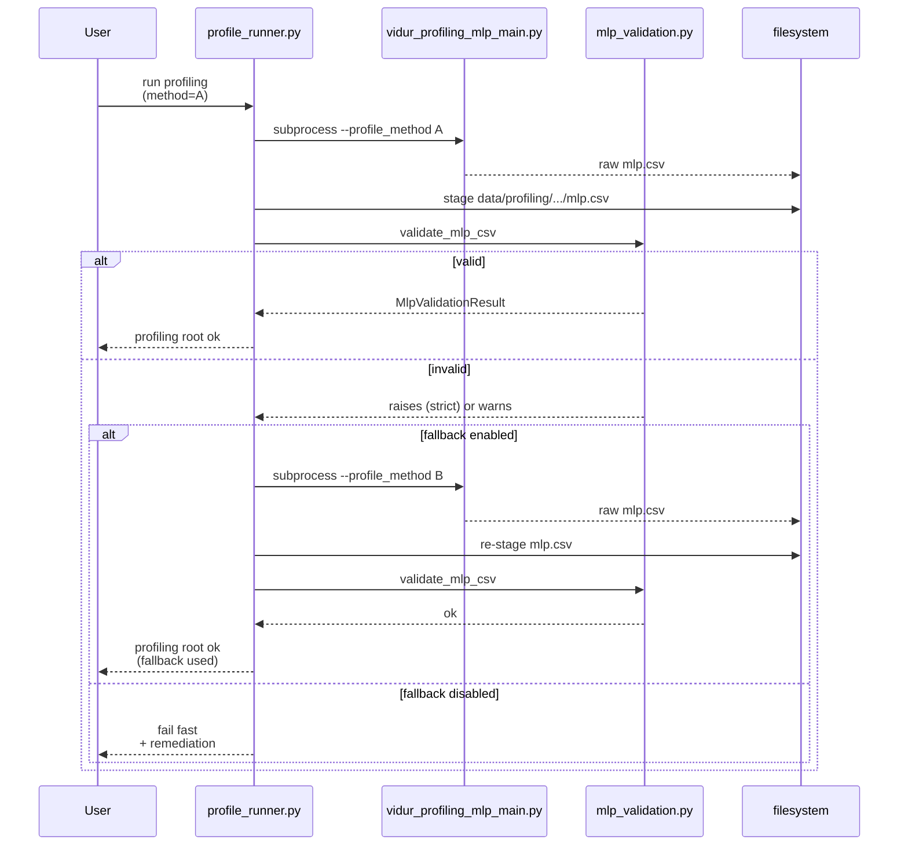
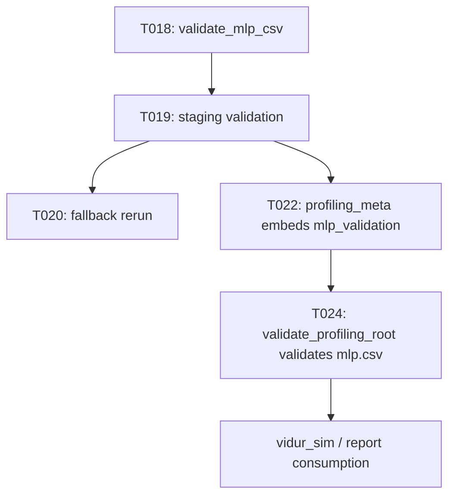

# Implementation Guide: US2 (validation, fail-fast, fallback, provenance)

**Phase**: 4 | **Feature**: Reliable Vidur MLP profiling for driver-launched kernels | **Tasks**: T018–T028

## Goal

Stop bad profiling data from silently propagating:

- Validate staged `mlp.csv` for missing core timing targets and suspiciously zero-heavy signals.
- Fail fast by default with actionable remediation guidance (including fallback instructions).
- Support opt-in automatic fallback to an alternate profiling method (e.g., `cuda_event`) when validation fails.
- Apply the same validation rules when *consuming* a profiling root (simulation/reporting).
- Record validation results and method/fallback decisions in profiling provenance (`profiling_meta.json`).

**Path convention**: All repo paths are relative to `<WORKSPACE_ROOT>` (repository root).

## Public APIs

### T018: MLP CSV validator (`src/gpu_simulate_test/vidur_ext/mlp_validation.py`)

Implement a lightweight validator with a JSON-serializable result object aligned to:

- `specs/005-vidur-mlp-cuda-driver/contracts/mlp_validation_result.schema.json`

Suggested API:

```python
# src/gpu_simulate_test/vidur_ext/mlp_validation.py

from __future__ import annotations

from dataclasses import asdict, dataclass
from pathlib import Path
from typing import Any, Literal

MlpValidationMode = Literal["strict", "non_strict"]


@dataclass(frozen=True)
class MlpValidationResult:
    csv_path: Path
    mode: MlpValidationMode
    row_count: int
    column_count: int
    time_column_count: int
    missing_cells_total: int
    missing_columns: list[str]
    zero_heavy_columns: list[str]
    thresholds: dict[str, Any]
    warnings: list[str]

    def as_jsonable(self) -> dict[str, Any]:
        data = asdict(self)
        data["csv_path"] = str(self.csv_path)
        return data


def validate_mlp_csv(
    csv_path: Path,
    *,
    mode: MlpValidationMode = "strict",
    small_input_threshold: int = 128,
    zero_heavy_limit: float = 0.01,
) -> MlpValidationResult:
    """Validate a staged Vidur-style MLP profiling CSV."""
    ...
```

Validation rules (from `specs/005-vidur-mlp-cuda-driver/spec.md`):

- **Missing values**: any missing cell in any core `time_stats.*.{min,max,mean,median}` column fails (always).
- **Zero-heavy**: for rows with `num_tokens >= small_input_threshold`, if a core target column has `zero_rate > zero_heavy_limit`:
  - `strict`: fail
  - `non_strict`: warn (do not fail)

Error messaging requirements (FR-007):

- Report the affected columns (missing and/or zero-heavy).
- Include at least one remediation action (e.g., “rerun with `profiling.mlp.profile_method=cuda_event`”).

---

### T019–T021: Staging validation + fallback (`src/gpu_simulate_test/vidur_ext/profile_runner.py`)

Apply validation when creating the profiling root:

- Validate immediately after writing the staged `mlp.csv` (and also when returning early due to existing outputs).
- On failure:
  - default: raise an error with remediation guidance
  - if `inputs.mlp_fallback_enabled`: rerun MLP profiling with `inputs.mlp_fallback_method` and re-stage/validate

Recommended control flow:

```python
def _stage_mlp_with_method(method: str) -> tuple[Path, MlpValidationResult]:
    run_mlp_profiler(profile_method=method)
    stage_csv()
    return mlp_dst, validate_mlp_csv(mlp_dst, mode=..., small_input_threshold=..., zero_heavy_limit=...)

try:
    mlp_csv, validation = _stage_mlp_with_method(inputs.mlp_profile_method)
except Exception as e:
    if not inputs.mlp_fallback_enabled:
        raise
    mlp_csv, validation = _stage_mlp_with_method(inputs.mlp_fallback_method)
    extra["mlp_fallback_used"] = True
```

**Usage Flow**:



---

### T022–T023: Provenance embedding (`profiling_meta.json`)

Embed validation output in profiling meta records:

- `src/gpu_simulate_test/vidur_ext/profiling_bundle.py` (`profiling_root/profiling_meta.json`)
- `src/gpu_simulate_test/paper_fidelity/profiling.py` (`profiling_root/profiling_meta.json`)

Target shape:

```json
{
  "profiling_outputs": { "mlp_csv": "...", "...": "..." },
  "mlp_profile_method": "record_function",
  "mlp_fallback": { "enabled": false, "used": false, "method": "cuda_event" },
  "mlp_validation": { "csv_path": "...", "mode": "strict", "missing_cells_total": 0, "...": "..." }
}
```

Keep the meta record compatible with:

- `specs/005-vidur-mlp-cuda-driver/contracts/profiling_meta_subset.schema.json`

---

### T024–T028: Consumption validation (`src/gpu_simulate_test/vidur_ext/profiling_root.py` + sim runners)

Extend profiling-root validation so consumers cannot silently use bad `mlp.csv`:

- Extend `ProfilingRootLayout` with MLP validation settings (mode + thresholds).
- Update `validate_profiling_root()` to:
  - validate required files exist (existing behavior)
  - validate `mlp.csv` using the same validator (`validate_mlp_csv`)
  - warn or fail based on configured strictness (missing always fails)
- Plumb `vidur.validation.mlp.*` from Hydra config into:
  - `VidurSimInputs` (`src/gpu_simulate_test/vidur_ext/sim_runner.py`)
  - CLI wrappers (`src/gpu_simulate_test/cli/vidur_sim.py`, `src/gpu_simulate_test/vidur_cli/stages.py`)

## Phase Integration



## Testing

### Test Input

Create synthetic CSVs under a temp directory (CPU-only):

- `<TMP>/mlp_missing.csv` contains at least one empty cell in a `time_stats.*.median` column.
- `<TMP>/mlp_zero_heavy.csv` contains many exact zeros for `num_tokens >= 128`.

### Test Procedure

```bash
cd <WORKSPACE_ROOT>

export TMP_DIR="$(mktemp -d)"

cat > "$TMP_DIR/mlp_missing.csv" <<'EOF'
time_stats.op.median,num_tokens
,128
1.0,256
EOF

pixi run python - <<'PY'
from pathlib import Path
import os
from gpu_simulate_test.vidur_ext.mlp_validation import validate_mlp_csv

csv_path = Path(os.environ["TMP_DIR"]) / "mlp_missing.csv"
try:
    validate_mlp_csv(csv_path, mode="strict")
except Exception as e:
    print("OK: strict failed:", type(e).__name__, e)
else:
    raise SystemExit("Expected strict validation to fail")
PY
```

Consumption-side smoke (CPU-only):

```bash
pixi run python - <<'PY'
from pathlib import Path
import pandas as pd

from gpu_simulate_test.vidur_ext.profiling_root import ProfilingRootLayout, validate_profiling_root

root = Path(__import__("tempfile").mkdtemp(prefix="profiling-root-"))
compute = root / "data" / "profiling" / "compute" / "a100" / "meta-llama/Llama-2-7b-hf"
compute.mkdir(parents=True, exist_ok=True)

# Minimal attention.csv (schema not validated here; only existence is required).
(compute / "attention.csv").write_text("x\n1\n", encoding="utf-8")

df = pd.DataFrame({"time_stats.op.median": [0.0, 0.0], "num_tokens": [256, 512]})
df.to_csv(compute / "mlp.csv", index=False)

layout = ProfilingRootLayout(
    profiling_root=root,
    device="a100",
    model_id="meta-llama/Llama-2-7b-hf",
)
try:
    validate_profiling_root(layout)
except Exception as e:
    print("OK: consumption validation triggered:", type(e).__name__, e)
PY
```

### Test Output

- `validate_mlp_csv(..., mode="strict")` fails on missing values and prints the remediation error.
- `validate_profiling_root(...)` fails (strict-by-default) or warns (non-strict) on zero-heavy signals, depending on configured mode.

## References

- Spec: `specs/005-vidur-mlp-cuda-driver/spec.md`
- Data model: `specs/005-vidur-mlp-cuda-driver/data-model.md`
- Contracts: `specs/005-vidur-mlp-cuda-driver/contracts/`

## Implementation Summary

TBD after implementation.
