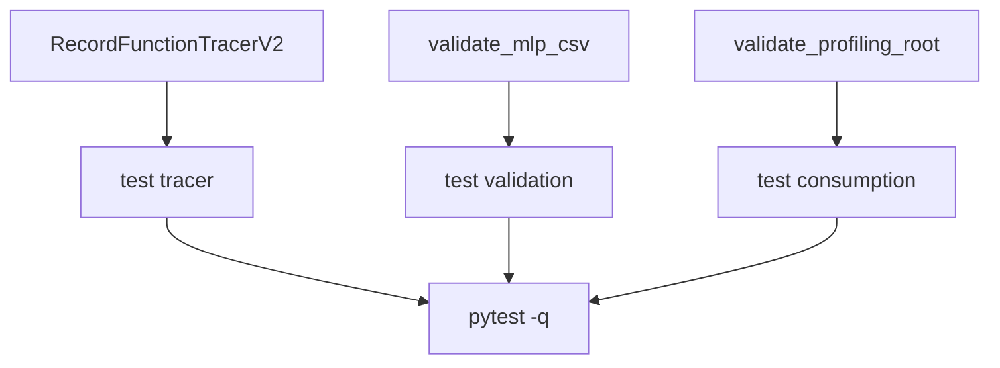

# Implementation Guide: US3 (regression tests)

**Phase**: 5 | **Feature**: Reliable Vidur MLP profiling for driver-launched kernels | **Tasks**: T029–T032

## Goal

Add CPU-only automated tests that prevent regressions in:

- Trace attribution for both runtime-launched and driver-launched kernels.
- MLP CSV validation semantics (missing vs zero-heavy; strict vs non-strict).
- Profiling-root consumption validation (fail-fast / warn behavior).

## Public APIs

### T029: Tracer tests (`tests/unit/test_vidur_record_function_tracer_v2.py`)

Keep tests independent of CUDA/Torch by targeting a pure helper (recommended from US1 guide):

- `compute_operation_time_stats(trace_events: list[dict]) -> dict[str, dict[str, float]]`

Minimal synthetic chrome trace events:

```python
trace = [
    # Region (Vidur uses user_annotation + "vidur_" prefix).
    {"cat": "user_annotation", "name": "vidur_mlp_up_proj", "ts": 0, "dur": 1000},
    # Launch event inside region (runtime or driver).
    {"cat": "cuda_driver", "name": "cuLaunchKernel", "ts": 100, "dur": 10, "args": {"correlation": 7}},
    # GPU execution correlated by id.
    {"cat": "kernel", "name": "someKernel", "ts": 120, "dur": 500, "args": {"correlation": 7}},
]
```

Core assertions:

- Runtime launch (`cuda_runtime`) correlates to `kernel` and produces non-zero stats.
- Driver launch (`cuda_driver`) correlates to `kernel` and produces non-zero stats.
- Duplicate launch events with the same correlation id do not double-count.
- Uncorrelated kernels are not counted.

---

### T030: Validation tests (`tests/unit/test_mlp_validation.py`)

Test `validate_mlp_csv()` behavior with small generated CSVs:

- Missing core targets always fail (strict and non-strict).
- Zero-heavy fails in strict and warns in non-strict.
- Thresholds behave as specified (`small_input_threshold`, `zero_heavy_limit`).

---

### T031: Profiling-root validation tests (`tests/unit/test_profiling_root_mlp_validation.py`)

Build a minimal profiling root layout under `tmp_path`:

```text
<tmp>/data/profiling/compute/a100/<model_id>/mlp.csv
<tmp>/data/profiling/compute/a100/<model_id>/attention.csv
```

Assertions:

- `validate_profiling_root(...)` fails under strict mode for zero-heavy (and always for missing values).
- `validate_profiling_root(...)` emits warnings under non-strict mode for zero-heavy.

---

### T032: Running the tests (Pixi + pytest)

```bash
cd <WORKSPACE_ROOT>
pixi run pytest -q
```

## Phase Integration



## Testing

### Test Input

- No GPU required (synthetic traces + synthetic CSVs only).

### Test Procedure

```bash
cd <WORKSPACE_ROOT>

# Focused iteration:
pixi run pytest -q tests/unit/test_vidur_record_function_tracer_v2.py
pixi run pytest -q tests/unit/test_mlp_validation.py
pixi run pytest -q tests/unit/test_profiling_root_mlp_validation.py
```

### Test Output

- `N passed, 0 failed` (pytest exit code 0).

## References

- Spec: `specs/005-vidur-mlp-cuda-driver/spec.md`
- Contracts: `specs/005-vidur-mlp-cuda-driver/contracts/`

## Implementation Summary

TBD after implementation.

