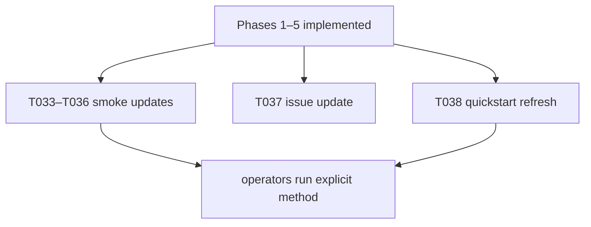

# Implementation Guide: Polish (docs, smoke scripts, issue update)

**Phase**: 6 | **Feature**: Reliable Vidur MLP profiling for driver-launched kernels | **Tasks**: T033–T038

## Goal

Make the new “explicit method + validation” behavior easy to adopt and hard to misuse:

- Ensure manual smoke tests and helper scripts pass an explicit `profiling.mlp.profile_method`.
- Update the known-issue writeup to reflect the fix and remediation flow.
- Refresh quickstart docs after plumbing and validation semantics are implemented.

## Public APIs

### T033–T036: Smoke tests and scripts now require an explicit MLP method

Update the following to pass a concrete `profiling.mlp.profile_method=...` override:

- `tests/manual/test_vidur_profiling_bundle_smoke.py`
- `tests/manual/test_vidur_profile_smoke.py`
- `tests/manual/test_paper_fidelity_profile_smoke.py`
- `scripts/run_vidur_profiling_llama2_7b.sh`

Recommended default for smoke runs:

- Use `cuda_event` for maximum stability.
- Add an optional flag/override path for `record_function` so the tracer fix can be manually exercised.

Example snippet (Hydra override list):

```python
cmd = [
    sys.executable,
    "-m",
    "gpu_simulate_test.cli.vidur_profiling_bundle",
    f"output.dir={output_dir}",
    "profiling.mlp.profile_method=cuda_event",
]
```

---

### T037: Update the known-issue doc (`context/issues/known/issue-vidur-mlp-profiling-misses-cuda-driver-kernels.md`)

Add a “Fix status” section that records:

- The chosen default operator guidance (explicit method selection; strict-by-default validation).
- How to remediate validation failures (enable fallback or switch methods).
- Before/after evidence pointers (optional but useful: missing/zero-heavy counts).

---

### T038: Refresh quickstart (`specs/005-vidur-mlp-cuda-driver/quickstart.md`)

Ensure quickstart commands remain correct after implementation:

- Required: `profiling.mlp.profile_method=...`
- Optional: `profiling.mlp.validation.*`
- Optional: `profiling.mlp.fallback.*`

## Phase Integration



## Testing

### Test Input

- GPU host for actually running the smoke scripts end-to-end.
- CPU-only host can still lint-check imports and `--help` paths.

### Test Procedure

```bash
cd <WORKSPACE_ROOT>

# CPU-only sanity: ensure scripts still import/parse.
pixi run python -m gpu_simulate_test.cli.vidur_profiling_bundle --cfg job --resolve \
  output.dir=/tmp/vidur-profiling-bundle-cfg \
  profiling.mlp.profile_method=cuda_event

# GPU manual smoke (optional; requires CUDA):
pixi run python tests/manual/test_vidur_profiling_bundle_smoke.py --max-tokens 256
```

### Test Output

- Config composition succeeds (exit code 0).
- On GPU hosts, smoke scripts print `OK: <profiling_root>`.

## References

- Spec: `specs/005-vidur-mlp-cuda-driver/spec.md`
- Quickstart: `specs/005-vidur-mlp-cuda-driver/quickstart.md`
- Issue: `context/issues/known/issue-vidur-mlp-profiling-misses-cuda-driver-kernels.md`

## Implementation Summary

TBD after implementation.

