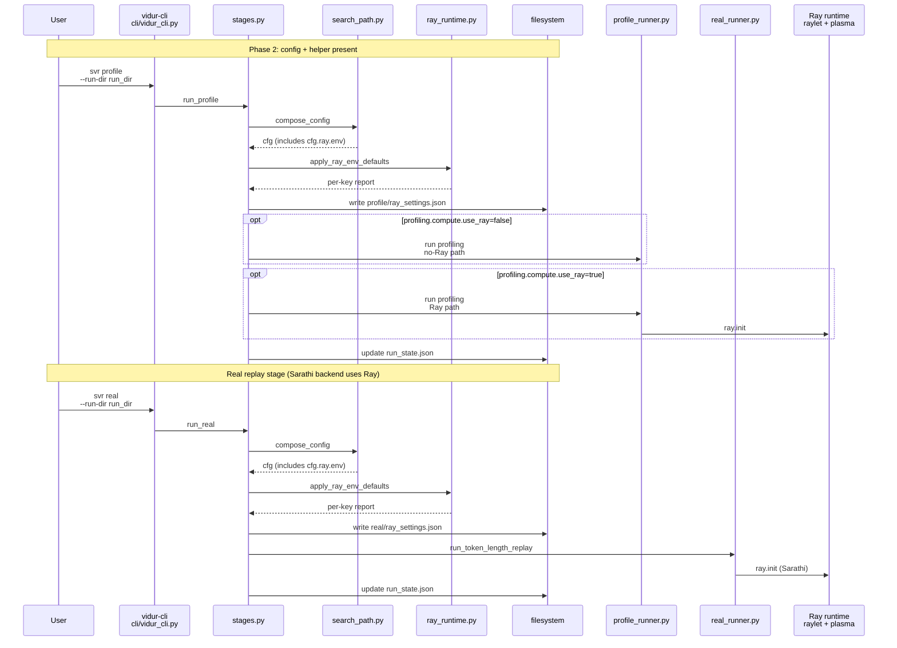
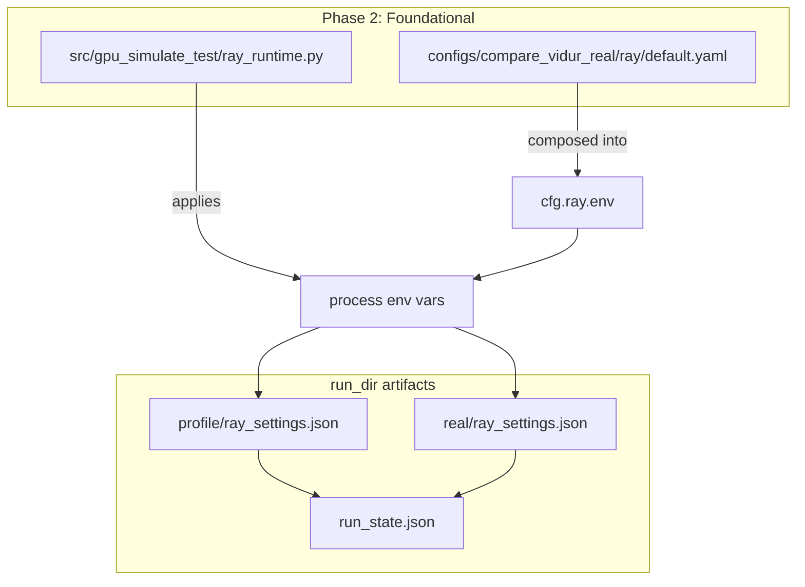
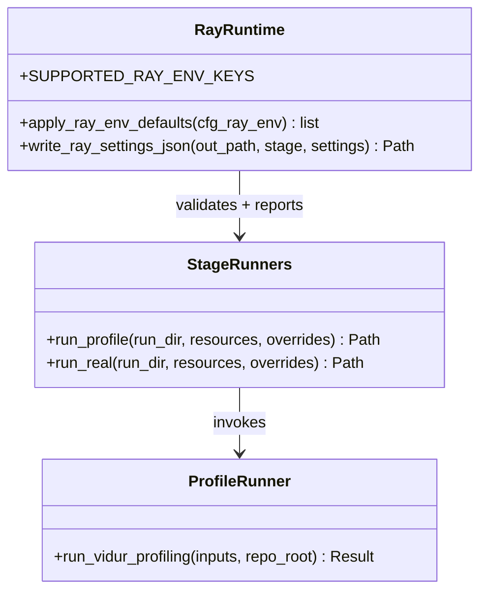
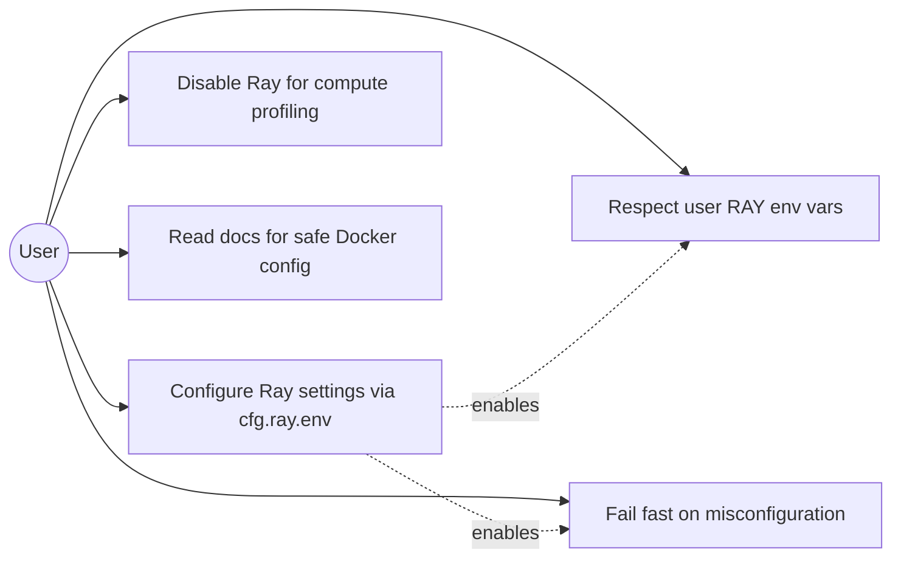
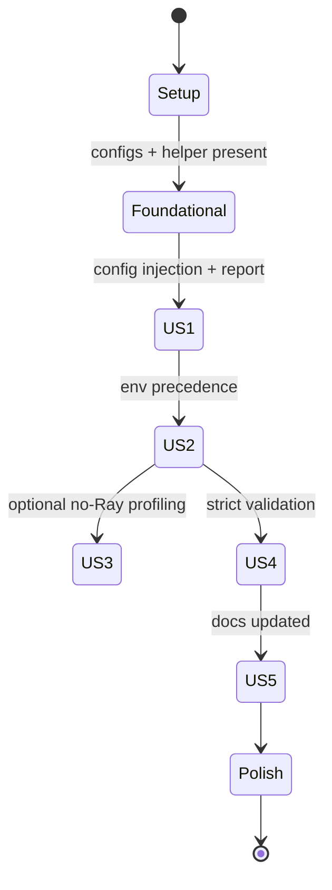

# Phase Integration Guide: Vidur CLI Ray runtime config

**Feature**: `006-vidur-cli-ray-config` | **Phases**: 8

## Overview

This feature makes Ray behavior reproducible and safer across host and Docker runs by letting `vidur-cli`:

- Read a small, explicitly supported set of Ray runtime settings from Hydra config (`cfg.ray.env`).
- Apply settings with per-key precedence **env > config > Ray default** (never override user-set `RAY_*`).
- Fail fast on misconfiguration (invalid values or unsupported keys) *before* starting Ray.
- Emit an “effective settings report” and persist it as `ray_settings.json` under the stage output directory.
- Optionally disable Ray for Vidur compute profiling (`profiling.compute.use_ray=false`) in supported single-GPU cases, using fallback outputs where needed.

**Path convention**: All repo paths are relative to `<WORKSPACE_ROOT>` (repository root). Run directories are under `<run_dir>` created by `vidur-cli svr init-run`.

## Phase Flow

**MUST HAVE: End-to-End Sequence Diagram**



## Artifact Flow Between Phases



## System Architecture



## Use Cases



## Activity Flow



## Inter-Phase Dependencies

### Phase 2 → Phase 3 (Foundational → US1)

**Artifacts / config**:

- `configs/compare_vidur_real/ray/default.yaml` must exist so `cfg.ray.env` composes.
- Workflow configs must include `ray: default` in `defaults:`.

**Code dependencies**:

```python
from gpu_simulate_test.ray_runtime import apply_ray_env_defaults, write_ray_settings_json
```

### Phase 3–4 → Phase 6 (US1/US2 → US4 validation)

- US4 tightens validation rules; it must not change the output schema for `ray_settings.json`.

### Phase 3–6 → Phase 7 (Docs)

- Docs must reflect the final behavior after precedence + validation + no-Ray decisions are implemented.

## Integration Testing

```bash
cd <WORKSPACE_ROOT>

# Unit test suite (covers precedence + validation contracts):
pixi run pytest tests/unit/test_ray_runtime_config.py

# No-Ray gating tests:
pixi run pytest tests/unit/test_vidur_profile_no_ray.py

# Full unit suite (may include other unrelated tests):
pixi run pytest
```

Manual smoke docs (GPU likely required for `svr profile`):

- `tests/manual/vidur_cli_ray_settings_smoke.md`
- `tests/manual/vidur_cli_no_ray_compute_profiling_smoke.md`

## Critical Integration Points

1. **Apply settings before Ray starts**
   - `apply_ray_env_defaults()` must run before any code path that imports/starts Ray.
2. **Stable reporting**
   - `ray_settings.json` must report only env/config values (leave `effective_value=null` when default) so host vs Docker reports can be compared.
3. **No-Ray mode must not import Ray**
   - No-Ray compute profiling must avoid importing Vidur profiling entrypoints that import `ray` at module import time.

## References

- Tasks: `specs/006-vidur-cli-ray-config/tasks.md`
- Spec: `specs/006-vidur-cli-ray-config/spec.md`
- Research: `specs/006-vidur-cli-ray-config/research.md`
- Data model: `specs/006-vidur-cli-ray-config/data-model.md`
- Contracts: `specs/006-vidur-cli-ray-config/contracts/`

## Implementation Status

Implemented (all tasks completed) with key entrypoints:

- Ray config surface: `configs/compare_vidur_real/ray/default.yaml`
- Ray env apply + reporting helpers: `src/gpu_simulate_test/ray_runtime.py`
- Stage integration + run_state artifacts: `src/gpu_simulate_test/vidur_cli/stages.py`
- No-Ray compute profiling path: `src/gpu_simulate_test/vidur_ext/profile_runner.py`

Validation:

```bash
cd <WORKSPACE_ROOT>
pixi run pytest
```
