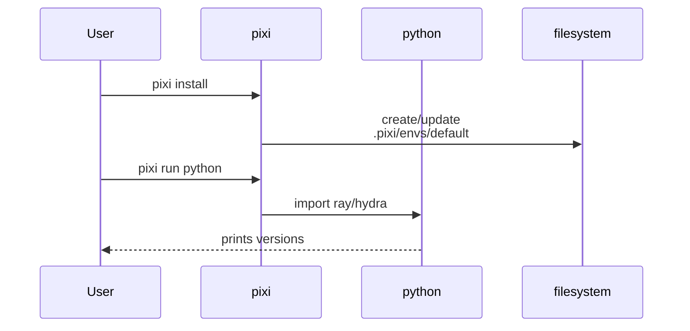
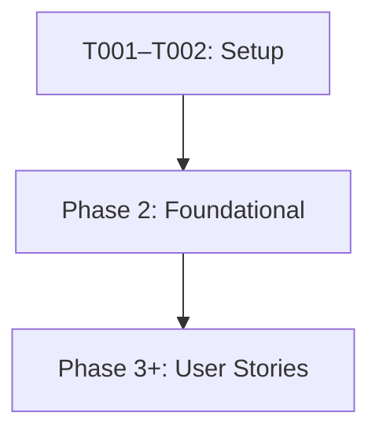

# Implementation Guide: Setup (Pixi env + submodules)

**Phase**: 1 | **Feature**: Vidur CLI Ray runtime config | **Tasks**: T001–T002

## Goal

Establish prerequisites so later phases can edit configs and run `vidur-cli` stages:

- A working Pixi environment (Python + deps) that can import `ray`, `hydra-core`, and `gpu_simulate_test`.
- Initialized git submodules for Vidur and Sarathi so imports resolve.

**Path convention**: All repo paths are relative to `<WORKSPACE_ROOT>` (repository root at `/data1/huangzhe/code/gpu-simulate-test`).

## Public APIs

### T001: Pixi environment bootstrap

This “task” is operational, but it gates all Python execution.

```bash
cd <WORKSPACE_ROOT>

# Create/refresh the Pixi env
pixi install

# Sanity: imports that this feature depends on
pixi run python -c "import ray; print(ray.__version__)"
pixi run python -c "import hydra, omegaconf; print('hydra_ok')"
pixi run python -c "import gpu_simulate_test; print('pkg_ok')"
```

**Usage Flow**:



---

### T002: Initialize Vidur + Sarathi submodules

This ensures editable submodule deps (`vidur`, `sarathi`) are present on disk.

```bash
cd <WORKSPACE_ROOT>

git submodule update --init --recursive

test -d extern/tracked/vidur
test -d extern/tracked/sarathi-serve
```

## Phase Integration



## Testing

### Test Input

- `<WORKSPACE_ROOT>` checkout with network access (for Pixi dependency resolution).
- Git available with access to submodules.

### Test Procedure

```bash
cd <WORKSPACE_ROOT>
pixi install
git submodule update --init --recursive
pixi run python -c "import ray; print(ray.__version__)"
```

### Test Output

- Pixi completes without errors and prints a Ray version.
- `extern/tracked/vidur/` and `extern/tracked/sarathi-serve/` exist.

## References

- Tasks: `specs/006-vidur-cli-ray-config/tasks.md`
- Spec: `specs/006-vidur-cli-ray-config/spec.md`

## Implementation Summary

Phase 1 is complete (environment + submodules are usable for later phases).

### What has been implemented

- Pixi env is installed and imports required packages (Ray/Hydra + local package).
- Vidur and Sarathi submodules are initialized.

### How to verify

```bash
cd <WORKSPACE_ROOT>
pixi install
pixi run python -c "import ray; print(ray.__version__)"
pixi run python -c "import hydra, omegaconf; print('hydra_ok')"
pixi run python -c "import gpu_simulate_test; print('pkg_ok')"
git submodule update --init --recursive
test -d extern/tracked/vidur
test -d extern/tracked/sarathi-serve
```
