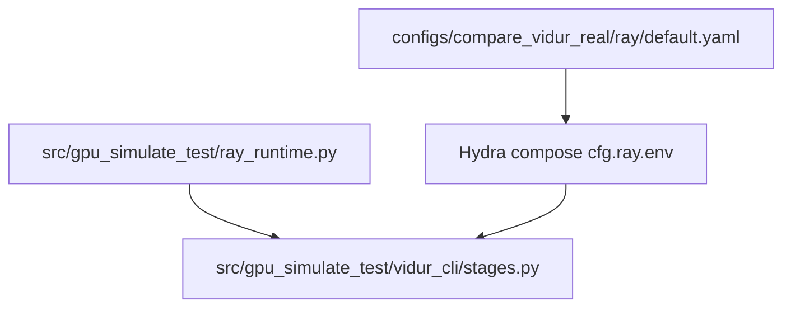

# Implementation Guide: Foundational (Ray config group + helper skeleton)

**Phase**: 2 | **Feature**: Vidur CLI Ray runtime config | **Tasks**: T003–T008

## Goal

Introduce the foundational config surface + code scaffold used by all user stories:

- A Hydra config group `ray/default.yaml` that exposes *only* the supported `ray.env` settings (nullable; opt-in).
- Include `ray: default` in the primary workflow configs so `cfg.ray.env` exists everywhere.
- Add a `gpu_simulate_test.ray_runtime` helper skeleton (no `ray` import) that later phases will fill in.

## Public APIs

### T003–T004: Ray config group (`configs/compare_vidur_real/ray/default.yaml`)

This file defines the public config surface for supported Ray settings.

```yaml
# configs/compare_vidur_real/ray/default.yaml

ray:
  env:
    # int bytes; null => no injection (Ray default)
    RAY_DEFAULT_OBJECT_STORE_MAX_MEMORY_BYTES: null
    # float in (0,1]; null => no injection (Ray default)
    RAY_DEFAULT_OBJECT_STORE_MEMORY_PROPORTION: null
    # bool; null => no injection (Ray default)
    RAY_OBJECT_STORE_ALLOW_SLOW_STORAGE: null
```

Notes:
- Keep values `null` by default to preserve “opt-in” behavior (FR-013).
- Do not add extra keys; later phases will reject unknown keys (FR-008).

---

### T005–T007: Include `ray: default` in primary workflow configs

Add `ray: default` to the `defaults:` list so `cfg.ray.env` resolves consistently.

`vidur_profile.yaml` also introduces the no-Ray compute profiling knob with a default:

```yaml
# configs/compare_vidur_real/vidur_profile.yaml

defaults:
  - model: qwen3_0_6b
  - hardware: a100
  - vidur: default
  - ray: default
  - _self_

profiling:
  compute:
    use_ray: true
```

For consistency, `real_bench.yaml` and `vidur_sim.yaml` should include `ray: default` as well.

---

### T008: Ray runtime helper skeleton (`src/gpu_simulate_test/ray_runtime.py`)

This is the core public API that other phases will extend. Keep it stdlib-only (no `ray` import) so it can run even when “no-Ray compute profiling” is enabled.

```python
# src/gpu_simulate_test/ray_runtime.py

from __future__ import annotations

import json
import os
from dataclasses import dataclass
from pathlib import Path
from typing import Any, Literal, Mapping

RaySettingSource = Literal["environment", "configuration", "default"]


@dataclass(frozen=True)
class RaySetting:
    key: str
    effective_value: str | None
    source: RaySettingSource


SUPPORTED_RAY_ENV_KEYS: tuple[str, ...] = (
    "RAY_DEFAULT_OBJECT_STORE_MAX_MEMORY_BYTES",
    "RAY_DEFAULT_OBJECT_STORE_MEMORY_PROPORTION",
    "RAY_OBJECT_STORE_ALLOW_SLOW_STORAGE",
)


def apply_ray_env_defaults(cfg_ray_env: Mapping[str, Any] | None) -> list[RaySetting]:
    \"\"\"Apply env defaults with env > config > default precedence.

    Returns a stable per-key report suitable for `ray_settings.json`:
    - If a key is not explicitly set by env or config, `effective_value` stays `None`
      (do not compute host-specific derived defaults).
    \"\"\"
    raise NotImplementedError


def write_ray_settings_json(out_path: Path, *, stage: str, settings: list[RaySetting]) -> Path:
    \"\"\"Write `ray_settings.json` with schema `specs/006-vidur-cli-ray-config/contracts/ray_settings.schema.json`.\"\"\"
    payload = {
        "schema_version": "v1",
        "created_at": "<utc-iso>",
        "stage": str(stage),
        "settings": [
            {"key": s.key, "effective_value": s.effective_value, "source": s.source}
            for s in settings
        ],
    }
    out_path.parent.mkdir(parents=True, exist_ok=True)
    out_path.write_text(json.dumps(payload, indent=2, sort_keys=True), encoding="utf-8")
    return out_path.resolve()
```

## Phase Integration



## Testing

### Test Input

- A working Pixi env (Phase 1 complete).

### Test Procedure

```bash
cd <WORKSPACE_ROOT>

# Config discovery should now include a "ray" group:
pixi run vidur-cli configs list --group ray

# Import the new helper module (even before it is fully implemented):
pixi run python -c "from gpu_simulate_test.ray_runtime import SUPPORTED_RAY_ENV_KEYS; print(SUPPORTED_RAY_ENV_KEYS)"
```

### Test Output

- `configs list --group ray` prints an entry for `default` and its source path.
- Python import prints the tuple of supported keys.

## References

- Tasks: `specs/006-vidur-cli-ray-config/tasks.md`
- Spec: `specs/006-vidur-cli-ray-config/spec.md`
- Research decisions: `specs/006-vidur-cli-ray-config/research.md`

## Implementation Summary

Phase 2 is complete (configs compose `cfg.ray.env` and helper module exists).

### What has been implemented

- Added Ray config group: `configs/compare_vidur_real/ray/default.yaml`.
- Updated workflow defaults to include `ray: default`:
  - `configs/compare_vidur_real/vidur_profile.yaml`
  - `configs/compare_vidur_real/real_bench.yaml`
  - `configs/compare_vidur_real/vidur_sim.yaml`
- Added `profiling.compute.use_ray` (default `true`) in `configs/compare_vidur_real/vidur_profile.yaml`.
- Added helper module `src/gpu_simulate_test/ray_runtime.py` (stdlib-only; no `ray` import).

### How to verify

```bash
cd <WORKSPACE_ROOT>
pixi run vidur-cli configs list --group ray
pixi run python -c "from gpu_simulate_test.ray_runtime import SUPPORTED_RAY_ENV_KEYS; print(SUPPORTED_RAY_ENV_KEYS)"
```
