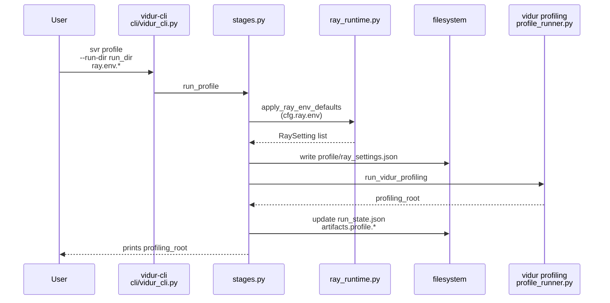
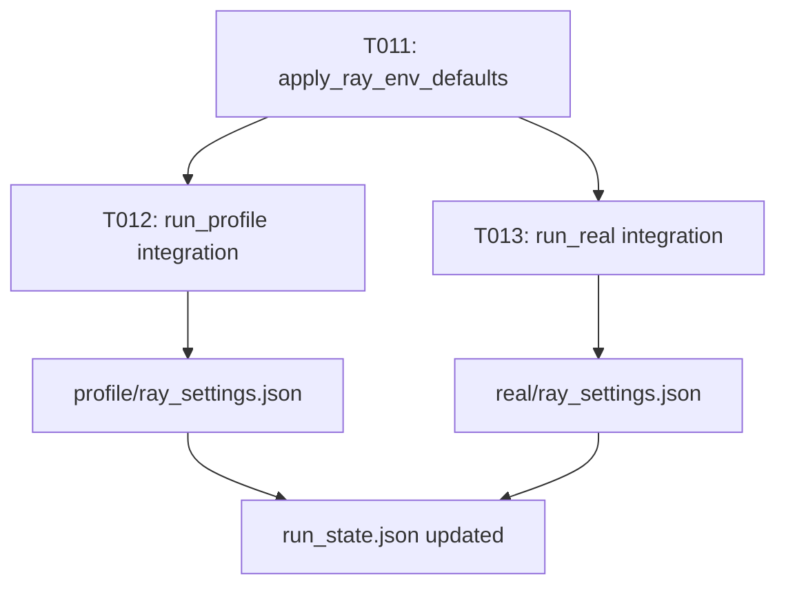

# Implementation Guide: US1 (config-defined Ray settings + effective report)

**Phase**: 3 | **Feature**: Vidur CLI Ray runtime config | **Tasks**: T009–T015

## Goal

Deliver User Story 1 (P1 MVP):

- Users configure a small supported set of Ray settings via Hydra (`cfg.ray.env.*`).
- `vidur-cli` applies those settings to Ray-using stages (at minimum: `svr profile` and `svr real`) without requiring manual `export RAY_*`.
- `vidur-cli` emits an “effective settings report” (value + source per setting) and persists a `ray_settings.json` artifact under the stage output directory.

## Public APIs

### T009–T010: Unit tests (`tests/unit/test_ray_runtime_config.py`)

Write tests first so `apply_ray_env_defaults()` has a clear contract.

Recommended cases:

```python
# tests/unit/test_ray_runtime_config.py

from __future__ import annotations

import os
from typing import Any

import pytest

from gpu_simulate_test.ray_runtime import apply_ray_env_defaults, SUPPORTED_RAY_ENV_KEYS


def test_config_injects_when_env_unset(monkeypatch: pytest.MonkeyPatch) -> None:
    for k in SUPPORTED_RAY_ENV_KEYS:
        monkeypatch.delenv(k, raising=False)

    cfg: dict[str, Any] = {
        "RAY_DEFAULT_OBJECT_STORE_MAX_MEMORY_BYTES": 4000000000,
        "RAY_DEFAULT_OBJECT_STORE_MEMORY_PROPORTION": 0.10,
        "RAY_OBJECT_STORE_ALLOW_SLOW_STORAGE": True,
    }
    settings = apply_ray_env_defaults(cfg)

    assert os.environ["RAY_DEFAULT_OBJECT_STORE_MAX_MEMORY_BYTES"] == "4000000000"
    assert os.environ["RAY_DEFAULT_OBJECT_STORE_MEMORY_PROPORTION"] == "0.1"
    assert os.environ["RAY_OBJECT_STORE_ALLOW_SLOW_STORAGE"] == "1"
    assert {s.source for s in settings} == {"configuration"}


def test_none_values_are_noop(monkeypatch: pytest.MonkeyPatch) -> None:
    for k in SUPPORTED_RAY_ENV_KEYS:
        monkeypatch.delenv(k, raising=False)

    cfg = {k: None for k in SUPPORTED_RAY_ENV_KEYS}
    settings = apply_ray_env_defaults(cfg)

    for k in SUPPORTED_RAY_ENV_KEYS:
        assert k not in os.environ

    # “default” means: not set by env/config (effective_value remains null)
    assert all(s.source == "default" for s in settings)
    assert all(s.effective_value is None for s in settings)
```

---

### T011: Apply config defaults (`src/gpu_simulate_test/ray_runtime.py`)

Implement the behavior for “config-only” settings:

- If a supported env var is not set by the user and config provides a non-null value, set `os.environ[key]`.
- If config is missing/`None`, do not inject anything.
- Return a stable report with `effective_value=None` when neither env nor config set the key (do not compute Ray’s derived defaults).

Suggested public types + function shape:

```python
# src/gpu_simulate_test/ray_runtime.py

from __future__ import annotations

import os
from dataclasses import dataclass
from typing import Any, Literal, Mapping


RaySettingSource = Literal["environment", "configuration", "default"]


@dataclass(frozen=True)
class RaySetting:
    key: str
    effective_value: str | None
    source: RaySettingSource


def apply_ray_env_defaults(cfg_ray_env: Mapping[str, Any] | None) -> list[RaySetting]:
    cfg_ray_env = dict(cfg_ray_env or {})
    out: list[RaySetting] = []
    for key in SUPPORTED_RAY_ENV_KEYS:
        if key in os.environ:
            out.append(RaySetting(key=key, effective_value=os.environ.get(key), source="environment"))
            continue
        raw = cfg_ray_env.get(key)
        if raw is None:
            out.append(RaySetting(key=key, effective_value=None, source="default"))
            continue

        # Phase 3 only: assume raw is valid; Phase 6 adds strict validation.
        value = _serialize_for_env(key, raw)
        os.environ[key] = value
        out.append(RaySetting(key=key, effective_value=value, source="configuration"))
    return out
```

Keep `_serialize_for_env()` local/private so Phase 6 can add validation + normalization.

---

### T012–T014: Integrate into `vidur-cli` stages (`src/gpu_simulate_test/vidur_cli/stages.py`)

Integration requirements:

- Must run **after** Hydra composition (needs `cfg.ray.env`) and **before** any imports/calls that may start Ray.
- Must write a JSON artifact per stage:
  - `<run_dir>/profile/ray_settings.json`
  - `<run_dir>/real/ray_settings.json` (when the backend uses Ray, e.g., Sarathi)
- Must not break stdout “primary output path” behavior; print the report to stderr.
- Must record the absolute `ray_settings.json` path into `run_state.json` under `artifacts.profile` / `artifacts.real` as a non-breaking extra field.

**Usage Flow**:



**Report format**: align JSON shape to `specs/006-vidur-cli-ray-config/contracts/ray_settings.schema.json`.

---

### T015: Manual smoke doc (`tests/manual/vidur_cli_ray_settings_smoke.md`)

Document a concrete command-line recipe that demonstrates:

- Config-only Ray settings (no `export RAY_*`)
- The stderr effective report and the on-disk `ray_settings.json` artifact locations

## Phase Integration



## Testing

### Test Input

- Pixi env (Phase 1).
- For an end-to-end manual run of `svr profile`, a CUDA-capable GPU host is required.
- For unit tests, no GPU is required.

### Test Procedure

```bash
cd <WORKSPACE_ROOT>

# Unit tests (no GPU required):
pixi run pytest tests/unit/test_ray_runtime_config.py

# Manual smoke (GPU likely required for svr profile):
# Follow: tests/manual/vidur_cli_ray_settings_smoke.md
```

### Test Output

- Unit tests pass.
- Manual smoke produces:
  - `<run_dir>/profile/ray_settings.json`
  - stderr report listing each supported key + source `configuration`/`default`

## References

- Spec: `specs/006-vidur-cli-ray-config/spec.md`
- Data model: `specs/006-vidur-cli-ray-config/data-model.md`
- Contracts: `specs/006-vidur-cli-ray-config/contracts/`

## Implementation Summary

US1 is complete (config-defined Ray settings + effective report + artifact).

### What has been implemented

- Added unit tests: `tests/unit/test_ray_runtime_config.py`.
- Implemented `apply_ray_env_defaults(...)` + `write_ray_settings_json(...)` in `src/gpu_simulate_test/ray_runtime.py`.
- Integrated into `vidur-cli` stages:
  - `svr profile` writes `<run_dir>/profile/ray_settings.json`, prints report to stderr, and records `artifacts.profile.ray_settings_json`.
  - `svr real` (Ray backend only, e.g. `backend=sarathi`) writes `<run_dir>/real/ray_settings.json`, prints report to stderr, and records `artifacts.real.ray_settings_json`.
- Added manual smoke doc: `tests/manual/vidur_cli_ray_settings_smoke.md`.

### How to verify

```bash
cd <WORKSPACE_ROOT>
pixi run pytest tests/unit/test_ray_runtime_config.py
```

For end-to-end stage smoke (GPU likely required), follow:

- `tests/manual/vidur_cli_ray_settings_smoke.md`
