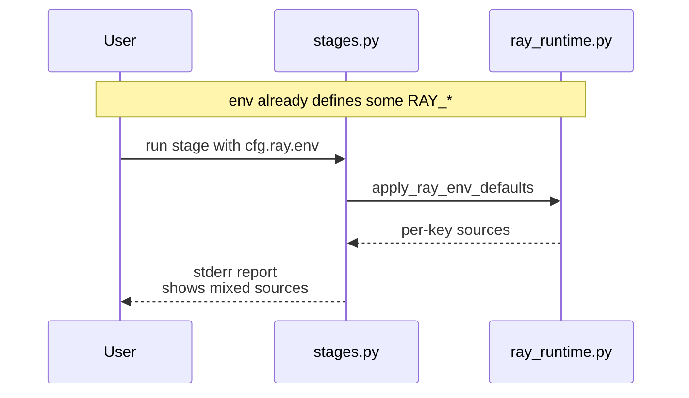
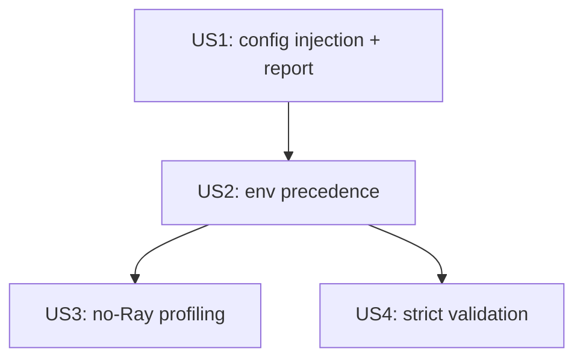

# Implementation Guide: US2 (env precedence: env > config per setting)

**Phase**: 4 | **Feature**: Vidur CLI Ray runtime config | **Tasks**: T016–T019

## Goal

Deliver User Story 2 (P1):

- If a supported `RAY_*` env var is set by the user, `vidur-cli` must never override it.
- Mixed sourcing is allowed and visible: some keys can come from env, others from config.

## Public APIs

### T016–T017: Unit tests (env > config precedence)

Extend `tests/unit/test_ray_runtime_config.py` with cases like:

```python
# tests/unit/test_ray_runtime_config.py

from __future__ import annotations

from typing import Any

import pytest

from gpu_simulate_test.ray_runtime import apply_ray_env_defaults


def test_env_wins_over_config(monkeypatch: pytest.MonkeyPatch) -> None:
    monkeypatch.setenv("RAY_DEFAULT_OBJECT_STORE_MAX_MEMORY_BYTES", "123")
    cfg: dict[str, Any] = {"RAY_DEFAULT_OBJECT_STORE_MAX_MEMORY_BYTES": 999}
    settings = apply_ray_env_defaults(cfg)
    assert monkeypatch.getenv("RAY_DEFAULT_OBJECT_STORE_MAX_MEMORY_BYTES") == "123"
    assert [s for s in settings if s.key == "RAY_DEFAULT_OBJECT_STORE_MAX_MEMORY_BYTES"][0].source == "environment"


def test_mixed_sourcing(monkeypatch: pytest.MonkeyPatch) -> None:
    monkeypatch.setenv("RAY_DEFAULT_OBJECT_STORE_MAX_MEMORY_BYTES", "123")
    cfg: dict[str, Any] = {
        "RAY_DEFAULT_OBJECT_STORE_MAX_MEMORY_BYTES": 999,
        "RAY_DEFAULT_OBJECT_STORE_MEMORY_PROPORTION": 0.1,
    }
    settings = apply_ray_env_defaults(cfg)
    sources = {s.key: s.source for s in settings}
    assert sources["RAY_DEFAULT_OBJECT_STORE_MAX_MEMORY_BYTES"] == "environment"
    assert sources["RAY_DEFAULT_OBJECT_STORE_MEMORY_PROPORTION"] == "configuration"
```

---

### T018: Precedence implementation (`src/gpu_simulate_test/ray_runtime.py`)

US1 already requires env keys are respected. For US2, ensure this is true for all supported keys and that the report is precise:

- If `key in os.environ` at entry, do not change it.
- `effective_value` for env keys should be the current env string.
- For config keys, set env and report `configuration`.
- For defaults, report `default` with `effective_value=None`.

---

### T019: Report clarity (stderr + JSON)

Make the stage-level report emitted by `stages.py` reflect mixed sourcing clearly (one line per key is sufficient).

**Usage Flow**:



## Phase Integration



## Testing

### Test Input

- None (unit tests only; use `pytest` + `monkeypatch`).

### Test Procedure

```bash
cd <WORKSPACE_ROOT>
pixi run pytest tests/unit/test_ray_runtime_config.py -k \"env_wins or mixed_sourcing\"
```

### Test Output

- Tests pass and confirm env vars are not overridden.

## References

- Spec: `specs/006-vidur-cli-ray-config/spec.md`
- Research: `specs/006-vidur-cli-ray-config/research.md`

## Implementation Summary

US2 is complete (env vars always win over config per setting, with mixed sourcing visible).

### What has been implemented

- Added unit tests for env precedence + mixed sourcing in `tests/unit/test_ray_runtime_config.py`.
- `src/gpu_simulate_test/ray_runtime.py` applies per-key precedence **environment > configuration > default**.
- `vidur-cli` stage stderr report includes per-key `source=environment|configuration|default`.

### How to verify

```bash
cd <WORKSPACE_ROOT>
pixi run pytest tests/unit/test_ray_runtime_config.py -k "env_wins or mixed_sourcing"
```
