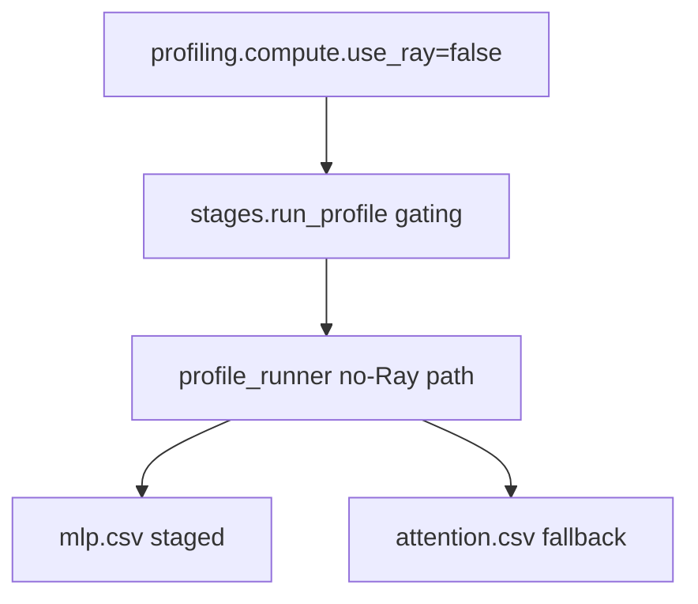

# Implementation Guide: US3 (no-Ray compute profiling + fallback outputs)

**Phase**: 5 | **Feature**: Vidur CLI Ray runtime config | **Tasks**: T020–T025

## Goal

Deliver User Story 3 (P2):

- Add `profiling.compute.use_ray` (default `true`) to control whether Vidur compute profiling uses Ray.
- When `false`, compute profiling must not start Ray at all (per clarifications) and must still produce downstream-compatible outputs:
  - Run MLP profiling sequentially (single-GPU only).
  - Skip attention profiling execution and always write an attention fallback CSV template.
- Unsupported “no-Ray” configurations must fail fast with an actionable `UserFacingError` (e.g., multi-GPU or tensor-parallel).

## Public APIs

### T020–T021: No-Ray gating tests (`tests/unit/test_vidur_profile_no_ray.py`)

Add unit tests that validate the “no-Ray” gating logic without requiring a GPU by testing the decision function(s).

Recommended patterns:

- In `stages.py`, centralize the “no-Ray allowed?” checks in a small pure function that you can unit test.
- Raise `UserFacingError` with a hint that tells the user how to proceed (e.g., set `profiling.compute.use_ray=true` or disable CPU overhead).

```python
# tests/unit/test_vidur_profile_no_ray.py

from __future__ import annotations

import pytest

from gpu_simulate_test.vidur_cli.errors import UserFacingError
from gpu_simulate_test.vidur_cli.stages import _validate_no_ray_compute_profiling  # helper you add


def test_no_ray_rejects_multi_gpu() -> None:
    with pytest.raises(UserFacingError, match="single-GPU"):
        _validate_no_ray_compute_profiling(num_gpus=2, tensor_parallel_size=1, include_cpu_overhead=False)


def test_no_ray_rejects_cpu_overhead() -> None:
    with pytest.raises(UserFacingError, match="cpu overhead"):
        _validate_no_ray_compute_profiling(num_gpus=1, tensor_parallel_size=1, include_cpu_overhead=True)
```

---

### T022: Stage-level gating (`src/gpu_simulate_test/vidur_cli/stages.py`)

In `run_profile()`:

- Read `profiling.compute.use_ray` from the composed config.
- If `false`, validate the supported scope (single GPU, no tensor-parallel, and no CPU overhead profiling if that would start Ray).
- Pass a `compute_use_ray` flag down to the profiling runner.

---

### T023–T024: No-Ray compute profiling implementation (`src/gpu_simulate_test/vidur_ext/profile_runner.py`)

Extend the public inputs:

```python
# src/gpu_simulate_test/vidur_ext/profile_runner.py

@dataclass(frozen=True)
class VidurProfileInputs:
    ...
    compute_use_ray: bool = True
```

Implement branching in `run_vidur_profiling()`:

- If `compute_use_ray=True`: keep current behavior (subprocess MLP + attention profiling entrypoints).
- If `compute_use_ray=False`:
  - Do **not** import `vidur.profiling.mlp.main` or `vidur.profiling.attention.main` (they import `ray` at module import time).
  - Instead import and use:
    - `vidur.profiling.common.model_config.ModelConfig`
    - `vidur.profiling.mlp.mlp_wrapper.MlpWrapper` (does not import Ray)
    - `vidur.profiling.utils.get_num_tokens_to_profile`
  - Generate rows sequentially for a single GPU and write `mlp.csv` directly to the staged destination.
  - Always write attention fallback CSV via the existing `_write_attention_fallback(...)`.

**Pseudocode** (MLP no-Ray path):

```python
def _run_and_stage_mlp_no_ray(*, model_id, max_tokens, tensor_parallel_size, profile_method, mlp_dst, staging_dir):
    assert tensor_parallel_size == 1
    model_cfg = ModelConfig.from_model_name(model_id)
    wrapper = MlpWrapper(
        model_cfg,
        num_tensor_parallel_workers=1,
        profile_method=_vidur_profile_method(requested_profile_method=profile_method),
        rank=0,
        output_dir=str(staging_dir),
    )
    results = []
    for num_tokens in get_num_tokens_to_profile(max_tokens):
        results.append(wrapper.profile(num_tokens))

    # flatten results like upstream Vidur main:
    df = pd.json_normalize([r["time_stats"] for r in results]).add_prefix("time_stats.")
    df = df.join(pd.DataFrame([{k: v for k, v in r.items() if k != "time_stats"} for r in results]))
    df.to_csv(mlp_dst, index=False)
```

Record clear provenance in `VidurProfileResult.extra`, e.g.:

- `extra["no_ray_compute_profiling"]=True`
- `extra["attention_fallback_template"]=...`

---

### T025: Manual smoke doc (`tests/manual/vidur_cli_no_ray_compute_profiling_smoke.md`)

Document:

- How to run `svr profile` with `profiling.compute.use_ray=false`.
- How to verify Ray did not start (e.g., check for `raylet` processes before/after).
- Which outputs must exist (`mlp.csv` + `attention.csv`).

## Phase Integration



## Testing

### Test Input

- Unit tests do not require GPU.
- For manual profiling runs: a CUDA-capable GPU host is required.

### Test Procedure

```bash
cd <WORKSPACE_ROOT>

# Unit tests:
pixi run pytest tests/unit/test_vidur_profile_no_ray.py

# Manual smoke:
# Follow: tests/manual/vidur_cli_no_ray_compute_profiling_smoke.md
```

### Test Output

- Unit tests pass and confirm unsupported configs are rejected.
- Manual smoke produces a profiling root with:
  - `data/profiling/compute/<hardware>/<model>/mlp.csv`
  - `data/profiling/compute/<hardware>/<model>/attention.csv` (fallback)

## References

- Spec: `specs/006-vidur-cli-ray-config/spec.md`
- Research: `specs/006-vidur-cli-ray-config/research.md` (Decision 6)
- Existing runner: `src/gpu_simulate_test/vidur_ext/profile_runner.py`

## Implementation Summary

US3 is complete (no-Ray compute profiling path + fail-fast gating + fallback outputs).

### What has been implemented

- Added stage-level gating in `src/gpu_simulate_test/vidur_cli/stages.py`:
  - Reads `profiling.compute.use_ray` (default `true`).
  - When `false`, rejects unsupported configs (multi-GPU, tensor-parallel, cpu overhead) before profiling starts.
- Extended `VidurProfileInputs` with `compute_use_ray: bool` and implemented the no-Ray path in `src/gpu_simulate_test/vidur_ext/profile_runner.py`:
  - Runs MLP profiling sequentially in-process via Vidur `MlpWrapper` (single GPU only).
  - Skips attention execution and always writes the fallback `attention.csv` via `_write_attention_fallback(...)`.
  - Records provenance flags in `VidurProfileResult.extra` (`no_ray_compute_profiling`, `attention_fallback_template`, etc.).
- Added unit tests for the gating helper: `tests/unit/test_vidur_profile_no_ray.py`.
- Added manual smoke doc: `tests/manual/vidur_cli_no_ray_compute_profiling_smoke.md`.

### How to verify

```bash
cd <WORKSPACE_ROOT>
pixi run pytest tests/unit/test_vidur_profile_no_ray.py
```

For end-to-end stage smoke (GPU required), follow:

- `tests/manual/vidur_cli_no_ray_compute_profiling_smoke.md`
