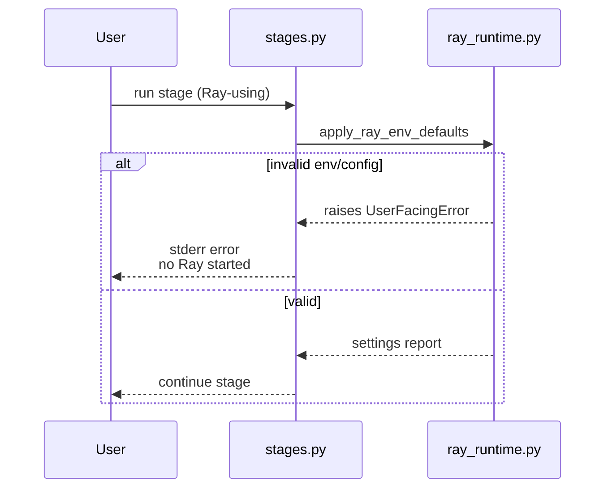
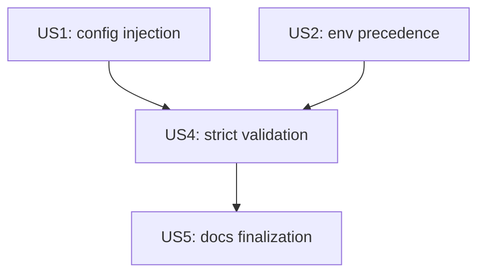

# Implementation Guide: US4 (fail fast validation + unsupported keys)

**Phase**: 6 | **Feature**: Vidur CLI Ray runtime config | **Tasks**: T026–T029

## Goal

Deliver User Story 4 (P2):

- Validate supported Ray env/config values before starting any Ray-using stage.
- Reject unknown keys under `ray.env` and list supported keys.
- Raise actionable `UserFacingError` messages (include which key is invalid and how to fix it).

## Public APIs

### T026–T027: Validation tests (`tests/unit/test_ray_runtime_config.py`)

Add tests for invalid values coming from:

- Config (`cfg.ray.env`)
- Existing env (`os.environ`)

Cases to include:
- Negative bytes
- Proportion outside `(0,1]`
- Slow-storage not parseable as bool (env) or non-bool (config)
- Empty string env var values

---

### T028: Strict validation + unsupported key rejection (`src/gpu_simulate_test/ray_runtime.py`)

Implement parsing/validation in one place so stage runners can call it early.

Recommended helpers:

```python
# src/gpu_simulate_test/ray_runtime.py

def _validate_no_unknown_keys(cfg_ray_env: Mapping[str, Any]) -> None:
    unknown = sorted(set(cfg_ray_env) - set(SUPPORTED_RAY_ENV_KEYS))
    if unknown:
        raise UserFacingError(
            "Unsupported Ray setting key(s) in config.",
            hint="Remove unsupported keys under ray.env.",
            context={"unknown": unknown, "supported": list(SUPPORTED_RAY_ENV_KEYS)},
        )


def _parse_env_int(name: str, raw: str) -> int:
    s = raw.strip()
    if not s.isdigit():
        raise UserFacingError(
            f"Invalid {name} environment value.",
            hint="Expected a non-negative integer string (bytes).",
            context={"value": raw},
        )
    return int(s)
```

Then enforce the rules from `specs/006-vidur-cli-ray-config/research.md` (Decision 4).

---

### T029: Ensure validation runs before Ray-starting imports (`src/gpu_simulate_test/vidur_cli/stages.py`)

In `run_profile()` / `run_real()`:

- Compose Hydra config.
- Immediately call `apply_ray_env_defaults(cfg.ray.env)` (now doing strict validation too).
- If validation fails, raise `UserFacingError` before any Ray-using imports/calls.

**Usage Flow**:



## Phase Integration



## Testing

### Test Input

- None (unit tests only).

### Test Procedure

```bash
cd <WORKSPACE_ROOT>
pixi run pytest tests/unit/test_ray_runtime_config.py -k \"invalid\"
```

### Test Output

- Tests pass and show invalid inputs raise `UserFacingError`.

## References

- Spec: `specs/006-vidur-cli-ray-config/spec.md`
- Research: `specs/006-vidur-cli-ray-config/research.md`

## Implementation Summary

US4 is complete (strict validation + unsupported key rejection + fail-fast behavior).

### What has been implemented

- Implemented strict validation + unsupported key rejection in `src/gpu_simulate_test/ray_runtime.py`:
  - Rejects unknown keys under `cfg.ray.env` and lists supported keys.
  - Validates both config values and existing env values for all supported keys.
  - Raises `UserFacingError` with actionable messages (no silent fallback).
- Added unit tests for invalid config/env values in `tests/unit/test_ray_runtime_config.py`.
- `vidur-cli` stages call `apply_ray_env_defaults(...)` before Ray-starting imports in Ray-using code paths.

### How to verify

```bash
cd <WORKSPACE_ROOT>
pixi run pytest tests/unit/test_ray_runtime_config.py -k "invalid or unsupported"
```
