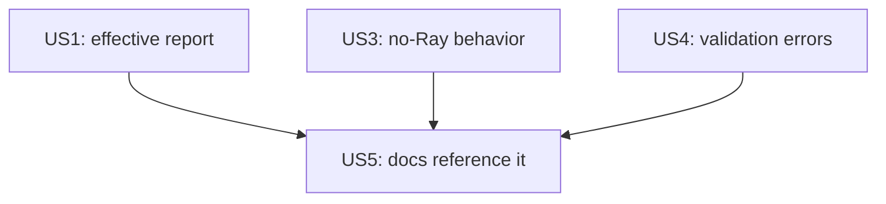

# Implementation Guide: US5 (documentation for safe configuration)

**Phase**: 7 | **Feature**: Vidur CLI Ray runtime config | **Tasks**: T030–T032

## Goal

Deliver User Story 5 (P3):

- Document supported settings, precedence, opt-in defaults, and a Docker-friendly example.
- Ensure docs match the final implemented behavior (including no-Ray limitations and what gets skipped).

## Public APIs

This phase is documentation-only; the “public API” is the user-facing documentation surface.

### T030: Known-issue runbook update (`context/issues/known/issue-vidur-ray-object-store-memory-spike-in-docker.md`)

Update the mitigations section to include config-first usage, e.g.:

- Where to set `ray.env.*` (Hydra overrides / config files)
- Precedence: env > config > defaults
- A Docker-friendly example that avoids manual `export RAY_*`

### T031: Configs README (`configs/README.md`)

Add a short section describing:

- The `ray` config group location (`configs/compare_vidur_real/ray/default.yaml`)
- Supported keys list
- That defaults are opt-in (nulls)

### T032: Feature quickstart alignment (`specs/006-vidur-cli-ray-config/quickstart.md`)

Ensure the quickstart:

- Uses the final override paths (`ray.env.*`, `profiling.compute.use_ray=false`)
- Mentions any unsupported no-Ray configurations and the fail-fast behavior

## Phase Integration

## Testing

### Test Input

- None.

### Test Procedure

- Manually verify each doc contains the required elements from the spec:
  - Supported settings list
  - Precedence rules
  - Opt-in defaults
  - Docker-friendly example

### Test Output

- A reader can configure Ray safely using only the docs and can find the supported settings + precedence rules quickly.

## References

- Spec: `specs/006-vidur-cli-ray-config/spec.md`
- Quickstart: `specs/006-vidur-cli-ray-config/quickstart.md`

## Implementation Summary

US5 is complete (docs cover supported settings, precedence, opt-in defaults, and examples).

### What has been implemented

- Updated known-issue runbook with config-first usage + precedence + example:
  - `context/issues/known/issue-vidur-ray-object-store-memory-spike-in-docker.md`
- Updated configs documentation:
  - `configs/README.md`
- Aligned feature quickstart with implemented behavior:
  - `specs/006-vidur-cli-ray-config/quickstart.md`

### How to verify

- Confirm the docs include:
  - Supported settings list + validation constraints.
  - Precedence rules: env > config > defaults.
  - Opt-in defaults (`null` means no injection).
  - A Docker-friendly example using `ray.env.*` (no manual `export RAY_*`).
