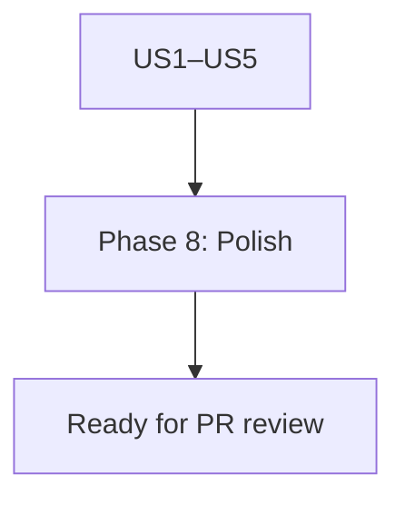

# Implementation Guide: Polish (tests, schema alignment, changelog note)

**Phase**: 8 | **Feature**: Vidur CLI Ray runtime config | **Tasks**: T033–T035

## Goal

Finish cross-cutting quality work:

- Run unit tests and fix regressions.
- Ensure the `ray_settings.json` artifact matches the schema contract.
- Add a short changelog-style note in the existing plan/runbook context.

## Public APIs

### T033: Keep tests green

```bash
cd <WORKSPACE_ROOT>
pixi run pytest
```

### T034: Schema ↔ implementation alignment

Ensure the JSON written by `write_ray_settings_json(...)` matches:

- `specs/006-vidur-cli-ray-config/contracts/ray_settings.schema.json`

### T035: Context note update

Add a short note in:

- `context/plans/plan-vidur-cli-ray-runtime-config.md`

Link to:

- `specs/006-vidur-cli-ray-config/plan.md`
- `specs/006-vidur-cli-ray-config/tasks.md`

## Phase Integration



## Testing

### Test Input

- A working Pixi env with all deps installed.

### Test Procedure

```bash
cd <WORKSPACE_ROOT>
pixi run pytest
```

### Test Output

- `N passed, 0 failed`

## References

- Tasks: `specs/006-vidur-cli-ray-config/tasks.md`
- Schema: `specs/006-vidur-cli-ray-config/contracts/ray_settings.schema.json`

## Implementation Summary

Phase 8 is complete (tests green, schema aligned, and context note updated).

### What has been implemented

- Ran the full test suite (`pixi run pytest`) and fixed any regressions introduced by this feature.
- Ensured `ray_settings.json` written by `src/gpu_simulate_test/ray_runtime.py` matches:
  - `specs/006-vidur-cli-ray-config/contracts/ray_settings.schema.json`
- Updated `context/plans/plan-vidur-cli-ray-runtime-config.md` with a short "implemented" note linking to the feature spec.

### How to verify

```bash
cd <WORKSPACE_ROOT>
pixi run pytest
```
