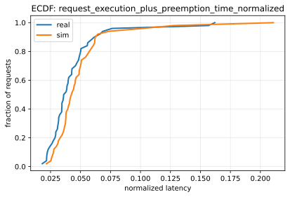
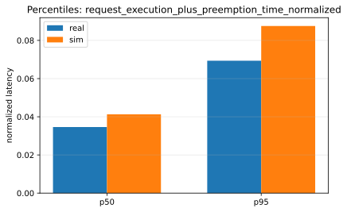
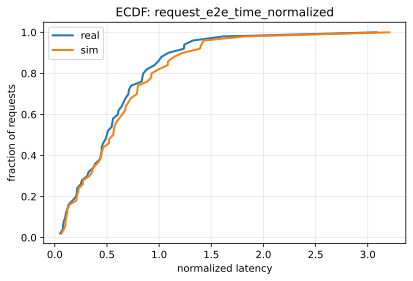
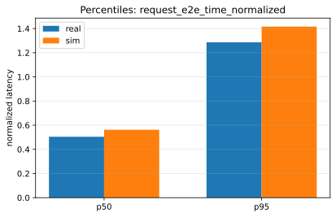
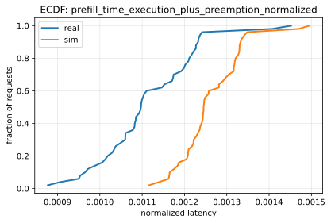
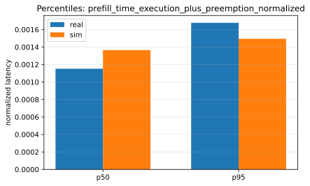
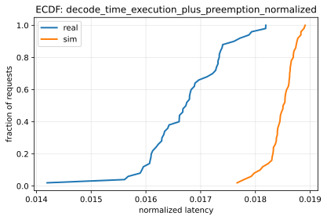
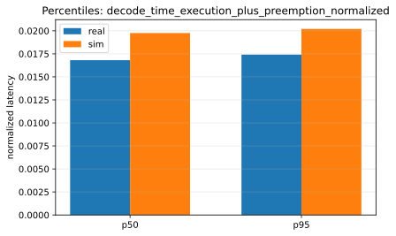

# Sim-vs-Real Report: <RUN_TAG>

## Inputs
- sim: `<RUN_DIR>/report/inputs/sim_request_metrics.csv`
- real: `<RUN_DIR>/report/inputs/real_request_metrics.csv`

## Profiling
- root: `<RUN_DIR>/profile`
- cpu_overhead:
  - modeling: `disabled`
  - csv: `<RUN_DIR>/profile/data/profiling/cpu_overhead/a100_pairwise_nvlink/meta-llama/Llama-2-7b-hf/cpu_overheads.csv`
  - status: `skipped`
- mlp:
  - profile_method: `record_function`
  - validation: `mode=strict nan_policy=zero small_input_threshold=128 zero_heavy_limit=0.01`
  - fallback: `enabled=false method=cuda_event used=false`
- mlp_consumer:
  - nan_policy: `zero` (nan_policy=`zero` mode=`strict`)
  - nan_drop: `disabled`
  - nan_fill_zero: `enabled` models_with_fills=`<N>` cells_filled_total=`<N>`

## Config (apple-to-apple)
- model_id: `meta-llama/Llama-2-7b-hf`
- model_ref (sim): `<MODEL_REF>`
- model_ref (real): `<MODEL_REF>`
- arrival_kind: `fixed_interval`
- arrival_params: `seed=0`
- trace: num_requests=`50` max_total_tokens=`4021`
- max_tokens: sim=`4096` real=`4096` (match)
- ignore_eos (real): `True`
- tensor_parallel_size: sim=`1` real=`1` (match)
- pipeline_parallel_size: sim=`1` real=`1` (match)
- chunk_size: sim=`16` real=`16` (match)
- batch_size: sim=`16` real=`16` (match)
- block_size (sim): `16`
- watermark_blocks_fraction (sim): `0.01`
- cpu_overhead_modeling (sim): `disabled`

## Scores
| Metric | Percentile | Sim | Real | Percent error |
|--------|------------|-----|------|---------------|
| request_execution_plus_preemption_time_normalized | p50 | 0.0390204 | 0.0348791 | 11.87% |
| request_execution_plus_preemption_time_normalized | p95 | 0.0825792 | 0.0698994 | 18.14% |
| request_e2e_time_normalized | p50 | 0.51677 | 0.447283 | 15.54% |
| request_e2e_time_normalized | p95 | 1.29773 | 1.1346 | 14.38% |
| prefill_time_execution_plus_preemption_normalized | p50 | 0.00124563 | 0.0010974 | 13.51% |
| prefill_time_execution_plus_preemption_normalized | p95 | 0.00134502 | 0.00123913 | 8.54% |
| decode_time_execution_plus_preemption_normalized | p50 | 0.0185211 | 0.0167377 | 10.65% |
| decode_time_execution_plus_preemption_normalized | p95 | 0.0188312 | 0.0179082 | 5.15% |

## Figures
### Metric: request_execution_plus_preemption_time_normalized

### Metric: request_e2e_time_normalized

### Metric: prefill_time_execution_plus_preemption_normalized

### Metric: decode_time_execution_plus_preemption_normalized

