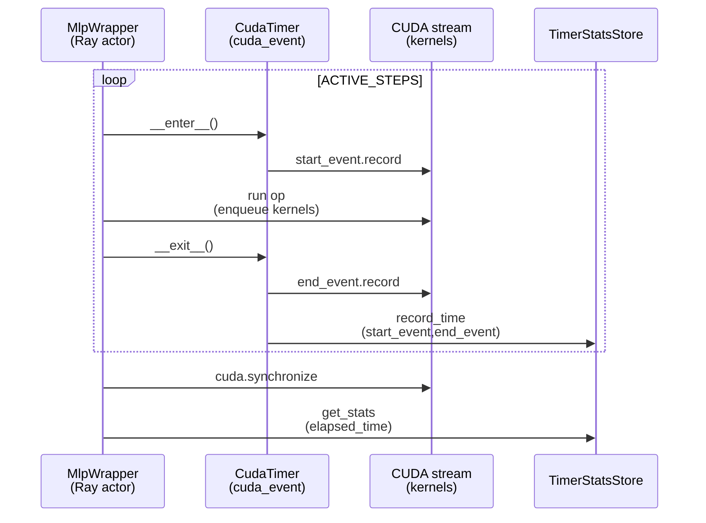
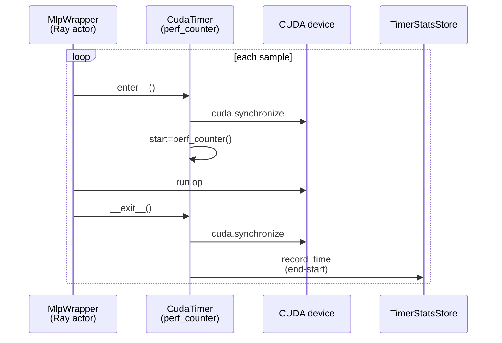
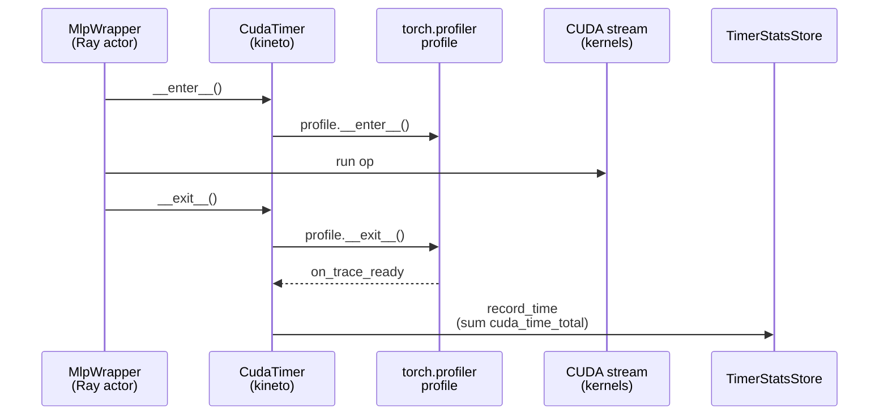
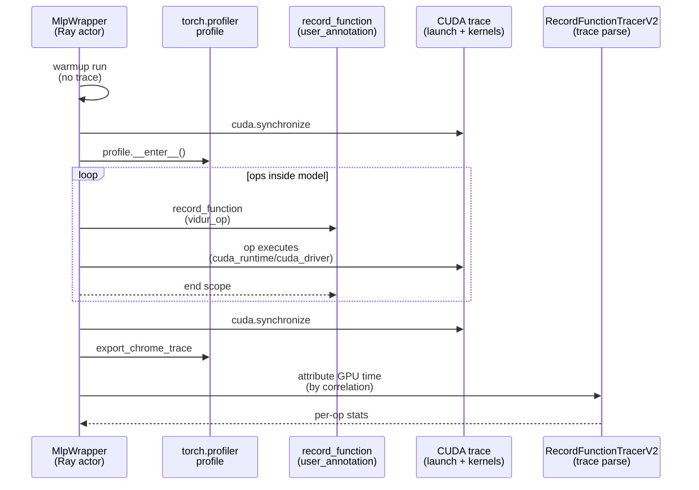

# Advanced tutorial: Vidur MLP `profile_method` sweep (sim-vs-real)

This tutorial helps answer: *“Why does sim-vs-real change so much when I change Vidur’s MLP profiling method?”*

You will run the exact same `vidur-cli` **static** sim-vs-real pipeline five times, varying only:

```yaml
profiling:
  mlp:
    profile_method: <one of: cuda_event | record_function | record_function_org | kineto | perf_counter>
```

Notes:

- `profiling.mlp.profile_method` is required (no hidden defaults).
- Missing (NaN) timing targets in `mlp.csv` are handled by `profiling.mlp.validation.nan_policy=auto|reject|drop|zero` (default `auto`).
- The sweep runner includes the 4 Vidur-native methods plus `record_function_org` (repo-only alias for upstream tracer behavior).
  - Because upstream `record_function` can miss driver-launched kernels, the sweep runs `record_function_org` with `nan_policy=drop` for both profiling and sim consumption.

and then compare the final report score tables.

All run artifacts go under `tmp/` (gitignored). This tutorial directory only tracks **small, essential** inputs and a
sanitized example of expected outputs.

## Concepts (what is `profiling.mlp.profile_method`?)

`profiling.mlp.profile_method` controls **how Vidur measures per-operation time** when building `mlp.csv` (the
microbenchmark dataset that feeds Vidur’s execution-time predictors).

Those predictors directly affect simulated request latency, so changing the profiling method can significantly shift
sim-vs-real accuracy.

Where it lives in Vidur:

- `vidur.profiling.mlp.mlp_wrapper.MlpWrapper.profile` decides whether to use trace-based attribution
  (`record_function`) or timer-based sampling (everything else).
- `vidur.profiling.common.cuda_timer.CudaTimer` implements `cuda_event`, `kineto`, and `perf_counter` timing inside
  the model, feeding `vidur.profiling.common.timer_stats_store.TimerStatsStore`.

Vidur supports four methods (plus one repo-only alias):

- `cuda_event` (timer-based): records a CUDA start/end event around each operation and reports `elapsed_time` (GPU time
  on the stream; excludes forced synchronizations).
- `record_function` (trace-based): runs `torch.profiler.profile(...CUDA...)` and uses `record_function` regions
  (`cat=user_annotation`) as op boundaries; then attributes GPU time by correlating launch events to `kernel` events.
  - Caveat: historically, Vidur’s upstream tracer only considered `cuda_runtime` launches, so it could miss GPU time
    when kernels were launched via the CUDA *driver* API (`cuda_driver`). This repo fixes that gap in
    `005-vidur-mlp-cuda-driver`, but trace attribution can still be sensitive to trace contents and adds overhead.
- `kineto` (timer-based): wraps each op in a `torch.profiler.profile(...CUDA...)` context and aggregates
  `cuda_time_total` from profiler events (high overhead; slow).
- `perf_counter` (timer-based): uses `time.perf_counter()` with `torch.cuda.synchronize()` before/after each op (simple
  but coarse; tends to overestimate due to sync/launch overhead).
- `record_function_org` (repo-only alias): runs upstream Vidur’s `record_function` tracer behavior (no local patching).

> **Warning (upstream vs this repo): `record_function` tracing**
>
> Upstream Vidur’s `record_function` tracer only considers `cat=cuda_runtime` launch events when attributing GPU time.
> This repo’s `record_function` uses `RecordFunctionTracerV2` and also considers `cat=cuda_driver` launches.
>
> If you suspect discrepancies or timing artifacts introduced by the patched tracer, try
> `profiling.mlp.profile_method=record_function_org` to match upstream Vidur behavior exactly.

## Timing brackets (sequence diagrams)

These diagrams show the **measurement bracket** used for each method (what’s “inside the timer”) at a high level.

### `cuda_event`



### `perf_counter`



### `kineto`



### `record_function`



## Step-by-step

### Step 0 — Prerequisites

From repo root:

```bash
pixi install
git submodule update --init --recursive
pixi run python -c "import torch; print(torch.cuda.is_available())"
bash models/llama2-7b-hf/bootstrap.sh
```

Expected result:
- CUDA check prints `True`.
- `models/llama2-7b-hf/source-data` exists (symlink to machine-local model assets).

### Step 1 — Run the sweep

From repo root:

```bash
docs/tutorial/in-depth/adv-tut-vidur-cli-mlp-profile-methods/run_sweep_static_profile_methods.sh
```

Expected result:
- The script prints `SWEEP_DIR=...` and finishes with:
  - `done: <SWEEP_DIR>`
  - `comparison: <SWEEP_DIR>/comparison.md`
- Under `<SWEEP_DIR>/`, you get one full `vidur-cli` run per method.

### Step 2 — Inspect per-method reports (sanity)

Open the copied summaries under `<SWEEP_DIR>/`:

- `<SWEEP_DIR>/cuda_event_summary.md`
- `<SWEEP_DIR>/record_function_summary.md`
- `<SWEEP_DIR>/record_function_org_summary.md`
- `<SWEEP_DIR>/kineto_summary.md`
- `<SWEEP_DIR>/perf_counter_summary.md`

Expected result:
- Each summary has a `## Profiling` section with an `mlp:` block, e.g.

```text
- mlp:
  - profile_method: `cuda_event`
  - validation: `mode=strict nan_policy=auto small_input_threshold=128 zero_heavy_limit=0.01`
  - fallback: `enabled=false method=cuda_event used=false`
```

This is how you confirm the report corresponds to the method you intended to test.

### Step 3 — Compare results across methods

Open:

- `<SWEEP_DIR>/comparison.md` (quick table)
- `<SWEEP_DIR>/comparison_scores.csv` (full score table)
- `<SWEEP_DIR>/comparison_runs.csv` (run dirs + settings)

Expected result:
- `comparison.md` contains:
  - a table mapping `method → run_dir`
  - a table of percent error for selected metrics (p50/p95)

### Step 4 — Interpret “sim is much larger than real”

If sim latencies are consistently **larger than real**, the simulator is likely using **over-estimated** microbenchmark
timings somewhere. In this tutorial you only vary MLP timing method, so:

- if `perf_counter` is worst: that’s often expected (sync-heavy wall-clock timing inflates costs)
- if `cuda_event` is worse than `record_function`/`kineto`: it suggests GPU-event timing for this setup is producing
  larger MLP costs than the trace-based methods (and you should choose the method that best matches your goal)

Use `comparison_scores.csv` to see whether the effect is mostly in:

- `prefill_time_*` vs `decode_time_*` (prefill-heavy vs decode-heavy sensitivity), and/or
- p50 vs p95 (tail sensitivity)

## Tracked inputs and expected outputs

This tutorial tracks only small files:

- `inputs/trace_import.csv`: static trace in `vidur-cli` import schema.
- `expected_outputs/`: sanitized example outputs to show the expected output *shape*.

Exact numbers vary across machines and code revisions; treat `expected_outputs/` as a structural reference.

## Maintainers: refresh `expected_outputs/`

Run:

```bash
docs/tutorial/in-depth/adv-tut-vidur-cli-mlp-profile-methods/run_sweep_static_profile_methods.sh --snapshot-expected
```

Expected result:
- A sanitized snapshot is written under `<SWEEP_DIR>/expected_snapshot/`.

To update the git-tracked expected outputs, copy the snapshot into:

- `docs/tutorial/in-depth/adv-tut-vidur-cli-mlp-profile-methods/expected_outputs/`
