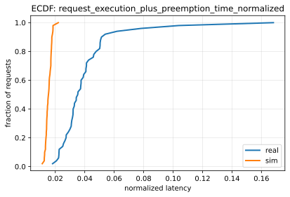
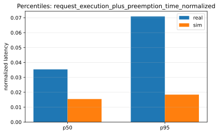
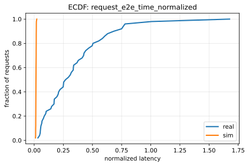
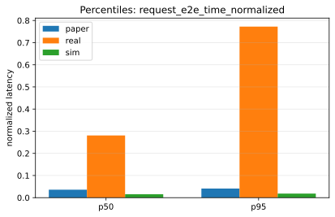

# Paper Fidelity Report: llama2_7b_arxiv

## Inputs
- sim: `/data1/huangzhe/code/gpu-simulate-test/tmp/paper_fidelity/runs/llama2_7b_arxiv/sim/request_metrics.csv`
- real: `/data1/huangzhe/code/gpu-simulate-test/tmp/paper_fidelity/runs/llama2_7b_arxiv/real/request_metrics.csv`

## Profiling
- root: `/data1/huangzhe/code/gpu-simulate-test/results/raw/vidur-profiling/llama2-7b/sarathi-serve/2026-01-07_15-15-15-281697026`
- mode: `host`
- interpretation: gap reproduction (host profiling bundle under results/raw/vidur-profiling)

## Scores
| Metric | Percentile | Sim | Real | Percent error | Verdict |
|--------|------------|-----|------|---------------|---------|
| request_execution_plus_preemption_time_normalized | p50 | 0.0154402 | 0.0353458 | 56.32% | fail |
| request_execution_plus_preemption_time_normalized | p95 | 0.0184007 | 0.0708718 | 74.04% | fail |
| request_e2e_time_normalized | p50 | 0.0154474 | 0.280828 | 94.50% | fail |
| request_e2e_time_normalized | p95 | 0.0184246 | 0.772279 | 97.61% | fail |

## Figures
### Static normalized latency

### Dynamic normalized latency

## Gap Diagnosis
- Vidur sim may underpredict wall-clock latency when CPU/runtime overhead is excluded and/or the profiling bundle is not host-matched; see `context/issues/known/issue-vidur-sim-underpredicts-sarathi-real.md`.
- Sim metrics: `/data1/huangzhe/code/gpu-simulate-test/tmp/paper_fidelity/runs/llama2_7b_arxiv/sim/request_metrics.csv`; Real metrics: `/data1/huangzhe/code/gpu-simulate-test/tmp/paper_fidelity/runs/llama2_7b_arxiv/real/request_metrics.csv`.

