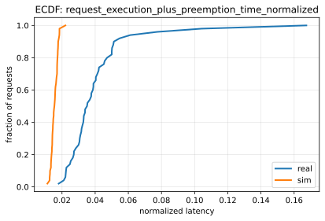
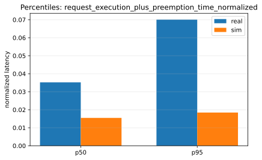
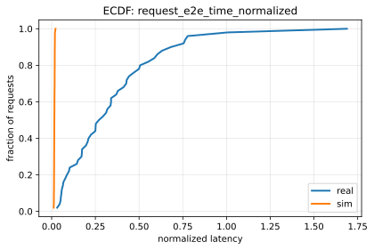
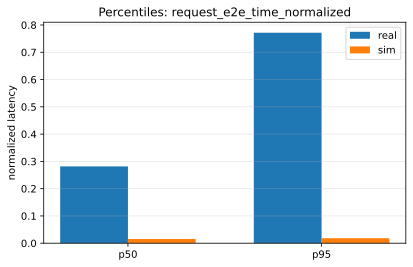

# Paper Fidelity Report: llama2_7b_arxiv_sim_vs_real_2026-01-08_03-43-35-976644797_dynamic_small

## Inputs
- sim: `/data1/huangzhe/code/gpu-simulate-test/tmp/paper_fidelity/runs/llama2_7b_arxiv_sim_vs_real_2026-01-08_03-43-35-976644797_dynamic_small/sim/request_metrics.csv`
- real: `/data1/huangzhe/code/gpu-simulate-test/tmp/paper_fidelity/runs/llama2_7b_arxiv_sim_vs_real_2026-01-08_03-43-35-976644797_dynamic_small/real/request_metrics.csv`

## Paper Reference
- workload_mode: `dynamic`
- matched: `False`
- model: `LLaMA2-7B (TP1)`
- trace: `Arxiv-4K`
- series: `predicted`
- metric: `request_e2e_time_normalized`
- load_frac_of_capacity: `0.85`
- error: `scenario.paper_reference.enabled=false`
- rows: `0`

## Scores
| Metric | Percentile | Sim | Real | Percent error | Verdict |
|--------|------------|-----|------|---------------|---------|
| request_execution_plus_preemption_time_normalized | p50 | 0.0154815 | 0.035231 | 56.06% | fail |
| request_execution_plus_preemption_time_normalized | p95 | 0.0184354 | 0.0700566 | 73.69% | fail |
| request_e2e_time_normalized | p50 | 0.0155332 | 0.281683 | 94.49% | fail |
| request_e2e_time_normalized | p95 | 0.018473 | 0.771545 | 97.61% | fail |
| prefill_time_execution_plus_preemption_normalized | p50 | 5.47285e-05 | 0.00111914 | 95.11% | fail |
| prefill_time_execution_plus_preemption_normalized | p95 | 6.47147e-05 | 0.0012651 | 94.88% | fail |
| decode_time_execution_plus_preemption_normalized | p50 | 0.014266 | 0.0169223 | 15.70% | fail |
| decode_time_execution_plus_preemption_normalized | p95 | 0.0171404 | 0.0180103 | 4.83% | fail |

## Figures
### Static normalized latency

### Dynamic normalized latency

## Gap Diagnosis
- Vidur sim may underpredict wall-clock latency when CPU/runtime overhead is excluded and/or the profiling bundle is not host-matched; see `context/issues/known/issue-vidur-sim-underpredicts-sarathi-real.md`.
- Sim metrics: `/data1/huangzhe/code/gpu-simulate-test/tmp/paper_fidelity/runs/llama2_7b_arxiv_sim_vs_real_2026-01-08_03-43-35-976644797_dynamic_small/sim/request_metrics.csv`; Real metrics: `/data1/huangzhe/code/gpu-simulate-test/tmp/paper_fidelity/runs/llama2_7b_arxiv_sim_vs_real_2026-01-08_03-43-35-976644797_dynamic_small/real/request_metrics.csv`.

