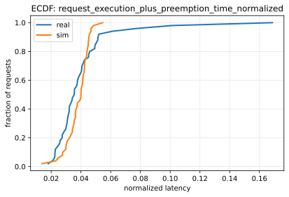
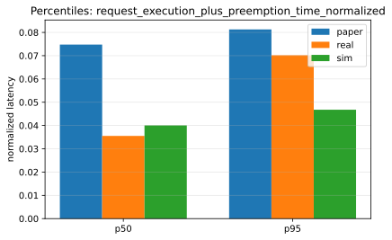
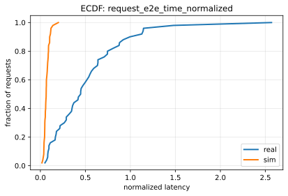
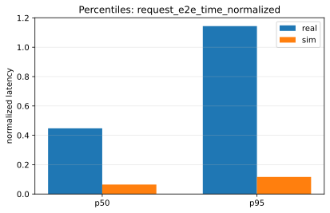

# Paper Fidelity Report: llama2_7b_arxiv_sim_vs_real_2026-01-08_03-43-35-976644797_static_small

## Inputs
- sim: `/data1/huangzhe/code/gpu-simulate-test/tmp/paper_fidelity/runs/llama2_7b_arxiv_sim_vs_real_2026-01-08_03-43-35-976644797_static_small/sim/request_metrics.csv`
- real: `/data1/huangzhe/code/gpu-simulate-test/tmp/paper_fidelity/runs/llama2_7b_arxiv_sim_vs_real_2026-01-08_03-43-35-976644797_static_small/real/request_metrics.csv`

## Profiling
- root: `/data1/huangzhe/code/gpu-simulate-test/results/raw/vidur-profiling/llama2-7b/sarathi-serve/2026-01-07_15-15-15-281697026`
- mode: `host`
- interpretation: gap reproduction (host profiling bundle under results/raw/vidur-profiling)

## Paper Reference
- model: `LLaMA2-7B (TP1)`
- trace: `Arxiv-4K`
- series: `predicted`
- sources: `/data1/huangzhe/code/gpu-simulate-test/context/summaries/vidur-kb/paper-results/static_fidelity_v12_request_execution_plus_preemption_time_normalized_p50.json`, `/data1/huangzhe/code/gpu-simulate-test/context/summaries/vidur-kb/paper-results/static_fidelity_v12_request_execution_plus_preemption_time_normalized_p95.json`

## Scores
| Metric | Percentile | Paper | Sim | Real | Sim vs Paper | Sim vs Real | Verdict |
|--------|------------|-------|-----|------|--------------|-------------|---------|
| request_execution_plus_preemption_time_normalized | p50 | 0.0747704 | 0.0400585 | 0.0355395 | 46.42% | 12.72% | fail |
| request_execution_plus_preemption_time_normalized | p95 | 0.0812659 | 0.0467845 | 0.0701834 | 42.43% | 33.34% | fail |
| request_e2e_time_normalized | p50 | N/A | 0.0645173 | 0.447524 | N/A | 85.58% | fail |
| request_e2e_time_normalized | p95 | N/A | 0.116475 | 1.14365 | N/A | 89.82% | fail |

## Figures
### Static normalized latency

### Dynamic normalized latency

## Gap Diagnosis
- Vidur sim may underpredict wall-clock latency when CPU/runtime overhead is excluded and/or the profiling bundle is not host-matched; see `context/issues/known/issue-vidur-sim-underpredicts-sarathi-real.md`.
- Sim metrics: `/data1/huangzhe/code/gpu-simulate-test/tmp/paper_fidelity/runs/llama2_7b_arxiv_sim_vs_real_2026-01-08_03-43-35-976644797_static_small/sim/request_metrics.csv`; Real metrics: `/data1/huangzhe/code/gpu-simulate-test/tmp/paper_fidelity/runs/llama2_7b_arxiv_sim_vs_real_2026-01-08_03-43-35-976644797_static_small/real/request_metrics.csv`.

