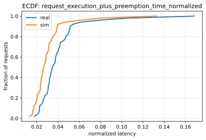
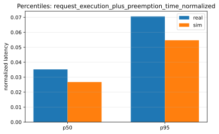
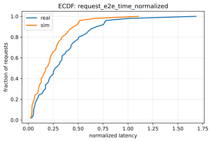
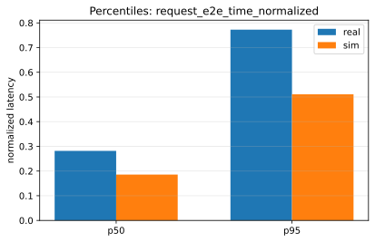

# Paper Fidelity Report: llama2_7b_arxiv_sim_vs_real_2026-01-08_11-19-50-358759756_dynamic_small

## Inputs
- sim: `/data1/huangzhe/code/gpu-simulate-test/tmp/paper_fidelity/runs/llama2_7b_arxiv_sim_vs_real_2026-01-08_11-19-50-358759756_dynamic_small/sim/request_metrics.csv`
- real: `/data1/huangzhe/code/gpu-simulate-test/tmp/paper_fidelity/runs/llama2_7b_arxiv_sim_vs_real_2026-01-08_11-19-50-358759756_dynamic_small/real/request_metrics.csv`

## Profiling
- root: `/data1/huangzhe/code/gpu-simulate-test/results/raw/vidur-profiling/llama2-7b/sarathi-serve/2026-01-07_15-15-15-281697026`
- mode: `host`
- interpretation: gap reproduction (host profiling bundle under results/raw/vidur-profiling)

## Scores
| Metric | Percentile | Sim | Real | Percent error | Verdict |
|--------|------------|-----|------|---------------|---------|
| request_execution_plus_preemption_time_normalized | p50 | 0.026752 | 0.0352056 | 24.01% | fail |
| request_execution_plus_preemption_time_normalized | p95 | 0.0546873 | 0.0705885 | 22.53% | fail |
| request_e2e_time_normalized | p50 | 0.185661 | 0.281631 | 34.08% | fail |
| request_e2e_time_normalized | p95 | 0.510727 | 0.772457 | 33.88% | fail |
| prefill_time_execution_plus_preemption_normalized | p50 | 0.000854232 | 0.0011139 | 23.31% | fail |
| prefill_time_execution_plus_preemption_normalized | p95 | 0.000956442 | 0.0012509 | 23.54% | fail |
| decode_time_execution_plus_preemption_normalized | p50 | 0.0128096 | 0.0169514 | 24.43% | fail |
| decode_time_execution_plus_preemption_normalized | p95 | 0.0134388 | 0.0179047 | 24.94% | fail |

## Figures
### Static normalized latency

### Dynamic normalized latency

## Gap Diagnosis
- Vidur sim may underpredict wall-clock latency when CPU/runtime overhead is excluded and/or the profiling bundle is not host-matched; see `context/issues/known/issue-vidur-sim-underpredicts-sarathi-real.md`.
- Sim metrics: `/data1/huangzhe/code/gpu-simulate-test/tmp/paper_fidelity/runs/llama2_7b_arxiv_sim_vs_real_2026-01-08_11-19-50-358759756_dynamic_small/sim/request_metrics.csv`; Real metrics: `/data1/huangzhe/code/gpu-simulate-test/tmp/paper_fidelity/runs/llama2_7b_arxiv_sim_vs_real_2026-01-08_11-19-50-358759756_dynamic_small/real/request_metrics.csv`.

