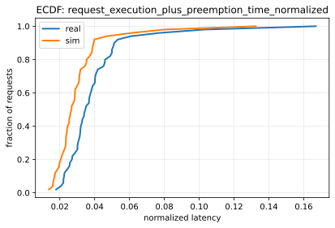
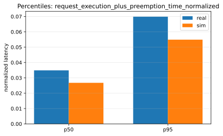
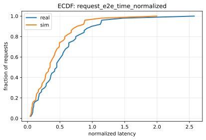
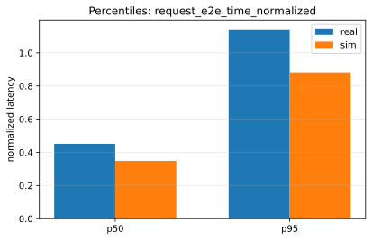

# Paper Fidelity Report: llama2_7b_arxiv_sim_vs_real_2026-01-08_11-19-50-358759756_static_small

## Inputs
- sim: `/data1/huangzhe/code/gpu-simulate-test/tmp/paper_fidelity/runs/llama2_7b_arxiv_sim_vs_real_2026-01-08_11-19-50-358759756_static_small/sim/request_metrics.csv`
- real: `/data1/huangzhe/code/gpu-simulate-test/tmp/paper_fidelity/runs/llama2_7b_arxiv_sim_vs_real_2026-01-08_11-19-50-358759756_static_small/real/request_metrics.csv`

## Profiling
- root: `/data1/huangzhe/code/gpu-simulate-test/results/raw/vidur-profiling/llama2-7b/sarathi-serve/2026-01-07_15-15-15-281697026`
- mode: `host`
- interpretation: gap reproduction (host profiling bundle under results/raw/vidur-profiling)

## Scores
| Metric | Percentile | Sim | Real | Percent error | Verdict |
|--------|------------|-----|------|---------------|---------|
| request_execution_plus_preemption_time_normalized | p50 | 0.026755 | 0.0348958 | 23.33% | fail |
| request_execution_plus_preemption_time_normalized | p95 | 0.0548906 | 0.0698779 | 21.45% | fail |
| request_e2e_time_normalized | p50 | 0.348741 | 0.451624 | 22.78% | fail |
| request_e2e_time_normalized | p95 | 0.88219 | 1.14164 | 22.73% | fail |
| prefill_time_execution_plus_preemption_normalized | p50 | 0.000855712 | 0.00110444 | 22.52% | fail |
| prefill_time_execution_plus_preemption_normalized | p95 | 0.000956403 | 0.00123574 | 22.60% | fail |
| decode_time_execution_plus_preemption_normalized | p50 | 0.0128092 | 0.0168223 | 23.86% | fail |
| decode_time_execution_plus_preemption_normalized | p95 | 0.0134381 | 0.017841 | 24.68% | fail |

## Figures
### Static normalized latency

### Dynamic normalized latency

## Gap Diagnosis
- Vidur sim may underpredict wall-clock latency when CPU/runtime overhead is excluded and/or the profiling bundle is not host-matched; see `context/issues/known/issue-vidur-sim-underpredicts-sarathi-real.md`.
- Sim metrics: `/data1/huangzhe/code/gpu-simulate-test/tmp/paper_fidelity/runs/llama2_7b_arxiv_sim_vs_real_2026-01-08_11-19-50-358759756_static_small/sim/request_metrics.csv`; Real metrics: `/data1/huangzhe/code/gpu-simulate-test/tmp/paper_fidelity/runs/llama2_7b_arxiv_sim_vs_real_2026-01-08_11-19-50-358759756_static_small/real/request_metrics.csv`.

