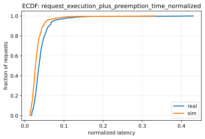
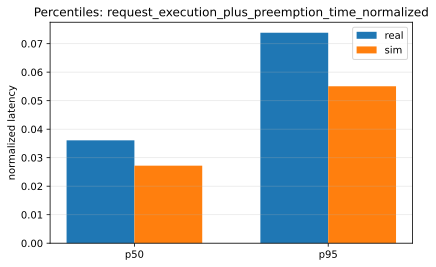
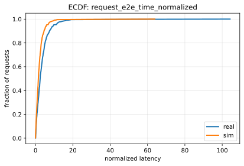
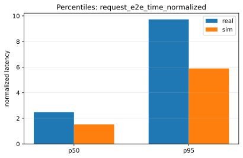

# Paper Fidelity Report: llama2_7b_arxiv_sim_vs_real_2026-01-08_12-22-51-887166845_dynamic_medium

## Inputs
- sim: `/data1/huangzhe/code/gpu-simulate-test/tmp/paper_fidelity/runs/llama2_7b_arxiv_sim_vs_real_2026-01-08_12-22-51-887166845_dynamic_medium/sim/request_metrics.csv`
- real: `/data1/huangzhe/code/gpu-simulate-test/tmp/paper_fidelity/runs/llama2_7b_arxiv_sim_vs_real_2026-01-08_12-22-51-887166845_dynamic_medium/real/request_metrics.csv`

## Profiling
- root: `/data1/huangzhe/code/gpu-simulate-test/results/raw/vidur-profiling/llama2-7b/sarathi-serve/2026-01-07_15-15-15-281697026`
- mode: `host`
- interpretation: gap reproduction (host profiling bundle under results/raw/vidur-profiling)

## Scores
| Metric | Percentile | Sim | Real | Percent error | Verdict |
|--------|------------|-----|------|---------------|---------|
| request_execution_plus_preemption_time_normalized | p50 | 0.0271965 | 0.0360758 | 24.61% | fail |
| request_execution_plus_preemption_time_normalized | p95 | 0.0550588 | 0.0738204 | 25.42% | fail |
| request_e2e_time_normalized | p50 | 1.52256 | 2.4883 | 38.81% | fail |
| request_e2e_time_normalized | p95 | 5.89653 | 9.72826 | 39.39% | fail |
| prefill_time_execution_plus_preemption_normalized | p50 | 0.000904453 | 0.0012066 | 25.04% | fail |
| prefill_time_execution_plus_preemption_normalized | p95 | 0.00108133 | 0.00145713 | 25.79% | fail |
| decode_time_execution_plus_preemption_normalized | p50 | 0.012915 | 0.0172028 | 24.93% | fail |
| decode_time_execution_plus_preemption_normalized | p95 | 0.0140736 | 0.018789 | 25.10% | fail |

## Figures
### Static normalized latency

### Dynamic normalized latency

## Gap Diagnosis
- Vidur sim may underpredict wall-clock latency when CPU/runtime overhead is excluded and/or the profiling bundle is not host-matched; see `context/issues/known/issue-vidur-sim-underpredicts-sarathi-real.md`.
- Sim metrics: `/data1/huangzhe/code/gpu-simulate-test/tmp/paper_fidelity/runs/llama2_7b_arxiv_sim_vs_real_2026-01-08_12-22-51-887166845_dynamic_medium/sim/request_metrics.csv`; Real metrics: `/data1/huangzhe/code/gpu-simulate-test/tmp/paper_fidelity/runs/llama2_7b_arxiv_sim_vs_real_2026-01-08_12-22-51-887166845_dynamic_medium/real/request_metrics.csv`.

