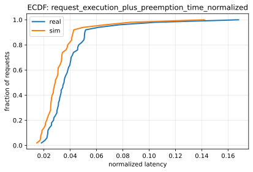
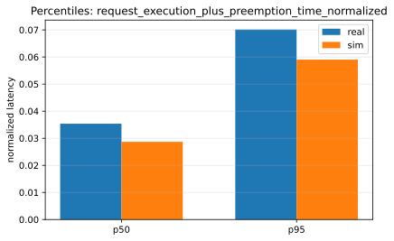
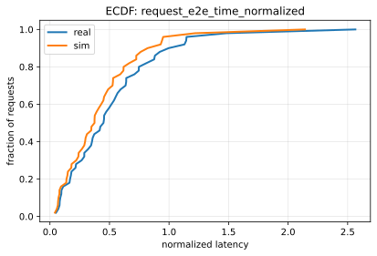
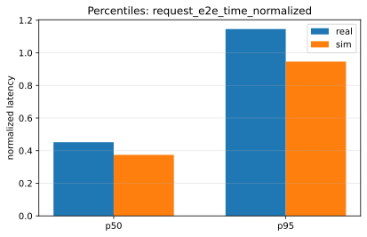

# Paper Fidelity Report: llama2_7b_arxiv

## Inputs
- sim: `/data1/huangzhe/code/gpu-simulate-test/tmp/paper_fidelity/runs/llama2_7b_arxiv/sim/request_metrics.csv`
- real: `/data1/huangzhe/code/gpu-simulate-test/tmp/paper_fidelity/runs/llama2_7b_arxiv/real/request_metrics.csv`

## Profiling
- root: `/data1/huangzhe/code/gpu-simulate-test/tmp/test_profiling_root`
- mode: `custom`
- interpretation: custom profiling root (interpret % error accordingly)

## Scores
| Metric | Percentile | Sim | Real | Percent error | Verdict |
|--------|------------|-----|------|---------------|---------|
| request_execution_plus_preemption_time_normalized | p50 | 0.0286743 | 0.035372 | 18.94% | fail |
| request_execution_plus_preemption_time_normalized | p95 | 0.0590226 | 0.0701305 | 15.84% | fail |
| request_e2e_time_normalized | p50 | 0.374385 | 0.451723 | 17.12% | fail |
| request_e2e_time_normalized | p95 | 0.946374 | 1.14568 | 17.40% | fail |
| prefill_time_execution_plus_preemption_normalized | p50 | 0.000916993 | 0.00111189 | 17.53% | fail |
| prefill_time_execution_plus_preemption_normalized | p95 | 0.00102076 | 0.0012551 | 18.67% | fail |
| decode_time_execution_plus_preemption_normalized | p50 | 0.0137182 | 0.0169171 | 18.91% | fail |
| decode_time_execution_plus_preemption_normalized | p95 | 0.0143484 | 0.0180215 | 20.38% | fail |

## Figures
### Static normalized latency

### Dynamic normalized latency

## Gap Diagnosis
- Vidur sim may underpredict wall-clock latency when CPU/runtime overhead is excluded and/or the profiling bundle is not host-matched; see `context/issues/known/issue-vidur-sim-underpredicts-sarathi-real.md`.
- Sim metrics: `/data1/huangzhe/code/gpu-simulate-test/tmp/paper_fidelity/runs/llama2_7b_arxiv/sim/request_metrics.csv`; Real metrics: `/data1/huangzhe/code/gpu-simulate-test/tmp/paper_fidelity/runs/llama2_7b_arxiv/real/request_metrics.csv`.

