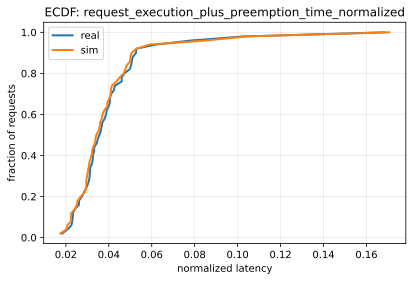
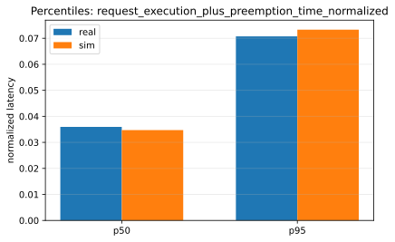
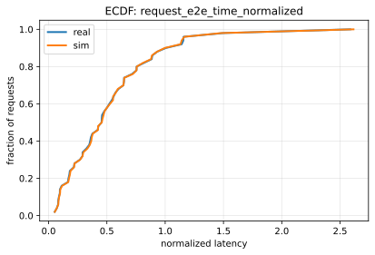
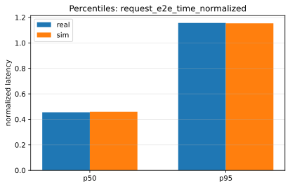

# Paper Fidelity Report: llama2_7b_arxiv

## Inputs
- sim: `/data1/huangzhe/code/gpu-simulate-test/tmp/paper_fidelity/runs/llama2_7b_arxiv/sim/request_metrics.csv`
- real: `/data1/huangzhe/code/gpu-simulate-test/tmp/paper_fidelity/runs/llama2_7b_arxiv/real/request_metrics.csv`

## Profiling
- root: `/data1/huangzhe/code/gpu-simulate-test/tmp/paper_fidelity/profiling_roots/llama2_7b_arxiv/2026-01-12_04-06-24-491602`
- mode: `host`
- interpretation: gap reproduction (profiled/microbenchmarked on this host)
- cpu_overhead:
  - modeling: `enabled`
  - validation: `strict`
  - csv: `/data1/huangzhe/code/gpu-simulate-test/tmp/paper_fidelity/profiling_roots/llama2_7b_arxiv/2026-01-12_04-06-24-491602/data/profiling/cpu_overhead/a100_pairwise_nvlink/meta-llama/Llama-2-7b-hf/cpu_overheads.csv`
  - status: `ok`
  - profiled: `True`

## Scores
| Metric | Percentile | Sim | Real | Percent error | Verdict |
|--------|------------|-----|------|---------------|---------|
| request_execution_plus_preemption_time_normalized | p50 | 0.0347175 | 0.0359328 | 3.38% | pass |
| request_execution_plus_preemption_time_normalized | p95 | 0.0732899 | 0.0707149 | 3.64% | pass |
| request_e2e_time_normalized | p50 | 0.45925 | 0.455112 | 0.91% | pass |
| request_e2e_time_normalized | p95 | 1.15372 | 1.15667 | 0.25% | pass |
| prefill_time_execution_plus_preemption_normalized | p50 | 0.00110829 | 0.00113049 | 1.96% | warn |
| prefill_time_execution_plus_preemption_normalized | p95 | 0.00119814 | 0.00127626 | 6.12% | warn |
| decode_time_execution_plus_preemption_normalized | p50 | 0.0164814 | 0.0171232 | 3.75% | warn |
| decode_time_execution_plus_preemption_normalized | p95 | 0.0167962 | 0.0182522 | 7.98% | warn |

## Figures
### Static normalized latency

### Dynamic normalized latency

## Gap Diagnosis
- Vidur sim may underpredict wall-clock latency when CPU/runtime overhead is excluded and/or the profiling bundle is not host-matched; see `context/issues/known/issue-vidur-sim-underpredicts-sarathi-real.md`.
- Sim metrics: `/data1/huangzhe/code/gpu-simulate-test/tmp/paper_fidelity/runs/llama2_7b_arxiv/sim/request_metrics.csv`; Real metrics: `/data1/huangzhe/code/gpu-simulate-test/tmp/paper_fidelity/runs/llama2_7b_arxiv/real/request_metrics.csv`.

