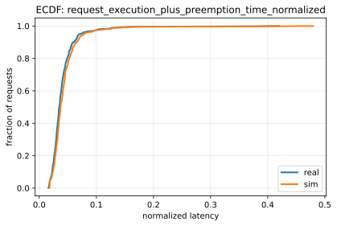
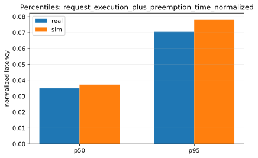
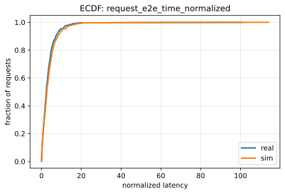
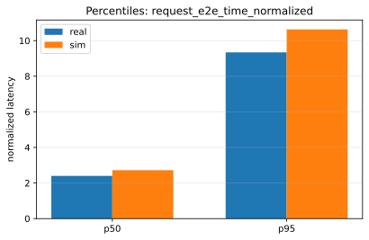

# Paper Fidelity Report: llama2_7b_arxiv_dynamic_medium

## Inputs
- sim: `/data1/huangzhe/code/gpu-simulate-test/results/reports/2026-01-12/paper_fidelity/llama2_7b_arxiv_dynamic_medium/inputs/sim_request_metrics.csv`
- real: `/data1/huangzhe/code/gpu-simulate-test/results/reports/2026-01-12/paper_fidelity/llama2_7b_arxiv_dynamic_medium/inputs/real_request_metrics.csv`

## Profiling
- root: `/data1/huangzhe/code/gpu-simulate-test/tmp/paper_fidelity/profiling_roots/llama2_7b_arxiv/2026-01-12_12-46-26-118841`
- mode: `host`
- interpretation: gap reproduction (profiled/microbenchmarked on this host)
- cpu_overhead:
  - modeling: `enabled`
  - validation: `strict`
  - csv: `/data1/huangzhe/code/gpu-simulate-test/tmp/paper_fidelity/profiling_roots/llama2_7b_arxiv/2026-01-12_12-46-26-118841/data/profiling/cpu_overhead/a100_pairwise_nvlink/meta-llama/Llama-2-7b-hf/cpu_overheads.csv`
  - status: `ok`
  - profiled: `True`

## Scores
| Metric | Percentile | Sim | Real | Percent error | Verdict |
|--------|------------|-----|------|---------------|---------|
| request_execution_plus_preemption_time_normalized | p50 | 0.0373452 | 0.035021 | 6.64% | fail |
| request_execution_plus_preemption_time_normalized | p95 | 0.0782962 | 0.0705236 | 11.02% | fail |
| request_e2e_time_normalized | p50 | 2.72111 | 2.40048 | 13.36% | fail |
| request_e2e_time_normalized | p95 | 10.629 | 9.34118 | 13.79% | fail |
| prefill_time_execution_plus_preemption_normalized | p50 | 0.00126606 | 0.00117165 | 8.06% | warn |
| prefill_time_execution_plus_preemption_normalized | p95 | 0.00144686 | 0.00143481 | 0.84% | warn |
| decode_time_execution_plus_preemption_normalized | p50 | 0.0179248 | 0.0168648 | 6.29% | warn |
| decode_time_execution_plus_preemption_normalized | p95 | 0.0184772 | 0.0187359 | 1.38% | warn |

## Figures
### Static normalized latency

### Dynamic normalized latency

## Gap Diagnosis
- Vidur sim may underpredict wall-clock latency when CPU/runtime overhead is excluded and/or the profiling bundle is not host-matched; see `context/issues/known/issue-vidur-sim-underpredicts-sarathi-real.md`.
- Sim metrics: `/data1/huangzhe/code/gpu-simulate-test/results/reports/2026-01-12/paper_fidelity/llama2_7b_arxiv_dynamic_medium/inputs/sim_request_metrics.csv`; Real metrics: `/data1/huangzhe/code/gpu-simulate-test/results/reports/2026-01-12/paper_fidelity/llama2_7b_arxiv_dynamic_medium/inputs/real_request_metrics.csv`.

