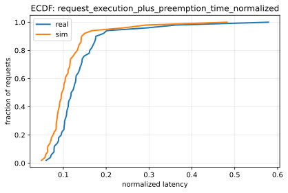
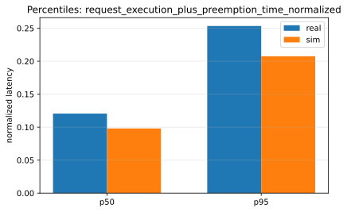
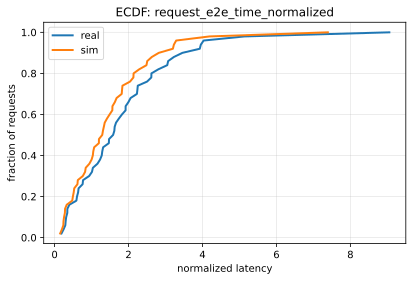
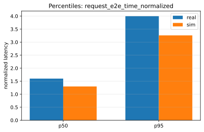

# Paper Fidelity Report: llama2_70b_arxiv_sweep_2026-01-13_12-52-21-924310365

## Inputs
- sim: `/data1/huangzhe/code/gpu-simulate-test/results/reports/2026-01-13/paper_fidelity/llama2_70b_arxiv_sweep_2026-01-13_12-52-21-924310365/inputs/sim_request_metrics.csv`
- real: `/data1/huangzhe/code/gpu-simulate-test/results/reports/2026-01-13/paper_fidelity/llama2_70b_arxiv_sweep_2026-01-13_12-52-21-924310365/inputs/real_request_metrics.csv`

## Workload
- this run: `static`
- static: all requests arrive at time 0 (`arrived_at=0`); no capacity search / QPS target.
- dynamic: requests arrive over time (non-zero `arrived_at`), generated via a Poisson process; the workflow performs capacity search and runs at an operating QPS (see `inputs/capacity.json` in dynamic reports).

## Profiling
- root: `/data1/huangzhe/code/gpu-simulate-test/tmp/paper_fidelity/profiling_roots/llama2_70b_arxiv_sweep_2026-01-13_12-52-21-924310365/2026-01-13_12-52-27-168104`
- mode: `host`
- interpretation: gap reproduction (profiled/microbenchmarked on this host)
- cpu_overhead:
  - modeling: `disabled`
  - validation: `strict`
  - csv: `/data1/huangzhe/code/gpu-simulate-test/tmp/paper_fidelity/profiling_roots/llama2_70b_arxiv_sweep_2026-01-13_12-52-21-924310365/2026-01-13_12-52-27-168104/data/profiling/cpu_overhead/a100_pairwise_nvlink/meta-llama/Llama-2-70b-hf/cpu_overheads.csv`
  - status: `disabled`
  - profiled: `True`

## Scores
| Metric | Percentile | Sim | Real | Percent error | Verdict |
|--------|------------|-----|------|---------------|---------|
| request_execution_plus_preemption_time_normalized | p50 | 0.0980349 | 0.120544 | 18.67% | fail |
| request_execution_plus_preemption_time_normalized | p95 | 0.207498 | 0.253335 | 18.09% | fail |
| request_e2e_time_normalized | p50 | 1.29813 | 1.59893 | 18.81% | fail |
| request_e2e_time_normalized | p95 | 3.26087 | 3.99693 | 18.42% | fail |
| prefill_time_execution_plus_preemption_normalized | p50 | 0.0031266 | 0.00389717 | 19.77% | fail |
| prefill_time_execution_plus_preemption_normalized | p95 | 0.00339053 | 0.00420165 | 19.30% | fail |
| decode_time_execution_plus_preemption_normalized | p50 | 0.0465574 | 0.0576647 | 19.26% | fail |
| decode_time_execution_plus_preemption_normalized | p95 | 0.047561 | 0.059009 | 19.40% | fail |

## Figures
### Metric: request_execution_plus_preemption_time_normalized

### Metric: request_e2e_time_normalized

