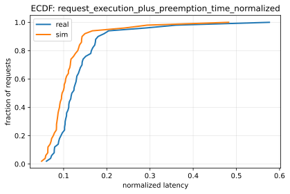
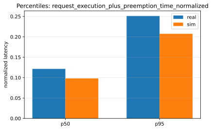
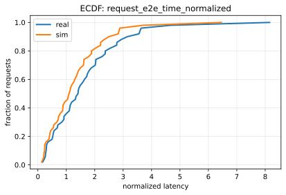
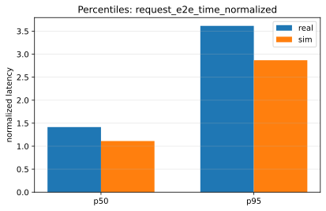

# Paper Fidelity Report: llama2_70b_arxiv_sweep_2026-01-13_12-52-21-924310365_dynamic_small

## Inputs
- sim: `/data1/huangzhe/code/gpu-simulate-test/results/reports/2026-01-13/paper_fidelity/llama2_70b_arxiv_sweep_2026-01-13_12-52-21-924310365_dynamic_small/inputs/sim_request_metrics.csv`
- real: `/data1/huangzhe/code/gpu-simulate-test/results/reports/2026-01-13/paper_fidelity/llama2_70b_arxiv_sweep_2026-01-13_12-52-21-924310365_dynamic_small/inputs/real_request_metrics.csv`

## Workload
- this run: `dynamic`
- seed: `42`
- operating_qps (qps_85): `0.85`
- capacity_qps: `1.0`
- capacity_json: `/data1/huangzhe/code/gpu-simulate-test/results/reports/2026-01-13/paper_fidelity/llama2_70b_arxiv_sweep_2026-01-13_12-52-21-924310365_dynamic_small/inputs/capacity.json`
- static: all requests arrive at time 0 (`arrived_at=0`); no capacity search / QPS target.
- dynamic: requests arrive over time (non-zero `arrived_at`), generated via a Poisson process; the workflow performs capacity search and runs at an operating QPS (see `inputs/capacity.json` in dynamic reports).

## Profiling
- root: `/data1/huangzhe/code/gpu-simulate-test/tmp/paper_fidelity/profiling_roots/llama2_70b_arxiv_sweep_2026-01-13_12-52-21-924310365/2026-01-13_12-52-27-168104`
- mode: `host`
- interpretation: gap reproduction (profiled/microbenchmarked on this host)
- cpu_overhead:
  - modeling: `disabled`
  - validation: `strict`
  - csv: `/data1/huangzhe/code/gpu-simulate-test/tmp/paper_fidelity/profiling_roots/llama2_70b_arxiv_sweep_2026-01-13_12-52-21-924310365/2026-01-13_12-52-27-168104/data/profiling/cpu_overhead/a100_pairwise_nvlink/meta-llama/Llama-2-70b-hf/cpu_overheads.csv`
  - status: `disabled`
  - profiled: `True`

## Scores
| Metric | Percentile | Sim | Real | Percent error | Verdict |
|--------|------------|-----|------|---------------|---------|
| request_execution_plus_preemption_time_normalized | p50 | 0.0980349 | 0.121408 | 19.25% | fail |
| request_execution_plus_preemption_time_normalized | p95 | 0.207498 | 0.251204 | 17.40% | fail |
| request_e2e_time_normalized | p50 | 1.11241 | 1.41565 | 21.42% | fail |
| request_e2e_time_normalized | p95 | 2.86875 | 3.61487 | 20.64% | fail |
| prefill_time_execution_plus_preemption_normalized | p50 | 0.0031266 | 0.00387189 | 19.25% | fail |
| prefill_time_execution_plus_preemption_normalized | p95 | 0.00339053 | 0.00424808 | 20.19% | fail |
| decode_time_execution_plus_preemption_normalized | p50 | 0.0465574 | 0.0575673 | 19.13% | fail |
| decode_time_execution_plus_preemption_normalized | p95 | 0.047561 | 0.0600196 | 20.76% | fail |

## Figures
### Metric: request_execution_plus_preemption_time_normalized

### Metric: request_e2e_time_normalized

