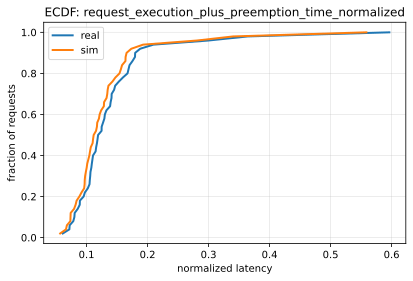
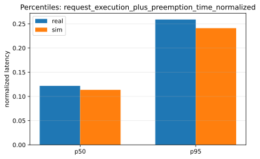
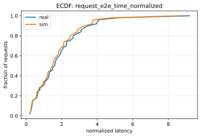
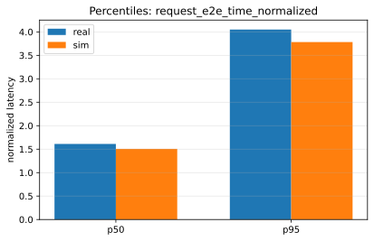

# Paper Fidelity Report: llama2_70b_arxiv_sweep_llama2_70b_static_tp4_2026-01-14_02-52-31

## Inputs
- sim: `/data1/huangzhe/code/gpu-simulate-test/results/reports/2026-01-14/paper_fidelity/llama2_70b_arxiv_sweep_llama2_70b_static_tp4_2026-01-14_02-52-31/inputs/sim_request_metrics.csv`
- real: `/data1/huangzhe/code/gpu-simulate-test/results/reports/2026-01-14/paper_fidelity/llama2_70b_arxiv_sweep_llama2_70b_static_tp4_2026-01-14_02-52-31/inputs/real_request_metrics.csv`

## Workload
- this run: `static`
- static: all requests arrive at time 0 (`arrived_at=0`); no capacity search / QPS target.
- dynamic: requests arrive over time (non-zero `arrived_at`), generated via a Poisson process; the workflow performs capacity search and runs at an operating QPS (see `inputs/capacity.json` in dynamic reports).

## Profiling
- root: `/data1/huangzhe/code/gpu-simulate-test/tmp/paper_fidelity/profiling_roots/llama2_70b_arxiv_sweep_llama2_70b_static_tp4_2026-01-14_02-52-31/2026-01-14_02-52-36-591791`
- mode: `host`
- interpretation: gap reproduction (profiled/microbenchmarked on this host)
- cpu_overhead:
  - modeling: `enabled`
  - validation: `strict`
  - csv: `/data1/huangzhe/code/gpu-simulate-test/tmp/paper_fidelity/profiling_roots/llama2_70b_arxiv_sweep_llama2_70b_static_tp4_2026-01-14_02-52-31/2026-01-14_02-52-36-591791/data/profiling/cpu_overhead/a100_pairwise_nvlink/meta-llama/Llama-2-70b-hf/cpu_overheads.csv`
  - status: `ok`
  - profiled: `True`

## Scores
| Metric | Percentile | Sim | Real | Percent error | Verdict |
|--------|------------|-----|------|---------------|---------|
| request_execution_plus_preemption_time_normalized | p50 | 0.113623 | 0.121783 | 6.70% | warn |
| request_execution_plus_preemption_time_normalized | p95 | 0.241099 | 0.258911 | 6.88% | warn |
| request_e2e_time_normalized | p50 | 1.50671 | 1.6113 | 6.49% | warn |
| request_e2e_time_normalized | p95 | 3.78302 | 4.04948 | 6.58% | warn |
| prefill_time_execution_plus_preemption_normalized | p50 | 0.00362522 | 0.00393314 | 7.83% | warn |
| prefill_time_execution_plus_preemption_normalized | p95 | 0.00392617 | 0.00422253 | 7.02% | warn |
| decode_time_execution_plus_preemption_normalized | p50 | 0.0539515 | 0.0584414 | 7.68% | warn |
| decode_time_execution_plus_preemption_normalized | p95 | 0.0550034 | 0.0597115 | 7.88% | warn |

## Figures
### Metric: request_execution_plus_preemption_time_normalized

### Metric: request_e2e_time_normalized

