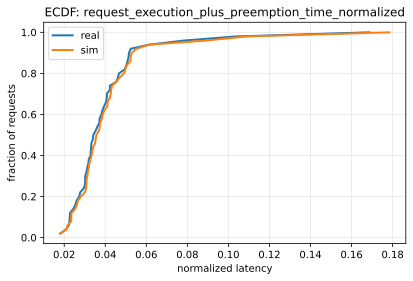
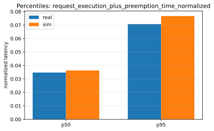
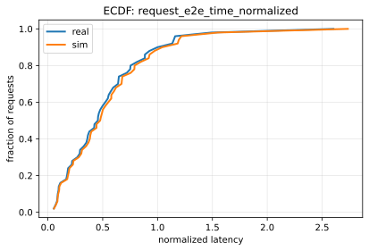
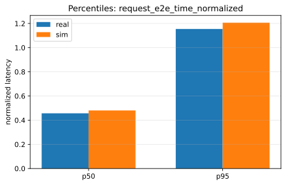

# Paper Fidelity Report: llama2_7b_arxiv_vc_profile_static_small_20260115

## Inputs
- sim: `/data1/huangzhe/code/gpu-simulate-test/results/reports/2026-01-15/paper_fidelity/llama2_7b_arxiv_vc_profile_static_small_20260115/inputs/sim_request_metrics.csv`
- real: `/data1/huangzhe/code/gpu-simulate-test/results/reports/2026-01-15/paper_fidelity/llama2_7b_arxiv_vc_profile_static_small_20260115/inputs/real_request_metrics.csv`

## Workload
- this run: `static`
- static: all requests arrive at time 0 (`arrived_at=0`); no capacity search / QPS target.
- dynamic: requests arrive over time (non-zero `arrived_at`), generated via a Poisson process; the workflow performs capacity search and runs at an operating QPS (see `inputs/capacity.json` in dynamic reports).

## Profiling
- root: `/data1/huangzhe/code/gpu-simulate-test/tmp/verify_pf_vs_vidur_cli_static_llama2_7b_20260115/vidur_cli_ws/sim_vs_real/m_llama2_7b+h_a100+b_sarathi+w_default+v_default+20260115T071809Z/profile`
- mode: `custom`
- interpretation: custom profiling root (interpret % error accordingly)
- cpu_overhead:
  - modeling: `enabled`
  - validation: `strict`
  - csv: `/data1/huangzhe/code/gpu-simulate-test/tmp/verify_pf_vs_vidur_cli_static_llama2_7b_20260115/vidur_cli_ws/sim_vs_real/m_llama2_7b+h_a100+b_sarathi+w_default+v_default+20260115T071809Z/profile/data/profiling/cpu_overhead/a100_pairwise_nvlink/meta-llama/Llama-2-7b-hf/cpu_overheads.csv`
  - status: `ok`

## Scores
| Metric | Percentile | Sim | Real | Percent error | Verdict |
|--------|------------|-----|------|---------------|---------|
| request_execution_plus_preemption_time_normalized | p50 | 0.0362965 | 0.0347364 | 4.49% | warn |
| request_execution_plus_preemption_time_normalized | p95 | 0.0766728 | 0.0706974 | 8.45% | warn |
| request_e2e_time_normalized | p50 | 0.480273 | 0.456808 | 5.14% | warn |
| request_e2e_time_normalized | p95 | 1.20632 | 1.15452 | 4.49% | warn |
| prefill_time_execution_plus_preemption_normalized | p50 | 0.00115845 | 0.00112403 | 3.06% | pass |
| prefill_time_execution_plus_preemption_normalized | p95 | 0.00125182 | 0.00124941 | 0.19% | pass |
| decode_time_execution_plus_preemption_normalized | p50 | 0.0172282 | 0.0169512 | 1.63% | pass |
| decode_time_execution_plus_preemption_normalized | p95 | 0.0175395 | 0.0180029 | 2.57% | pass |

## Figures
### Metric: request_execution_plus_preemption_time_normalized

### Metric: request_e2e_time_normalized

